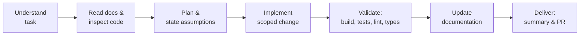

# 01 — Engineering Handbook Guide

# EcoTrace India — How to Use the Engineering Documentation

Version: 1.0

Status: Active

---

# Table of Contents

1. [Purpose](#purpose)
2. [Audience](#audience)
3. [Documentation Map](#documentation-map)
4. [Documentation Priority](#documentation-priority)
5. [How to Navigate by Task Type](#how-to-navigate-by-task-type)
6. [Engineering Workflow Summary](#engineering-workflow-summary)
7. [Document Conventions](#document-conventions)
8. [Keeping Documentation Current](#keeping-documentation-current)

---

# Purpose

This document is the entry point to the EcoTrace India engineering handbook located in `docs/engineering/`.

It explains what each handbook document covers, in what order to read them, and which document governs which kind of decision.

The handbook defines **standards, conventions, and architecture decisions** — not implementation code. Implementation lives in the module directories (`backend/`, `mobile/`, `dashboard/`, `blockchain/`, `ai/`, `database/`).

---

# Audience

- AI engineering agents (Claude Code and others, per `AGENTS.md`)
- Human contributors and reviewers
- IEEE YESIST 2026 evaluators reviewing engineering rigor

---

# Documentation Map

| Document | Scope |
|---|---|
| `01_CLAUDE.md` | This guide — handbook navigation and conventions |
| `02_PROJECT_RULES.md` | Repository rules: Git workflow, branching, commits, PRs, code style, security baseline |
| `03_ARCHITECTURE.md` | System architecture, component boundaries, layering, data flows, architecture decisions |
| `04_DATABASE.md` | PostgreSQL + Prisma standards, entity model, migration policy |
| `05_API.md` | REST conventions, versioning, authentication, error contract, endpoint catalog |
| `06_BACKEND.md` | Node.js / Express / TypeScript service standards and internal layering |
| `07_FRONTEND.md` | Flutter application and React dashboard standards |
| `08_AI.md` | AI service standards: classification, forecasting, fraud detection |
| `09_BLOCKCHAIN.md` | Hyperledger Fabric design: chaincode scope, on-chain vs off-chain data |
| `10_TESTING.md` | Testing strategy, tooling per stack, quality gates |
| `11_DEPLOYMENT.md` | Docker, CI/CD, environments, NGINX, operational standards |
| `12_ROADMAP.md` | Engineering roadmap mapped to project phases |

---

# Documentation Priority

As defined in `CLAUDE.md` (repository root), when documents conflict, resolve in this order:

1. `PROJECT.md` — product vision, scope, and objectives
2. `docs/engineering/` — this handbook (technical decisions)
3. `CLAUDE.md` — repository instructions
4. `AGENTS.md` — AI workflow
5. `README.md` — public overview

Within `docs/engineering/`, `03_ARCHITECTURE.md` governs cross-module decisions; module documents (04–09) govern their own module and must not contradict the architecture document.

If a conflict is found, do not silently pick a side — fix the lower-priority document and note the correction in the pull request.

---

# How to Navigate by Task Type

| Task | Read first | Then |
|---|---|---|
| Any task | `PROJECT.md`, `02_PROJECT_RULES.md` | Relevant module document |
| New API endpoint | `05_API.md` | `06_BACKEND.md`, `04_DATABASE.md` |
| Schema change | `04_DATABASE.md` | `03_ARCHITECTURE.md` |
| Mobile screen / dashboard view | `07_FRONTEND.md` | `05_API.md` |
| AI model or pipeline | `08_AI.md` | `03_ARCHITECTURE.md`, `05_API.md` |
| Chaincode / ledger event | `09_BLOCKCHAIN.md` | `03_ARCHITECTURE.md` |
| Adding tests | `10_TESTING.md` | Module document |
| CI/CD, Docker, environments | `11_DEPLOYMENT.md` | `02_PROJECT_RULES.md` |
| Planning next milestone | `12_ROADMAP.md` | `PROJECT.md` |

---

# Engineering Workflow Summary

The full workflow is defined in `AGENTS.md`. In brief:

No step may be skipped. Documentation updates are part of the implementation, not an afterthought.

---

# Document Conventions

All handbook documents follow these conventions:

- **Header block** — title, `Version`, `Status` at the top, matching the style of `PROJECT.md`.
- **Table of contents** — every document begins with one.
- **Normative language** — "must" is mandatory; "should" is strongly recommended; "may" is optional.
- **Cross-references over duplication** — link to the owning document instead of restating its content.
- **Mermaid diagrams** — used where a diagram clarifies structure or flow; kept small and focused.
- **No implementation code** — illustrative snippets (schemas, payload shapes, directory trees) are allowed; working application code is not.

---

# Keeping Documentation Current

- Any change to APIs, database, architecture, deployment, configuration, or testing **must** update the corresponding handbook document in the same pull request.
- Version numbers in a document's header are bumped when its normative content changes.
- Documentation gaps discovered during work should be recorded in the PR description and, where possible, fixed immediately.

Related: `02_PROJECT_RULES.md` → Documentation Policy.
