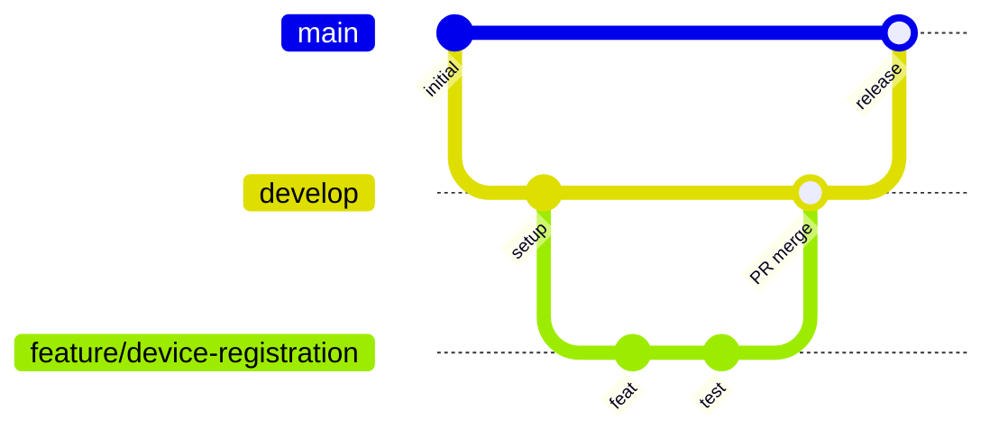

# 02 — Project Rules

# EcoTrace India — Repository Rules & Engineering Standards

Version: 1.0

Status: Active

---

# Table of Contents

1. [Purpose](#purpose)
2. [Repository Structure](#repository-structure)
3. [Git Workflow](#git-workflow)
4. [Branch Naming](#branch-naming)
5. [Commit Conventions](#commit-conventions)
6. [Pull Request Rules](#pull-request-rules)
7. [Code Style Standards](#code-style-standards)
8. [Configuration & Secrets](#configuration--secrets)
9. [Security Baseline](#security-baseline)
10. [Documentation Policy](#documentation-policy)
11. [Definition of Done](#definition-of-done)

---

# Purpose

This document defines the repository-wide rules every contributor — human or AI — must follow. It operationalizes the governance defined in `CLAUDE.md` and `AGENTS.md`.

Module-specific standards live in documents 03–11 of this handbook.

---

# Repository Structure

The approved top-level layout (per `CLAUDE.md`):

```
backend/       Node.js + Express + TypeScript REST API
mobile/        React Native (Expo) applications (consumer, collector)
dashboard/     React + Tailwind CSS web dashboard (admin, government)
blockchain/    Hyperledger Fabric network config and chaincode
ai/            Python AI services (classification, forecasting, fraud)
database/      Schema documentation, seeds, migration references
deployment/    Docker, NGINX, environment templates
scripts/       Repository automation and developer tooling
testing/       Cross-cutting test assets (e2e suites, fixtures)
docs/          Documentation (engineering handbook in docs/engineering/)
```

Rules:

- New top-level folders **must not** be created without approval.
- Code goes only in its owning module directory.
- Shared contracts (e.g., API types) are documented in `05_API.md`, not duplicated ad hoc across modules.

---

# Git Workflow



- All work happens on `feature/<feature-name>` branches cut from `develop`.
- Features merge into `develop` via pull request only.
- `develop` merges into `main` as a release.
- **Never** commit directly to `main`.
- **Never** rewrite published Git history (no force-push to shared branches).

---

# Branch Naming

| Prefix | Use |
|---|---|
| `feature/<name>` | New functionality |
| `fix/<name>` | Bug fixes |
| `docs/<name>` | Documentation-only changes |
| `chore/<name>` | Tooling, CI, dependencies |

Names are lowercase, kebab-case, and descriptive: `feature/collection-scheduling`, `fix/ecoid-qr-encoding`.

---

# Commit Conventions

Commits follow the Conventional Commits format:

```
<type>(<scope>): <short imperative summary>
```

- **Types:** `feat`, `fix`, `docs`, `test`, `chore`, `refactor`, `perf`, `ci`
- **Scopes:** module names — `backend`, `mobile`, `dashboard`, `blockchain`, `ai`, `database`, `deployment`, `docs`
- Keep commits small and focused on one logical change.
- Examples:
  - `feat(backend): add collection request endpoint`
  - `docs(engineering): update database entity model`

---

# Pull Request Rules

Every PR must include:

1. **Summary** — what changed and why.
2. **Scope** — affected modules.
3. **Verification** — how it was tested (build, tests, lint, types).
4. **Documentation** — which handbook documents were updated, or why none were needed.
5. **Assumptions and risks** — if any.

PR checks (see `11_DEPLOYMENT.md` → CI/CD):

- Build passes
- Tests pass
- Lint passes
- Type checking passes

A PR with failing checks must not be merged.

---

# Code Style Standards

Cross-cutting rules (language-specific detail lives in the module documents):

| Stack | Formatter | Linter | Typing |
|---|---|---|---|
| Backend (TypeScript) | Prettier | ESLint | `strict` TypeScript |
| Dashboard (React/TS) | Prettier | ESLint | `strict` TypeScript |
| Mobile (React Native/TypeScript) | `eslint --fix` | `eslint` | `tsc --noEmit` strict mode |
| AI (Python) | Black | Ruff | Type hints + mypy |

General principles (from `AGENTS.md`):

- Small files, small functions, clear interfaces.
- Explicit naming; no magic values — use named constants or configuration.
- No deep nesting; prefer early returns.
- No duplicate logic — search the repository before writing anything new.
- No unused or speculative code.
- Comments explain *why*, not *what*, and only when necessary.

---

# Configuration & Secrets

- All configuration comes from environment variables; `.env` files are **never** committed.
- Each service ships a committed `.env.example` documenting required variables without values.
- Secrets (API keys, passwords, tokens, certificates, Fabric credentials) never appear in code, logs, documentation, or commit history.
- CI secrets are stored in GitHub Actions encrypted secrets.

See `11_DEPLOYMENT.md` for environment definitions.

---

# Security Baseline

Applies to every module:

- Validate and sanitize all external input; never trust the client.
- Parameterized queries only (enforced via Prisma — see `04_DATABASE.md`).
- Principle of least privilege for database roles, API scopes, and Fabric identities.
- Authentication and authorization on every non-public endpoint (see `05_API.md`).
- No sensitive data in logs, error messages, or on-chain records (see `09_BLOCKCHAIN.md`).

---

# Documentation Policy

Documentation is part of the implementation.

| Change affects | Update |
|---|---|
| Architecture / module boundaries | `03_ARCHITECTURE.md` |
| Database schema | `04_DATABASE.md` + migrations + ORM models |
| API endpoints / contracts | `05_API.md` |
| Backend structure | `06_BACKEND.md` |
| Frontend structure | `07_FRONTEND.md` |
| AI models / pipelines | `08_AI.md` |
| Chaincode / ledger events | `09_BLOCKCHAIN.md` |
| Test strategy / tooling | `10_TESTING.md` |
| Deployment / CI / config | `11_DEPLOYMENT.md` |
| Milestones / phases | `12_ROADMAP.md` |

Documentation updates ship in the **same pull request** as the change.

---

# Definition of Done

A task is complete only when (per `CLAUDE.md`):

- Requested functionality is implemented — nothing more, nothing less.
- Code follows this handbook's conventions.
- Tests pass (where applicable).
- Documentation is updated.
- No lint or type errors remain.
- Git working tree is clean.
- No unrelated files were modified.
