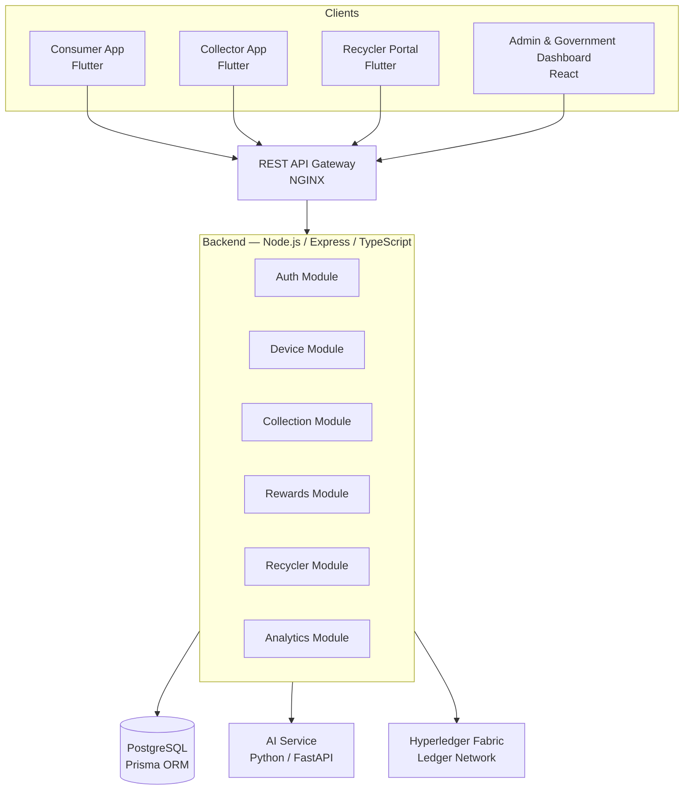
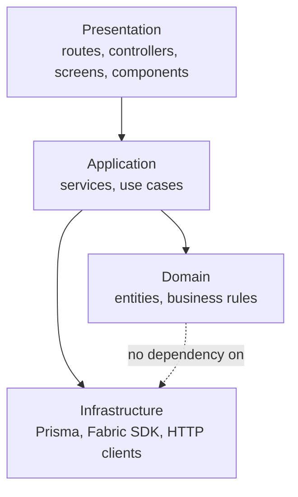
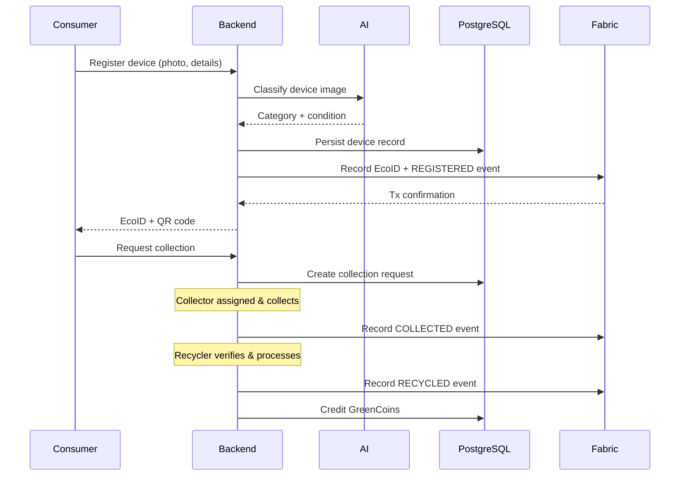

# 03 — Architecture

# EcoTrace India — System Architecture

Version: 1.0

Status: Active

---

# Table of Contents

1. [Purpose](#purpose)
2. [Architecture Goals](#architecture-goals)
3. [System Context](#system-context)
4. [Component Architecture](#component-architecture)
5. [Layering Model](#layering-model)
6. [Device Lifecycle Flow](#device-lifecycle-flow)
7. [Data Flow & Integration Rules](#data-flow--integration-rules)
8. [Data Ownership](#data-ownership)
9. [Cross-Cutting Concerns](#cross-cutting-concerns)
10. [Architecture Decision Records](#architecture-decision-records)
11. [Non-Goals](#non-goals)

---

# Purpose

This document defines the system architecture of EcoTrace India: the components, their boundaries, how they communicate, and the decisions behind that structure.

It is the authoritative technical reference for cross-module decisions. Module documents (04–09) refine it but must not contradict it.

---

# Architecture Goals

Derived from `PROJECT.md`:

- **Traceability** — every device lifecycle event is recorded and verifiable.
- **Modularity** — mobile, dashboard, backend, AI, and blockchain evolve independently.
- **Simplicity** — a modular monolith backend, not premature microservices.
- **Scalability path** — clean module boundaries that permit later extraction into services.
- **Security** — least privilege, validated input, no secrets in code.
- **Demonstrability** — the whole stack must run locally via Docker for IEEE YESIST 2026.

---

# System Context

Key rule: **clients talk only to the backend REST API.** No client communicates directly with the database, the AI service, or the Fabric network.

---

# Component Architecture

| Component | Directory | Technology | Responsibility |
|---|---|---|---|
| Mobile apps | `mobile/` | Flutter | Consumer, collector, and recycler user experiences |
| Dashboard | `dashboard/` | React + Tailwind | Admin and government analytics and management |
| Backend API | `backend/` | Node.js, Express, TypeScript | Business logic, orchestration, authentication, API contracts |
| Database | `database/`, backend Prisma | PostgreSQL + Prisma | System of record for application data |
| AI service | `ai/` | Python (FastAPI, YOLOv8, Prophet, OpenCV) | Classification, condition assessment, forecasting, fraud detection |
| Blockchain | `blockchain/` | Hyperledger Fabric | Immutable lifecycle records, verification, audit trail |
| Deployment | `deployment/` | Docker, NGINX, GitHub Actions | Packaging, environments, CI/CD |

The backend is a **modular monolith**: one deployable process, internally separated by module (auth, device, collection, rewards, recycler, analytics). See `06_BACKEND.md`.

The AI service is a **separate process** with its own HTTP interface, called only by the backend. See `08_AI.md`.

---

# Layering Model

Inside every application component, dependencies point downward only (per `AGENTS.md`):

- Presentation never contains business logic.
- Domain never imports infrastructure.
- Infrastructure is accessed through interfaces so it can be mocked in tests (see `10_TESTING.md`).
- Reversing a dependency requires an ADR (see below).

---

# Device Lifecycle Flow

The core business flow the architecture must serve:

Lifecycle states are defined canonically in `04_DATABASE.md` (device status enum) and mirrored on-chain as events (`09_BLOCKCHAIN.md`).

---

# Data Flow & Integration Rules

1. **Synchronous REST** is the default integration style (backend ↔ AI, clients ↔ backend).
2. **Blockchain writes are backend-only.** The backend is the sole Fabric client; it submits transactions after the database write succeeds.
3. **Blockchain writes must not block the user path indefinitely** — failures are retried; the database remains the system of record for application state, the ledger for verification.
4. **AI calls are advisory.** If the AI service is unavailable, flows degrade gracefully (e.g., manual device categorization) rather than failing.
5. **No shared databases.** The AI service and blockchain never read PostgreSQL directly; all data crosses component boundaries through APIs.

---

# Data Ownership

| Data | Owner (system of record) | Also present in |
|---|---|---|
| Users, roles, credentials | PostgreSQL | — |
| Devices, EcoIDs | PostgreSQL | Fabric (identity + event hashes) |
| Collections, schedules | PostgreSQL | Fabric (lifecycle events) |
| GreenCoin balances | PostgreSQL | — |
| Recycling certificates | PostgreSQL | Fabric (verification record) |
| Lifecycle audit trail | Hyperledger Fabric | — |
| AI models & artifacts | `ai/` model registry | — |

Rule: on-chain data is minimal — identities, events, hashes. Full records stay off-chain. See `09_BLOCKCHAIN.md`.

---

# Cross-Cutting Concerns

- **Authentication & authorization** — JWT with role claims, enforced at the backend; see `05_API.md`.
- **Validation** — every boundary (API, AI service, chaincode) validates its input.
- **Error handling** — uniform error contract defined in `05_API.md`.
- **Logging** — structured logs, no sensitive data; correlation IDs propagate from gateway to backend to AI.
- **Configuration** — environment variables only; see `02_PROJECT_RULES.md`.

---

# Architecture Decision Records

Significant decisions are recorded here as concise ADRs. New ADRs are appended with sequential numbers.

## ADR-001 — Modular monolith backend

- **Decision:** One Express application with internal modules, not microservices.
- **Rationale:** Small team, competition timeline, simpler deployment and debugging; module boundaries preserve a path to later extraction.

## ADR-002 — Backend as sole blockchain gateway

- **Decision:** Only the backend holds Fabric identities and submits transactions.
- **Rationale:** Centralizes credential management and validation; clients stay thin and untrusted.

## ADR-003 — PostgreSQL as system of record

- **Decision:** Application state lives in PostgreSQL; the ledger stores verification events, not primary data.
- **Rationale:** Relational queries, migrations, and analytics are impractical on-chain; the ledger's value is immutability, not storage.

## ADR-004 — Separate Python AI service

- **Decision:** AI runs as an independent FastAPI service called over HTTP.
- **Rationale:** Python ML ecosystem (YOLOv8, Prophet) cannot live inside Node.js; independent scaling and testing.

## ADR-005 — REST over messaging

- **Decision:** No message broker in v1; synchronous REST with retry for Fabric writes.
- **Rationale:** Avoids operational complexity out of scope for the prototype; revisit if async workloads grow (see `12_ROADMAP.md`).

---

# Non-Goals

Per `PROJECT.md` scope exclusions, the architecture does **not** provide for:

- ERP or payment gateway integration
- International logistics
- IoT device ingestion
- Real banking integrations

Designs must not add speculative hooks for these.
