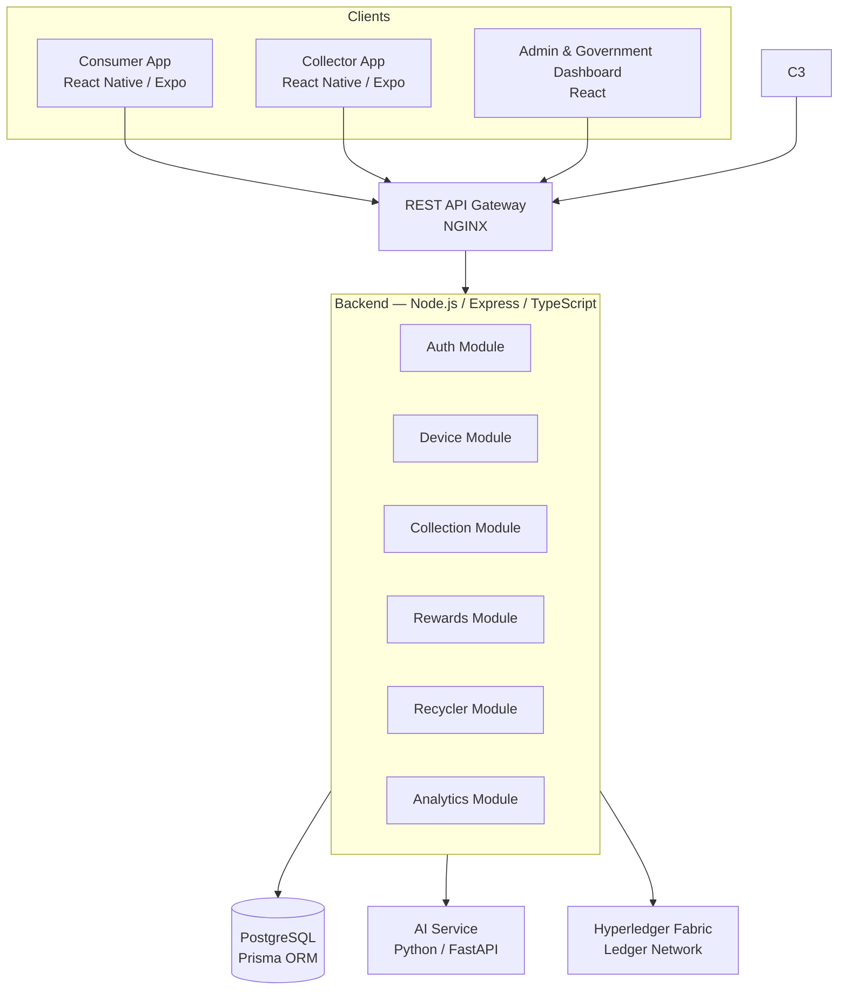
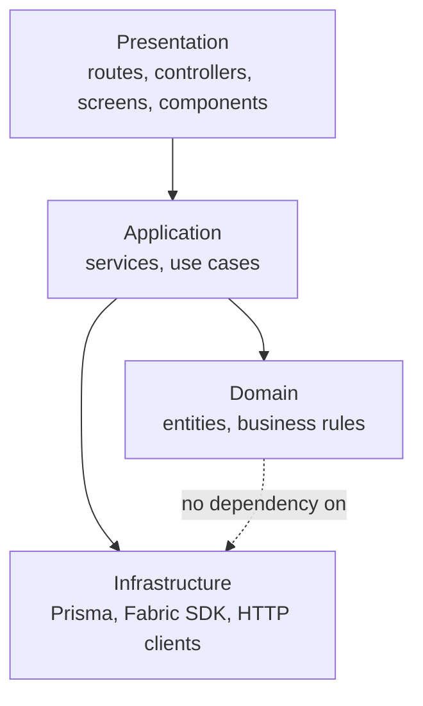
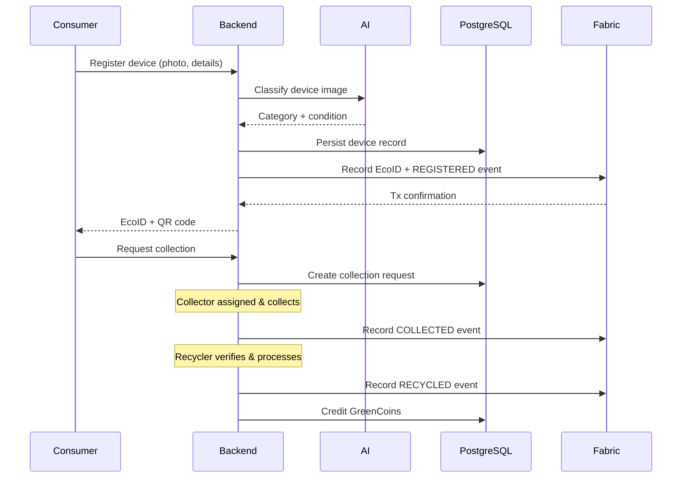

# 03 — Architecture

# EcoTrace India — System Architecture

Version: 1.0

Status: Active

---

# Table of Contents

1. [Purpose](#purpose)
2. [Architecture Goals](#architecture-goals)
3. [System Context](#system-context)
4. [Component Architecture](#component-architecture)
5. [Layering Model](#layering-model)
6. [Device Lifecycle Flow](#device-lifecycle-flow)
7. [Data Flow & Integration Rules](#data-flow--integration-rules)
8. [Data Ownership](#data-ownership)
9. [Cross-Cutting Concerns](#cross-cutting-concerns)
10. [Architecture Decision Records](#architecture-decision-records)
11. [Non-Goals](#non-goals)

---

# Purpose

This document defines the system architecture of EcoTrace India: the components, their boundaries, how they communicate, and the decisions behind that structure.

It is the authoritative technical reference for cross-module decisions. Module documents (04–09) refine it but must not contradict it.

---

# Architecture Goals

Derived from `PROJECT.md`:

- **Traceability** — every device lifecycle event is recorded and verifiable.
- **Modularity** — mobile, dashboard, backend, AI, and blockchain evolve independently.
- **Simplicity** — a modular monolith backend, not premature microservices.
- **Scalability path** — clean module boundaries that permit later extraction into services.
- **Security** — least privilege, validated input, no secrets in code.
- **Demonstrability** — the whole stack must run locally via Docker for IEEE YESIST 2026.

---

# System Context

Key rule: **clients talk only to the backend REST API.** No client communicates directly with the database, the AI service, or the Fabric network.

---

# Component Architecture

**Corrected P8.9** — real directories, as verified live throughout P5–P8
(the `ai/`, `dashboard/`, `database/`, `deployment/` paths below were an
early plan never built out; see `README.md` → Repository Structure):

| Component | Real directory | Technology | Responsibility |
|---|---|---|---|
| Mobile apps | `mobile/collector_app/`, `mobile/consumer_app/` | React Native (Expo SDK 57, TypeScript) — migrated from Flutter/Dart in P9.3 | Consumer and collector user experiences (Recycler workflow is API-only today, no dedicated app — `06_BACKEND.md`) |
| Dashboard | `frontend/` | React + Tailwind (Vite) | Admin and government submission audit/assignment; analytics module not yet deployed (frontend degrades this honestly) |
| Backend API | `backend/` | Node.js, Express, TypeScript, Prisma | Business logic, orchestration, authentication, API contracts, Submission lifecycle |
| Database | `backend/prisma/`, PostgreSQL | PostgreSQL + Prisma (backend); optionally also `intelligence/device_ai` via `DEVICE_BACKEND=postgres` | System of record for application data |
| AI service | `intelligence/device_ai/` | Python, FastAPI, a trained YOLO-family detector, OCR, CLIP | Device registration, condition/material intelligence, Device Passport, local + external Trust Anchors |
| Blockchain | `blockchain/chaincode/`, `intelligence/device_ai` (Gateway client) | Hyperledger Fabric chaincode (TypeScript) + gRPC client (Python) | Immutable lifecycle records, verification, audit trail — real and tested, no live network in this environment (`09_BLOCKCHAIN.md`) |
| Deployment | `docker-compose.yml`, each service's own `Dockerfile` | Docker, GitHub Actions (backend only so far) | Packaging, local/demo environment, CI (`11_DEPLOYMENT.md`) |

The backend is a **modular monolith**: one deployable process, internally separated by module (auth, users, submission, rewards, blockchain proxy, metrics). See `06_BACKEND.md`.

The AI service is a **separate process** with its own HTTP interface — reached by the backend's one read-only proxy call **and** directly by evaluators/demo scripts (its port is host-mapped for exactly that reason, P7.5/P8.8); "called only by the backend" was inaccurate and has been corrected. See `08_AI.md`.

---

# Layering Model

Inside every application component, dependencies point downward only (per `AGENTS.md`):

- Presentation never contains business logic.
- Domain never imports infrastructure.
- Infrastructure is accessed through interfaces so it can be mocked in tests (see `10_TESTING.md`).
- Reversing a dependency requires an ADR (see below).

---

# Device Lifecycle Flow

The core business flow the architecture must serve:

Lifecycle states are defined canonically in `04_DATABASE.md` (device status enum) and mirrored on-chain as events (`09_BLOCKCHAIN.md`).

---

# Data Flow & Integration Rules

**Corrected P8.9**: rules #2 and #5 below described a design that was
superseded during real implementation without the doc being updated —
fixed to match what actually ships (verified P6.2, re-verified live
P8.2/P8.5/P8.7).

1. **Synchronous REST** is the default integration style (backend ↔ AI, clients ↔ backend).
2. **The Python AI service (`intelligence/device_ai`) is the Fabric client, not the backend.** `backend/`'s own `blockchain.service.ts` explicitly holds no Fabric connection — it only proxies one read-only health check to the AI service. Local and external (blockchain-abstraction) Trust Anchors are created directly against the AI service's own API (`scripts/demo/run_demo.py`), never routed through the backend.
3. **Blockchain writes must not block the user path indefinitely** — the external anchor step degrades honestly (never fabricates a status) when unreachable, verified live in P8.5 §9/§10.
4. **AI calls are advisory** where the backend does call the AI service (its one health proxy): if unreachable, the backend's own health stays unaffected — no cascading failure (P8.5 §9, live-verified).
5. **The AI service may optionally use PostgreSQL** (`DEVICE_BACKEND=postgres`/`TRUST_ANCHOR_BACKEND=postgres`) but defaults to an isolated in-memory store — it never shares the backend's own Postgres tables/schema either way; "never reads PostgreSQL directly" was inaccurate as an absolute claim and has been corrected.

---

# Data Ownership

| Data | Owner (system of record) | Also present in |
|---|---|---|
| Users, roles, credentials | PostgreSQL | — |
| Devices, EcoIDs | PostgreSQL | Fabric (identity + event hashes) |
| Collections, schedules | PostgreSQL | Fabric (lifecycle events) |
| GreenCoin balances | PostgreSQL | — |
| Recycling certificates | PostgreSQL | Fabric (verification record) |
| Lifecycle audit trail | Hyperledger Fabric | — |
| AI models & artifacts | `ai/` model registry | — |

Rule: on-chain data is minimal — identities, events, hashes. Full records stay off-chain. See `09_BLOCKCHAIN.md`.

---

# Cross-Cutting Concerns

- **Authentication & authorization** — JWT with role claims, enforced at the backend; see `05_API.md`.
- **Validation** — every boundary (API, AI service, chaincode) validates its input.
- **Error handling** — uniform error contract defined in `05_API.md`.
- **Logging** — structured logs, no sensitive data; correlation IDs propagate from gateway to backend to AI.
- **Configuration** — environment variables only; see `02_PROJECT_RULES.md`.

---

# Architecture Decision Records

Significant decisions are recorded here as concise ADRs. New ADRs are appended with sequential numbers.

## ADR-001 — Modular monolith backend

- **Decision:** One Express application with internal modules, not microservices.
- **Rationale:** Small team, competition timeline, simpler deployment and debugging; module boundaries preserve a path to later extraction.

## ADR-002 — Backend as sole blockchain gateway (SUPERSEDED, P8.9)

- **Original decision:** Only the backend holds Fabric identities and submits transactions.
- **What actually shipped instead (P6.2):** the Python AI service
  (`intelligence/device_ai`) holds the Fabric identity and is the actual
  Gateway client; the backend never connects to Fabric at all, only
  proxying one read-only health check. Recorded here rather than left
  silently wrong — an ADR that no longer matches reality is worse than no
  ADR. See `09_BLOCKCHAIN.md` and `reports/P8_2_LIVE_BLOCKCHAIN.md`.

## ADR-003 — PostgreSQL as system of record

- **Decision:** Application state lives in PostgreSQL; the ledger stores verification events, not primary data.
- **Rationale:** Relational queries, migrations, and analytics are impractical on-chain; the ledger's value is immutability, not storage.

## ADR-004 — Separate Python AI service

- **Decision:** AI runs as an independent FastAPI service called over HTTP.
- **Rationale:** Python ML ecosystem (YOLOv8, Prophet) cannot live inside Node.js; independent scaling and testing.

## ADR-005 — REST over messaging

- **Decision:** No message broker in v1; synchronous REST with retry for Fabric writes.
- **Rationale:** Avoids operational complexity out of scope for the prototype; revisit if async workloads grow (see `12_ROADMAP.md`).

---

# Non-Goals

Per `PROJECT.md` scope exclusions, the architecture does **not** provide for:

- ERP or payment gateway integration
- International logistics
- IoT device ingestion
- Real banking integrations

Designs must not add speculative hooks for these.
