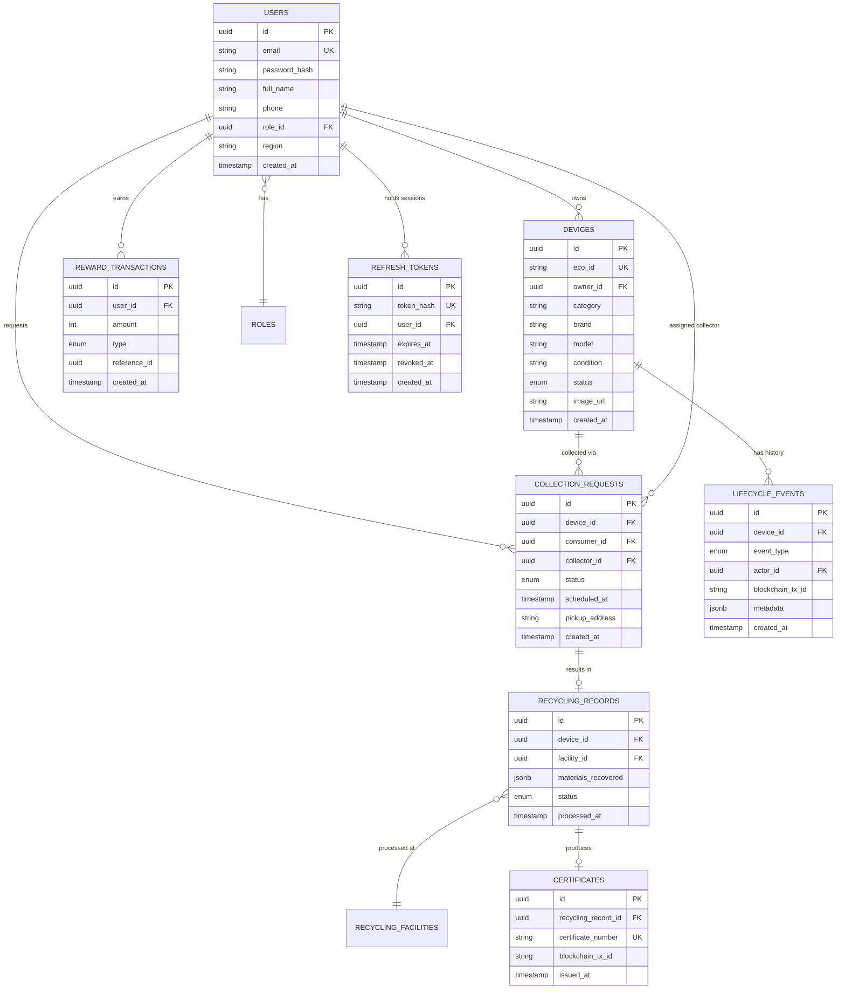

# 04 — Database

# EcoTrace India — Database Design & Standards

Version: 1.0

Status: Active

---

# Table of Contents

1. [Purpose](#purpose)
2. [Technology](#technology)
3. [Design Principles](#design-principles)
4. [Naming Conventions](#naming-conventions)
5. [Entity Model](#entity-model)
6. [Core Entities](#core-entities)
7. [Enumerations](#enumerations)
8. [Migration Policy](#migration-policy)
9. [Data Integrity Rules](#data-integrity-rules)
10. [Security & Access](#security--access)
11. [Seed Data](#seed-data)

---

# Purpose

This document defines the relational data model, conventions, and change-management rules for the EcoTrace India database.

PostgreSQL is the **system of record** for all application data (see `03_ARCHITECTURE.md` → ADR-003). The blockchain stores only verification events (`09_BLOCKCHAIN.md`).

---

# Technology

- **Database:** PostgreSQL (v15+)
- **ORM:** Prisma (schema at `backend/prisma/schema.prisma`)
- **Migrations:** Prisma Migrate — migrations are generated, reviewed, and committed
- **Reference documentation and seeds:** `database/`

---

# Design Principles

- Normalized relational design (3NF) unless a measured reason exists to denormalize.
- Every table has a UUID primary key (`id`), `created_at`, and `updated_at`.
- Soft state transitions are modeled with status enums, not row deletion.
- Historical/audit data is append-only (e.g., lifecycle events, reward transactions).
- No business logic in the database — no triggers or stored procedures in v1; logic belongs in the backend application layer (`06_BACKEND.md`).

---

# Naming Conventions

| Item | Convention | Example |
|---|---|---|
| Tables | `snake_case`, plural | `collection_requests` |
| Columns | `snake_case` | `scheduled_at` |
| Prisma models | `PascalCase`, singular | `CollectionRequest` |
| Enums | `PascalCase` type, `SCREAMING_SNAKE` values | `DeviceStatus.REGISTERED` |
| Foreign keys | `<entity>_id` | `device_id` |
| Indexes | `idx_<table>_<columns>` | `idx_devices_owner_id` |

---

# Entity Model

This is the **conceptual model**; the Prisma schema is the authoritative physical definition. When they diverge, update this document in the same PR (see `02_PROJECT_RULES.md`).

---

# Core Entities

| Entity | Purpose |
|---|---|
| `users` / `roles` | Accounts for all personas (consumer, collector, recycler, government, admin) with role-based access |
| `refresh_tokens` | Revocable auth sessions; stores **SHA-256 hashes** of refresh tokens (never raw tokens) with expiry and revocation timestamps. Rotated on every refresh; cascade-deleted with the user |
| `devices` | Registered electronic devices; each carries a unique `eco_id` used for QR codes and on-chain identity |
| `collection_requests` | Pickup lifecycle: requested → scheduled → collected |
| `lifecycle_events` | Append-only history of device events; stores the Fabric transaction ID linking off-chain to on-chain |
| `reward_transactions` | Append-only GreenCoin ledger; a user's balance is the sum of transactions |
| `recycling_facilities` | Registered recycler organizations and locations |
| `recycling_records` | Material recovery and processing outcome per device |
| `certificates` | Issued recycling certificates, anchored on-chain |

---

# Enumerations

Canonical enums (mirrored by backend types and on-chain event names):

| Enum | Values |
|---|---|
| `UserRole` | `CONSUMER`, `COLLECTOR`, `RECYCLER`, `GOVERNMENT`, `ADMIN` |
| `DeviceStatus` | `REGISTERED`, `COLLECTION_REQUESTED`, `SCHEDULED`, `COLLECTED`, `RECEIVED`, `RECYCLED` |
| `CollectionStatus` | `REQUESTED`, `ASSIGNED`, `IN_PROGRESS`, `COMPLETED`, `CANCELLED` |
| `LifecycleEventType` | `REGISTERED`, `COLLECTION_REQUESTED`, `COLLECTED`, `RECEIVED`, `RECYCLED`, `CERTIFIED` |
| `RewardType` | `EARNED`, `REDEEMED` |

Changing an enum is a schema change and follows the migration policy below.

---

# Migration Policy

Per `CLAUDE.md` database rules:

1. Every schema change ships with, in the **same PR**:
   - A Prisma migration file
   - Updated Prisma models
   - An update to this document
2. Migrations are **forward-only** in shared environments; never edit an applied migration.
3. **Destructive changes** (dropping tables/columns, narrowing types) require explicit approval and a stated data-preservation plan.
4. Prefer additive, backward-compatible changes: add column → backfill → switch reads → deprecate.
5. Migrations must run cleanly on an empty database (CI verifies this — see `10_TESTING.md`).

---

# Data Integrity Rules

- Foreign keys are enforced at the database level, always.
- `eco_id` and `certificate_number` are unique and immutable once assigned.
- `lifecycle_events` and `reward_transactions` are append-only: no `UPDATE`/`DELETE` paths in application code.
- Status transitions are validated in the application layer against the allowed state machine (`03_ARCHITECTURE.md` → Device Lifecycle Flow).
- Monetary/point amounts are integers (GreenCoins have no fractional unit).

---

# Security & Access

- Only the backend connects to PostgreSQL; clients and the AI service never do (`03_ARCHITECTURE.md`).
- The backend uses a dedicated database role with least privilege (no superuser, no DDL at runtime).
- All access goes through Prisma — parameterized by construction; raw SQL requires review and must use parameter binding.
- Passwords are stored as bcrypt/argon2 hashes only. No plaintext secrets or tokens in any table.
- Personally identifiable information is limited to what registration requires and is never written on-chain.

---

# Seed Data

- Seeds live in `database/seeds/` and provide demo data for IEEE YESIST 2026 demonstrations: sample users per role, devices, collections, and reward history.
- Seeds must be idempotent and must never run against production-like environments automatically.
