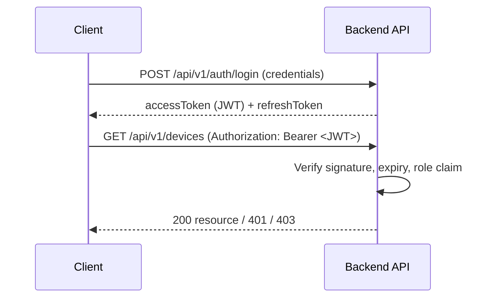

# 05 — API

# EcoTrace India — REST API Standards & Contract

Version: 1.0

Status: Active

---

# Table of Contents

1. [Purpose](#purpose)
2. [General Conventions](#general-conventions)
3. [Versioning](#versioning)
4. [Authentication & Authorization](#authentication--authorization)
5. [Request & Response Format](#request--response-format)
6. [Error Contract](#error-contract)
7. [HTTP Status Codes](#http-status-codes)
8. [Pagination, Filtering & Sorting](#pagination-filtering--sorting)
9. [Endpoint Catalog](#endpoint-catalog)
10. [Internal AI Service API](#internal-ai-service-api)
11. [Validation Rules](#validation-rules)
12. [Documentation Requirements](#documentation-requirements)

---

# Purpose

This document defines the REST API conventions and the endpoint contract exposed by the EcoTrace India backend. All clients (Flutter apps, React dashboard) consume this API exclusively (`03_ARCHITECTURE.md`).

This is a **contract document** — request/response shapes are normative; implementation details belong in `06_BACKEND.md`.

---

# General Conventions

- Base path: `/api/v1`
- Resources are **plural nouns** in kebab-case: `/devices`, `/collection-requests`
- No verbs in URLs; actions are expressed via HTTP method or sub-resources (`POST /devices/{id}/verification`)
- JSON only (`Content-Type: application/json`), UTF-8
- Field names in `camelCase`
- Timestamps in ISO 8601 UTC (`2026-07-20T10:30:00Z`)
- IDs are UUIDs; the public device identifier is the `ecoId`

---

# Versioning

- URL versioning: `/api/v1/...`
- Breaking changes require a new version; `v1` contracts stay backward compatible.
- Additive changes (new optional fields, new endpoints) are non-breaking and allowed within `v1`.
- Deprecations are announced in this document and carried for at least one release cycle.

---

# Authentication & Authorization



- **Scheme:** JWT bearer tokens in the `Authorization` header.
- Access tokens are short-lived; refresh tokens rotate via `POST /auth/refresh`.
- The access JWT carries `sub` (user ID), `email`, and `role` (see `04_DATABASE.md` → `UserRole`). The refresh JWT carries only `sub` and a unique `jti`.
- Refresh tokens are persisted **only as SHA-256 hashes** (`refresh_tokens` table) and are revocable: rotation on refresh, revocation on logout, family-wide revocation on reuse of a rotated token.
- **Role enforcement is server-side per endpoint** (see catalog below). Client-side role checks are UX only, never security.
- Public endpoints: registration, login, health check. Everything else requires authentication.

---

# Request & Response Format

Success envelope:

```json
{
  "success": true,
  "data": { },
  "meta": { "page": 1, "pageSize": 20, "total": 143 }
}
```

- `data` holds the resource or array of resources.
- `meta` appears only on paginated list responses.

---

# Error Contract

All errors — validation, auth, business, server — use one shape:

```json
{
  "success": false,
  "error": {
    "code": "DEVICE_NOT_FOUND",
    "message": "No device exists with the given EcoID.",
    "details": [
      { "field": "ecoId", "issue": "not_found" }
    ]
  }
}
```

- `code` is a stable, SCREAMING_SNAKE machine-readable identifier.
- `message` is safe for display; it never leaks internals (stack traces, SQL, file paths).
- `details` is optional, used mainly for field-level validation errors.

---

# HTTP Status Codes

| Code | Use |
|---|---|
| 200 | Successful read or update |
| 201 | Resource created |
| 204 | Successful delete / no body |
| 400 | Validation failure, malformed request |
| 401 | Missing or invalid authentication |
| 403 | Authenticated but not authorized (wrong role/ownership) |
| 404 | Resource not found |
| 409 | Conflict (duplicate registration, invalid state transition) |
| 422 | Semantically invalid business operation |
| 429 | Rate limit exceeded |
| 500 | Unhandled server error (logged; generic message returned) |

---

# Pagination, Filtering & Sorting

Query parameters on list endpoints:

| Parameter | Example | Default |
|---|---|---|
| `page` | `?page=2` | `1` |
| `pageSize` | `?pageSize=50` | `20` (max `100`) |
| `sort` | `?sort=-createdAt` | endpoint-defined |
| field filters | `?status=COLLECTED&region=TN` | none |

---

# Endpoint Catalog

Role legend: `C` Consumer, `CO` Collector, `R` Recycler, `G` Government, `A` Admin, `*` any authenticated, `pub` public.

## Auth

| Method | Path | Roles | Description |
|---|---|---|---|
| POST | `/auth/register` | pub | Create consumer account |
| POST | `/auth/login` | pub | Obtain access + refresh tokens |
| POST | `/auth/refresh` | pub | Rotate tokens |
| POST | `/auth/logout` | pub | Revoke a refresh token (idempotent) |
| GET | `/auth/me` | * | Current user profile |

### POST /auth/register — 201

Request:

```json
{
  "email": "asha@example.com",
  "password": "s3cure-password",
  "confirmPassword": "s3cure-password",
  "fullName": "Asha Kumar",
  "phone": "9876543210",
  "region": "TN"
}
```

`phone` and `region` are optional. Passwords: 8–128 chars; `confirmPassword` must match. Duplicate email → `409 CONFLICT`.

Response `data`:

```json
{
  "user": {
    "id": "uuid",
    "fullName": "Asha Kumar",
    "email": "asha@example.com",
    "phone": "9876543210",
    "region": "TN",
    "role": "CONSUMER",
    "emailVerified": false,
    "createdAt": "2026-07-22T10:30:00.000Z"
  },
  "accessToken": "<jwt>",
  "refreshToken": "<jwt>"
}
```

### POST /auth/login — 200

Request: `{ "email": "...", "password": "..." }`. Response `data`: same shape as register.
Invalid credentials → `401 UNAUTHORIZED` with a generic message (no user enumeration). Deactivated accounts are rejected.

### POST /auth/refresh — 200

Request: `{ "refreshToken": "<jwt>" }`. Response `data`: `{ "accessToken": "<jwt>", "refreshToken": "<jwt>" }`.
Refresh tokens are **single-use**: each refresh revokes the presented token and issues a new pair. Reusing a rotated token revokes **all** of the user's sessions and returns `401`. Invalid/expired/unknown tokens → `401`.

### POST /auth/logout — 200

Request: `{ "refreshToken": "<jwt>" }`. Response `data`: `{ "loggedOut": true }`.
Idempotent — unknown or already-revoked tokens still return `200`.

### GET /auth/me — 200

Requires `Authorization: Bearer <accessToken>`. Response `data`: the `user` object shape from register.
Missing/invalid token → `401`.


## Devices

| Method | Path | Roles | Description |
|---|---|---|---|
| POST | `/devices` | C | Register device; triggers AI classification and EcoID generation |
| GET | `/devices` | * | List own devices (admin: all, filterable) |
| GET | `/devices/{ecoId}` | * | Device detail with lifecycle history |
| GET | `/devices/{ecoId}/qr` | C, A | QR code payload for the device |
| GET | `/devices/{ecoId}/history` | * | Lifecycle events incl. blockchain tx references |

## Collection

| Method | Path | Roles | Description |
|---|---|---|---|
| POST | `/collection-requests` | C | Request pickup for a device |
| GET | `/collection-requests` | C, CO, A | List (scoped by role) |
| PATCH | `/collection-requests/{id}/assign` | A | Assign a collector |
| PATCH | `/collection-requests/{id}/status` | CO | Update status (state machine enforced) |
| POST | `/collection-requests/{id}/verify` | CO | Verify device at pickup (QR scan) |

## Recycling

| Method | Path | Roles | Description |
|---|---|---|---|
| POST | `/recycling/intake` | R | Record device intake at facility |
| POST | `/recycling/{deviceId}/process` | R | Record material recovery & completion |
| GET | `/recycling/records` | R, G, A | Processing reports |
| GET | `/certificates/{certificateNumber}` | * | Verify a recycling certificate |

## Rewards

| Method | Path | Roles | Description |
|---|---|---|---|
| GET | `/rewards/balance` | C | GreenCoin balance |
| GET | `/rewards/transactions` | C | Reward history |
| POST | `/rewards/redeem` | C | Redeem GreenCoins |

## Analytics

| Method | Path | Roles | Description |
|---|---|---|---|
| GET | `/analytics/overview` | G, A | National statistics |
| GET | `/analytics/regions` | G, A | Regional breakdown / heatmap data |
| GET | `/analytics/forecast` | G, A | AI demand forecast (proxied from AI service) |
| GET | `/analytics/environmental-impact` | G, A | Impact metrics |

## System

| Method | Path | Roles | Description |
|---|---|---|---|
| GET | `/health` | pub | Liveness/readiness for deployment (`11_DEPLOYMENT.md`) |

---

# Internal AI Service API

The AI service (`08_AI.md`) exposes an internal HTTP API consumed **only by the backend** — never by clients:

| Method | Path | Description |
|---|---|---|
| POST | `/internal/classify` | Device image → category, condition, confidence |
| POST | `/internal/forecast` | Historical volumes → demand forecast |
| POST | `/internal/fraud-check` | Transaction context → fraud risk score |
| GET | `/internal/health` | Service health |

Internal APIs follow the same envelope and error contract as the public API.

---

# Validation Rules

- Every endpoint validates its request body, params, and query with a schema (Zod on the backend — see `06_BACKEND.md`).
- Validation failures return `400` with field-level `details`.
- Ownership checks (a consumer can only act on their own devices) are enforced in the application layer and return `403` on violation.
- State transitions (device, collection) are validated against the canonical enums in `04_DATABASE.md`; invalid transitions return `409`.

---

# Documentation Requirements

Per `CLAUDE.md` API rules:

- Every new or changed endpoint updates this catalog **in the same PR**.
- Each endpoint's implementation must match the documented roles, status codes, and shapes.
- An OpenAPI specification generated from the backend is a planned enhancement (`12_ROADMAP.md`); until then, this document is the contract.
