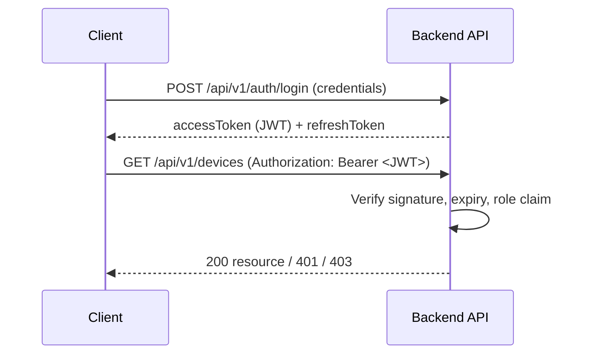

# 05 — API

# EcoTrace India — REST API Standards & Contract

Version: 1.0

Status: Active

---

# Table of Contents

1. [Purpose](#purpose)
2. [General Conventions](#general-conventions)
3. [Versioning](#versioning)
4. [Authentication & Authorization](#authentication--authorization)
5. [Request & Response Format](#request--response-format)
6. [Error Contract](#error-contract)
7. [HTTP Status Codes](#http-status-codes)
8. [Pagination, Filtering & Sorting](#pagination-filtering--sorting)
9. [Endpoint Catalog](#endpoint-catalog)
10. [Internal AI Service API](#internal-ai-service-api)
11. [Validation Rules](#validation-rules)
12. [Documentation Requirements](#documentation-requirements)

---

# Purpose

This document defines the REST API conventions and the endpoint contract exposed by the EcoTrace India backend. All clients (Flutter apps, React dashboard) consume this API exclusively (`03_ARCHITECTURE.md`).

This is a **contract document** — request/response shapes are normative; implementation details belong in `06_BACKEND.md`.

---

# General Conventions

- Base path: `/api/v1`
- Resources are **plural nouns** in kebab-case: `/devices`, `/collection-requests`
- No verbs in URLs; actions are expressed via HTTP method or sub-resources (`POST /devices/{id}/verification`)
- JSON only (`Content-Type: application/json`), UTF-8
- Field names in `camelCase`
- Timestamps in ISO 8601 UTC (`2026-07-20T10:30:00Z`)
- IDs are UUIDs; the public device identifier is the `ecoId`

---

# Versioning

- URL versioning: `/api/v1/...`
- Breaking changes require a new version; `v1` contracts stay backward compatible.
- Additive changes (new optional fields, new endpoints) are non-breaking and allowed within `v1`.
- Deprecations are announced in this document and carried for at least one release cycle.

---

# Authentication & Authorization



- **Scheme:** JWT bearer tokens in the `Authorization` header.
- Access tokens are short-lived; refresh tokens rotate via `POST /auth/refresh`.
- The access JWT carries `sub` (user ID), `email`, and `role` (see `04_DATABASE.md` → `UserRole`). The refresh JWT carries only `sub` and a unique `jti`.
- Refresh tokens are persisted **only as SHA-256 hashes** (`refresh_tokens` table) and are revocable: rotation on refresh, revocation on logout, family-wide revocation on reuse of a rotated token.
- **Role enforcement is server-side per endpoint** (see catalog below). Client-side role checks are UX only, never security.
- Public endpoints: registration, login, health check. Everything else requires authentication.

---

# Request & Response Format

Success envelope:

```json
{
  "success": true,
  "data": {},
  "meta": { "page": 1, "pageSize": 20, "total": 143 }
}
```

- `data` holds the resource or array of resources.
- `meta` appears only on paginated list responses.

---

# Error Contract

All errors — validation, auth, business, server — use one shape:

```json
{
  "success": false,
  "error": {
    "code": "DEVICE_NOT_FOUND",
    "message": "No device exists with the given EcoID.",
    "details": [{ "field": "ecoId", "issue": "not_found" }]
  }
}
```

- `code` is a stable, SCREAMING_SNAKE machine-readable identifier.
- `message` is safe for display; it never leaks internals (stack traces, SQL, file paths).
- `details` is optional, used mainly for field-level validation errors.
- Known database (Prisma) errors are translated centrally by the global error handler into semantic responses with safe, generic messages: a unique-constraint violation (`P2002`) → `409 CONFLICT`; a missing required record (`P2025`) → `404 NOT_FOUND`. Any other Prisma error remains a generic `500` (logged server-side; internals never returned).

---

# HTTP Status Codes

| Code | Use                                                         |
| ---- | ----------------------------------------------------------- |
| 200  | Successful read or update                                   |
| 201  | Resource created                                            |
| 204  | Successful delete / no body                                 |
| 400  | Validation failure, malformed request                       |
| 401  | Missing or invalid authentication                           |
| 403  | Authenticated but not authorized (wrong role/ownership)     |
| 404  | Resource not found                                          |
| 409  | Conflict (duplicate registration, invalid state transition) |
| 422  | Semantically invalid business operation                     |
| 429  | Rate limit exceeded                                         |
| 500  | Unhandled server error (logged; generic message returned)   |

---

# Pagination

List endpoints use validated offset-based pagination via query parameters:

| Parameter | Example      | Default | Constraints            |
| --------- | ------------ | ------- | ---------------------- |
| `limit`   | `?limit=25`  | `50`    | integer, `1`–`100`     |
| `offset`  | `?offset=40` | `0`     | integer, `>= 0`        |

Both parameters are optional and coerced from the query string; a request that
omits them returns the first 50 rows. Out-of-range or non-numeric values fail
validation and return `400 VALIDATION_ERROR`. Results keep the standard
response envelope — `data` is the row array (no wrapper `meta` block); ordering
is `createdAt` descending (newest first) and is not client-configurable.

Endpoints supporting pagination:

- `GET /submissions`
- `GET /collector/submissions`
- `GET /recycler/submissions`
- `GET /rewards/history`

Sorting and field filtering are not yet implemented.

---

# Endpoint Catalog

Role legend: `C` Consumer, `CO` Collector, `R` Recycler, `G` Government, `A` Admin, `*` any authenticated, `pub` public.

## Auth

| Method | Path             | Roles | Description                         |
| ------ | ---------------- | ----- | ----------------------------------- |
| POST   | `/auth/register` | pub   | Create consumer account             |
| POST   | `/auth/login`    | pub   | Obtain access + refresh tokens      |
| POST   | `/auth/refresh`  | pub   | Rotate tokens                       |
| POST   | `/auth/logout`   | pub   | Revoke a refresh token (idempotent) |
| GET    | `/auth/me`       | *     | Current user profile                |

### POST /auth/register — 201

Request:

```json
{
  "email": "asha@example.com",
  "password": "s3cure-password",
  "confirmPassword": "s3cure-password",
  "fullName": "Asha Kumar",
  "phone": "9876543210",
  "region": "TN"
}
```

`phone` and `region` are optional. Passwords: 8–128 chars; `confirmPassword` must match. Duplicate email → `409 CONFLICT`.

Response `data`:

```json
{
  "user": {
    "id": "uuid",
    "fullName": "Asha Kumar",
    "email": "asha@example.com",
    "phone": "9876543210",
    "region": "TN",
    "role": "CONSUMER",
    "emailVerified": false,
    "createdAt": "2026-07-22T10:30:00.000Z"
  },
  "accessToken": "<jwt>",
  "refreshToken": "<jwt>"
}
```

### POST /auth/login — 200

Request: `{ "email": "...", "password": "..." }`. Response `data`: same shape as register.
Invalid credentials → `401 UNAUTHORIZED` with a generic message (no user enumeration). Deactivated accounts are rejected.

### POST /auth/refresh — 200

Request: `{ "refreshToken": "<jwt>" }`. Response `data`: `{ "accessToken": "<jwt>", "refreshToken": "<jwt>" }`.
Refresh tokens are **single-use**: each refresh revokes the presented token and issues a new pair. Reusing a rotated token revokes **all** of the user's sessions and returns `401`. Invalid/expired/unknown tokens → `401`.

### POST /auth/logout — 200

Request: `{ "refreshToken": "<jwt>" }`. Response `data`: `{ "loggedOut": true }`.
Idempotent — unknown or already-revoked tokens still return `200`.

### GET /auth/me — 200

Requires `Authorization: Bearer <accessToken>`. Response `data`: the `user` object shape from register.
Missing/invalid token → `401`.

## Submissions

E-waste pickup submissions created by consumers, plus the collector workflow
that drives a submission from assignment through collection, and the recycler
workflow that continues it through processing. Consumers create and manage their
own submissions; Admin/Government assign a collector and later a recycler; the
assigned collector accepts, starts, and completes the pickup; the assigned
recycler then processes the collected e-waste and records material recovery.

| Method | Path                                 | Roles | Description                                                     |
| ------ | ------------------------------------ | ----- | --------------------------------------------------------------- |
| POST   | `/submissions`                       | C     | Create an e-waste pickup submission (status `PENDING`)          |
| GET    | `/submissions`                       | *     | List submissions (consumer: own only; admin: all)               |
| GET    | `/submissions/{id}`                  | *     | Submission detail (owner or admin only)                         |
| PATCH  | `/submissions/{id}`                  | *     | Update a submission (owner while `PENDING`; admin always)       |
| DELETE | `/submissions/{id}`                  | *     | Delete a submission (owner while `PENDING`; admin always)       |
| PATCH  | `/submissions/{id}/assign`           | A, G  | Assign a collector (`PENDING → ASSIGNED`)                       |
| PATCH  | `/submissions/{id}/accept`           | CO    | Assigned collector accepts (`ASSIGNED → ACCEPTED`)              |
| PATCH  | `/submissions/{id}/start`            | CO    | Assigned collector starts pickup (`ACCEPTED → IN_PROGRESS`)     |
| PATCH  | `/submissions/{id}/complete`         | CO    | Assigned collector completes pickup (`IN_PROGRESS → COLLECTED`) |
| GET    | `/collector/submissions`             | CO    | Collector dashboard: own active assignments, newest first       |
| PATCH  | `/submissions/{id}/assign-recycler`  | A, G  | Assign a recycler to a collected submission                     |
| PATCH  | `/submissions/{id}/recycle/start`    | R     | Assigned recycler starts processing (`COLLECTED → RECYCLING`)   |
| PATCH  | `/submissions/{id}/recycle/complete` | R     | Assigned recycler records recovery (`RECYCLING → RECYCLED`)     |
| GET    | `/recycler/submissions`              | R     | Recycler dashboard: own active assignments, newest first        |

`SubmissionStatus`: `PENDING`, `ASSIGNED`, `ACCEPTED`, `IN_PROGRESS`, `COLLECTED`, `RECYCLING`, `RECYCLED`, `COMPLETED`, `REJECTED` (see `04_DATABASE.md`).

**Submission state machine.** Status changes are governed by a single
transition validator in the submission service:

```
PENDING → ASSIGNED → ACCEPTED → IN_PROGRESS → COLLECTED → RECYCLING → RECYCLED
```

Any transition not on this path is rejected with `409 CONFLICT`. An Admin may
override and (re)assign a submission — collector or recycler — regardless of its
current status; Government must follow the strict path (collector assignment
only while `PENDING`; recycler assignment only while `COLLECTED`).

### POST /submissions — 201

Consumer-only. Request:

```json
{
  "category": "Laptop",
  "description": "Old work laptop",
  "estimatedWeight": 2.5,
  "address": "12 MG Road, Bengaluru",
  "latitude": 12.9716,
  "longitude": 77.5946,
  "imageUrls": ["https://cdn.example.com/a.jpg"]
}
```

`description` and `imageUrls` are optional. `estimatedWeight` must be positive; `latitude` ∈ [-90, 90]; `longitude` ∈ [-180, 180]. The owner and `PENDING` status are set server-side; any client-supplied status is ignored. Non-consumer roles → `403`.

Response `data`:

```json
{
  "id": "uuid",
  "userId": "uuid",
  "category": "Laptop",
  "description": "Old work laptop",
  "estimatedWeight": 2.5,
  "address": "12 MG Road, Bengaluru",
  "latitude": 12.9716,
  "longitude": 77.5946,
  "imageUrls": ["https://cdn.example.com/a.jpg"],
  "status": "PENDING",
  "assignedCollectorId": null,
  "assignedRecyclerId": null,
  "pickupScheduledAt": null,
  "completedAt": null,
  "processingStartedAt": null,
  "recycledAt": null,
  "recyclerNotes": null,
  "recoveredWeight": null,
  "materialRecovery": null,
  "createdAt": "2026-07-22T10:30:00.000Z",
  "updatedAt": "2026-07-22T10:30:00.000Z"
}
```

### GET /submissions — 200

Response `data`: an array of submission objects, newest first. A consumer receives only their own submissions; an admin receives all. Supports `limit`/`offset` pagination (see [Pagination](#pagination)).

### GET /submissions/{id} — 200

Response `data`: a single submission object. A consumer may read only their own submission; an admin may read any. To avoid leaking existence, a submission owned by another user returns `404`, not `403`.

### PATCH /submissions/{id} — 200

Partial update; at least one editable field must be provided (`category`, `description`, `estimatedWeight`, `address`, `latitude`, `longitude`, `imageUrls`). Owners may edit only while `status == PENDING`; an admin may edit at any time. Owner editing after assignment → `403`. Non-owner (non-admin) → `404`. Response `data`: the updated submission object.

### DELETE /submissions/{id} — 204

No response body. Owners may delete only while `status == PENDING`; an admin may delete at any time. Owner deleting after assignment → `403`. Non-owner (non-admin) → `404`.

### PATCH /submissions/{id}/assign — 200

Admin/Government only (`403` for any other role — a collector can never assign, including themselves). Request:

```json
{ "collectorId": "uuid" }
```

`collectorId` is required and must be a UUID naming an **active** user with the `COLLECTOR` role; otherwise `404 NOT_FOUND` (`Collector not found.`). An unknown submission → `404`. Government assigning a submission that is not `PENDING` → `409 CONFLICT`; an Admin may override and assign at any status. On success the submission moves to `ASSIGNED` with `assignedCollectorId` set. Response `data`: the updated submission object.

### PATCH /submissions/{id}/accept — 200

Collector only. The caller must be the assigned collector, else `404` (a collector must not learn about submissions that are not theirs). Requires `status == ASSIGNED`, else `409`. Moves the submission to `ACCEPTED`.

### PATCH /submissions/{id}/start — 200

Collector only, assigned collector only (`404` otherwise). Requires `status == ACCEPTED`, else `409`. Moves the submission to `IN_PROGRESS` and stamps `pickupScheduledAt` with the server clock.

### PATCH /submissions/{id}/complete — 200

Collector only, assigned collector only (`404` otherwise). Requires `status == IN_PROGRESS`, else `409`. Moves the submission to `COLLECTED`.

The three transition endpoints carry no request body — only the `:id` path parameter is validated.

### GET /collector/submissions — 200

Collector only. Response `data`: an array of the authenticated collector's **active** assignments — submissions in `ASSIGNED`, `ACCEPTED`, or `IN_PROGRESS` assigned to them — newest first. `COLLECTED` and later statuses are excluded. Supports `limit`/`offset` pagination (see [Pagination](#pagination)). Other roles → `403`.

### PATCH /submissions/{id}/assign-recycler — 200

Admin/Government only (`403` for any other role — a recycler can never assign, including themselves). Request:

```json
{ "recyclerId": "uuid" }
```

`recyclerId` is required and must be a UUID naming an **active** user with the `RECYCLER` role; otherwise `404 NOT_FOUND` (`Recycler not found.`). An unknown submission → `404`. Government assigning a submission that is not `COLLECTED` → `409 CONFLICT`; an Admin may override and assign at any status. Assignment sets `assignedRecyclerId` and does **not** change the submission status (the recycler advances it via the transition endpoints below). Response `data`: the updated submission object.

### PATCH /submissions/{id}/recycle/start — 200

Recycler only. The caller must be the assigned recycler, else `404` (a recycler must not learn about submissions that are not theirs). Requires `status == COLLECTED`, else `409`. Moves the submission to `RECYCLING` and stamps `processingStartedAt` with the server clock. Carries no request body — only the `:id` path parameter is validated.

### PATCH /submissions/{id}/recycle/complete — 200

Recycler only, assigned recycler only (`404` otherwise). Requires `status == RECYCLING`, else `409`. Records the recovery outcome and moves the submission to `RECYCLED`, stamping `recycledAt` with the server clock. Request:

```json
{
  "recoveredWeight": 12.5,
  "recyclerNotes": "Separated lithium batteries.",
  "materialRecovery": {
    "plastic": 3.2,
    "metal": 6.1,
    "glass": 3.2
  }
}
```

`recoveredWeight` is required and must be positive. `recyclerNotes` is optional (≤ 2000 chars). `materialRecovery` is an optional object mapping material names to non-negative recovered weights. Response `data`: the updated submission object with `recoveredWeight`, `recyclerNotes`, and `materialRecovery` populated.

### GET /recycler/submissions — 200

Recycler only. Response `data`: an array of the authenticated recycler's **active** assignments — submissions in `COLLECTED` or `RECYCLING` assigned to them — newest first. `RECYCLED` and later statuses are excluded. Supports `limit`/`offset` pagination (see [Pagination](#pagination)). Other roles → `403`.

## Devices

| Method | Path                       | Roles | Description                                                      |
| ------ | -------------------------- | ----- | ---------------------------------------------------------------- |
| POST   | `/devices`                 | C     | Register device; triggers AI classification and EcoID generation |
| GET    | `/devices`                 | *     | List own devices (admin: all, filterable)                        |
| GET    | `/devices/{ecoId}`         | *     | Device detail with lifecycle history                             |
| GET    | `/devices/{ecoId}/qr`      | C, A  | QR code payload for the device                                   |
| GET    | `/devices/{ecoId}/history` | *     | Lifecycle events incl. blockchain tx references                  |

## Collection

| Method | Path                               | Roles    | Description                            |
| ------ | ---------------------------------- | -------- | -------------------------------------- |
| POST   | `/collection-requests`             | C        | Request pickup for a device            |
| GET    | `/collection-requests`             | C, CO, A | List (scoped by role)                  |
| PATCH  | `/collection-requests/{id}/assign` | A        | Assign a collector                     |
| PATCH  | `/collection-requests/{id}/status` | CO       | Update status (state machine enforced) |
| POST   | `/collection-requests/{id}/verify` | CO       | Verify device at pickup (QR scan)      |

## Recycling

| Method | Path                                | Roles   | Description                           |
| ------ | ----------------------------------- | ------- | ------------------------------------- |
| POST   | `/recycling/intake`                 | R       | Record device intake at facility      |
| POST   | `/recycling/{deviceId}/process`     | R       | Record material recovery & completion |
| GET    | `/recycling/records`                | R, G, A | Processing reports                    |
| GET    | `/certificates/{certificateNumber}` | *       | Verify a recycling certificate        |

## Rewards

| Method | Path                    | Roles | Description       |
| ------ | ----------------------- | ----- | ----------------- |
| GET    | `/rewards/balance`      | C     | GreenCoin balance |
| GET    | `/rewards/transactions` | C     | Reward history    |
| POST   | `/rewards/redeem`       | C     | Redeem GreenCoins |

## Analytics

| Method | Path                              | Roles | Description                                  |
| ------ | --------------------------------- | ----- | -------------------------------------------- |
| GET    | `/analytics/overview`             | G, A  | National statistics                          |
| GET    | `/analytics/regions`              | G, A  | Regional breakdown / heatmap data            |
| GET    | `/analytics/forecast`             | G, A  | AI demand forecast (proxied from AI service) |
| GET    | `/analytics/environmental-impact` | G, A  | Impact metrics                               |

## System

| Method | Path      | Roles | Description                                            |
| ------ | --------- | ----- | ------------------------------------------------------ |
| GET    | `/health` | pub   | Liveness/readiness for deployment (`11_DEPLOYMENT.md`) |

---

# Internal AI Service API

The AI service (`08_AI.md`) exposes an internal HTTP API consumed **only by the backend** — never by clients:

| Method | Path                    | Description                                    |
| ------ | ----------------------- | ---------------------------------------------- |
| POST   | `/internal/classify`    | Device image → category, condition, confidence |
| POST   | `/internal/forecast`    | Historical volumes → demand forecast           |
| POST   | `/internal/fraud-check` | Transaction context → fraud risk score         |
| GET    | `/internal/health`      | Service health                                 |

Internal APIs follow the same envelope and error contract as the public API.

---

# Validation Rules

- Every endpoint validates its request body, params, and query with a schema (Zod on the backend — see `06_BACKEND.md`).
- Validation failures return `400` with field-level `details`.
- Ownership checks (a consumer can only act on their own devices) are enforced in the application layer and return `403` on violation.
- State transitions (device, collection) are validated against the canonical enums in `04_DATABASE.md`; invalid transitions return `409`.

---

# Documentation Requirements

Per `CLAUDE.md` API rules:

- Every new or changed endpoint updates this catalog **in the same PR**.
- Each endpoint's implementation must match the documented roles, status codes, and shapes.
- An OpenAPI specification generated from the backend is a planned enhancement (`12_ROADMAP.md`); until then, this document is the contract.
