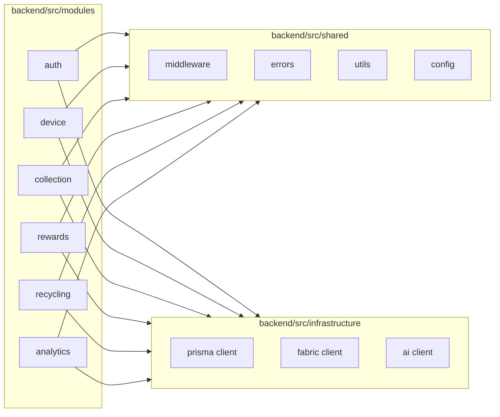

# 06 — Backend

# EcoTrace India — Backend Engineering Standards

Version: 1.0

Status: Active

---

# Table of Contents

1. [Purpose](#purpose)
2. [Technology](#technology)
3. [Module Structure](#module-structure)
4. [Internal Layering](#internal-layering)
5. [Directory Layout](#directory-layout)
6. [Coding Standards](#coding-standards)
7. [Validation](#validation)
8. [Error Handling](#error-handling)
9. [Authentication Middleware](#authentication-middleware)
10. [External Integrations](#external-integrations)
11. [Logging](#logging)
12. [Configuration](#configuration)
13. [Testing Expectations](#testing-expectations)

---

# Purpose

This document defines how the EcoTrace India backend is structured and written. The API contract it implements is defined in `05_API.md`; the architecture it fits into is defined in `03_ARCHITECTURE.md`.

---

# Technology

- **Runtime:** Node.js (LTS)
- **Framework:** Express.js
- **Language:** TypeScript, `strict: true`
- **ORM:** Prisma (see `04_DATABASE.md`)
- **Validation:** Zod
- **Logging:** Pino (`pino-http` for request logging)
- **Auth:** JWT (`jsonwebtoken`), bcrypt/argon2 for password hashing
- **Testing:** Jest + Supertest (see `10_TESTING.md`)
- **Tooling:** ESLint, Prettier, Husky + lint-staged (pre-commit)

Husky hooks are installed via `backend/.husky/install.mjs` (the `prepare` script). The script is a no-op when `NODE_ENV=production`, `CI=true`, or `HUSKY=0`, so Docker image builds and CI runs skip Git hook installation (Husky is a devDependency and is absent in `npm ci --omit=dev` installs).

New runtime dependencies require justification in the PR — prefer the standard library and existing utilities (`AGENTS.md` → Repository Awareness).

---

# Module Structure

The backend is a modular monolith (`03_ARCHITECTURE.md` → ADR-001) organized by **business module**, not by technical type:



Rules:

- Modules communicate through their **service interfaces**, never by importing another module's repository or controller.
- Shared code lives in `shared/`; if two modules need the same logic, extract it — never duplicate it.
- Infrastructure clients (Prisma, Fabric, AI) are injected into services, not imported directly by domain code.

---

# Internal Layering

Each module follows the layering from `03_ARCHITECTURE.md`:

| Layer | Artifact | Responsibility |
|---|---|---|
| Presentation | `*.routes.ts`, `*.controller.ts` | HTTP wiring, request parsing, response shaping |
| Application | `*.service.ts` | Use cases, orchestration, transactions |
| Domain | `*.types.ts`, domain rules | Entities, state machines, invariants |
| Infrastructure | `*.repository.ts`, clients | Prisma queries, Fabric submission, AI calls |

- Controllers contain **no business logic** — they validate, delegate to a service, and map the result to the response envelope.
- Services contain **no Express types** — they are framework-agnostic and unit-testable.
- Repositories are the only place Prisma is used.

---

# Directory Layout

```
backend/
├── prisma/
│   ├── schema.prisma
│   └── migrations/
├── src/
│   ├── app.ts                 # Express app assembly
│   ├── server.ts              # Entry point
│   ├── modules/
│   │   ├── auth/
│   │   │   ├── auth.routes.ts
│   │   │   ├── auth.controller.ts
│   │   │   ├── auth.service.ts
│   │   │   ├── auth.repository.ts
│   │   │   └── auth.types.ts
│   │   ├── device/
│   │   ├── collection/
│   │   ├── rewards/
│   │   ├── recycling/
│   │   └── analytics/
│   ├── shared/
│   │   ├── middleware/        # auth, validation, error handler, rate limit
│   │   ├── errors/            # AppError hierarchy, error codes
│   │   ├── utils/
│   │   └── config/            # env parsing & typed config
│   └── infrastructure/
│       ├── prisma/
│       ├── fabric/
│       └── ai/
├── tests/
├── .env.example
├── tsconfig.json
└── package.json
```

---

# Coding Standards

In addition to the cross-cutting rules in `02_PROJECT_RULES.md`:

- `strict` TypeScript; `any` is forbidden except at well-commented boundaries.
- Explicit return types on exported functions.
- `async/await` only — no raw promise chains or callbacks.
- One class/major concern per file; files stay small.
- Constants and enums mirror the canonical definitions in `04_DATABASE.md` — never re-declare divergent copies.
- Path aliases (`@shared/*`, `@modules/*`) over deep relative imports.

---

# Validation

- Every route validates `body`, `params`, and `query` with a Zod schema before the controller runs (validation middleware).
- Schemas live beside the module (`*.schemas.ts`) and are the single source of request typing (`z.infer`).
- Never trust client input — including IDs: ownership and role checks happen in the service layer (`05_API.md` → Validation Rules).

---

# Error Handling

- A single `AppError` hierarchy carries `code` (stable identifier), `httpStatus`, and a safe `message`.
- A global Express error middleware maps errors to the contract in `05_API.md` → Error Contract.
- Unexpected errors are logged with stack traces server-side and returned as generic `500` responses — internals never leak to clients.
- Services throw typed errors; controllers do not catch except to translate.

---

# Authentication Middleware

- `authenticate` — verifies the JWT, attaches `{ userId, role }` to the request context.
- `authorize(...roles)` — enforces the role table in `05_API.md` → Endpoint Catalog.
- Both are applied at the route level; no endpoint outside the public list may omit them.

---

# Security Headers

- `securityHeaders` (Helmet) is the **first** middleware in the pipeline, so every response — including 404s and error responses — carries HTTP security headers.
- `Content-Security-Policy` is intentionally **disabled**: this service is a JSON REST API, and a restrictive default CSP would break the future Swagger/UI docs page (`{apiPrefix}/docs`). All other Helmet defaults (HSTS, `X-Content-Type-Options`, `X-Frame-Options`, `Referrer-Policy`, etc.) remain enabled.
- `x-powered-by` is disabled separately (`app.disable('x-powered-by')`) to remove the Express fingerprint.

---

# External Integrations

## AI service client (`infrastructure/ai/`)

- Thin typed HTTP client for the internal AI API (`05_API.md` → Internal AI Service API).
- Timeouts and graceful degradation are mandatory: AI unavailability must not fail device registration (`03_ARCHITECTURE.md` → integration rule 4).

## Fabric client (`infrastructure/fabric/`)

- Sole holder of Fabric identities (`03_ARCHITECTURE.md` → ADR-002).
- Submits lifecycle transactions after the database write; failures are queued and retried, and the resulting `blockchain_tx_id` is stored on the `lifecycle_events` row (`04_DATABASE.md`).
- Chaincode contract details: `09_BLOCKCHAIN.md`.

---

# Logging

- Structured JSON logs (level, timestamp, message, correlation ID, module).
- A correlation ID is generated per request and propagated to AI-service calls.
- Never log: passwords, tokens, JWT contents, personal data, request bodies containing secrets.

---

# Configuration

- All configuration is read once at startup from environment variables into a **typed, validated config object** (Zod-parsed); the app fails fast on missing/invalid values.
- No `process.env` access outside `shared/config/`.
- `.env.example` is kept current with every new variable (`02_PROJECT_RULES.md`).

---

# Testing Expectations

Defined fully in `10_TESTING.md`. Backend-specific minimums:

- Services: unit tests with mocked repositories/clients.
- Routes: integration tests via Supertest against a test database.
- State machines (device/collection status): exhaustive transition tests.
- Every bug fix adds a regression test.
