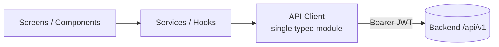

# 07 — Frontend

# EcoTrace India — Frontend Engineering Standards

Version: 1.0

Status: Active

---

# Table of Contents

1. [Purpose](#purpose)
2. [Applications Overview](#applications-overview)
3. [Shared Frontend Rules](#shared-frontend-rules)
4. [Flutter Applications](#flutter-applications)
5. [React Dashboard](#react-dashboard)
6. [API Consumption](#api-consumption)
7. [State Management](#state-management)
8. [UI & Design Standards](#ui--design-standards)
9. [Offline & Error Behavior](#offline--error-behavior)
10. [Testing Expectations](#testing-expectations)

---

# Purpose

This document defines standards for the EcoTrace India client applications: the Flutter mobile apps (`mobile/`) and the React dashboard (`dashboard/`).

Both consume only the backend REST API defined in `05_API.md` (`03_ARCHITECTURE.md` → System Context).

---

# Applications Overview

| Application | Stack | Persona(s) | Key features |
|---|---|---|---|
| Consumer app | Flutter | Consumer | Device registration, EcoID/QR, collection scheduling, GreenCoins, history |
| Collector app | Flutter | Collector | Assigned pickups, route view, QR verification, status updates |
| Recycler portal | Flutter | Recycler | Device intake, material recovery, certification |
| Dashboard | React + Tailwind | Admin, Government | Analytics, heatmaps, reports, user/device management |

The three Flutter experiences are built as **one codebase with role-based flows**, sharing widgets, services, and models — not three separate projects.

---

# Shared Frontend Rules

- Clients are **untrusted**: all authorization is server-side; client role checks are UX only (`05_API.md`).
- No business rules in the UI — the client renders server state and submits intents.
- Never store secrets in client code; tokens go in platform-secure storage (Flutter secure storage; the dashboard keeps tokens out of `localStorage` where feasible, preferring memory + refresh flow).
- All user input is validated client-side for UX **and** re-validated server-side for security.
- Text shown to users is centralized (string constants / i18n-ready), not hardcoded across widgets.

---

# Flutter Applications

## Structure

Feature-first layout with separation of UI and logic (`CLAUDE.md` → Frontend Rules):

```
mobile/
├── lib/
│   ├── main.dart
│   ├── app/                # routing, theming, app shell
│   ├── core/
│   │   ├── api/            # API client, interceptors, token refresh
│   │   ├── models/         # DTOs mirroring 05_API.md shapes
│   │   ├── services/       # business-facing services
│   │   └── widgets/        # shared reusable widgets
│   └── features/
│       ├── auth/
│       ├── devices/
│       ├── collection/
│       ├── rewards/
│       └── recycling/
│           ├── screens/
│           ├── widgets/
│           └── state/
└── test/
```

## Standards

- Screens are thin: layout + wiring only; logic lives in services/state classes.
- Widgets are small and reusable; extract any widget used twice into `core/widgets/`.
- Sound null safety; no `dynamic` in public interfaces.
- `flutter analyze` clean and `dart format` applied (`02_PROJECT_RULES.md`).
- QR generation/scanning is wrapped in a single service so the underlying package can be swapped.

---

# React Dashboard

## Structure

```
dashboard/
├── src/
│   ├── main.tsx
│   ├── app/                # router, providers, layout shell
│   ├── api/                # typed API client & hooks
│   ├── components/         # shared reusable components
│   ├── features/
│   │   ├── analytics/
│   │   ├── users/
│   │   ├── devices/
│   │   ├── collections/
│   │   └── reports/
│   └── lib/                # utilities, formatting, constants
└── tests/
```

## Standards

- Function components + hooks only; TypeScript `strict`.
- Reusable components over duplicated layouts (`CLAUDE.md`); shared layout primitives live in `components/`.
- Tailwind CSS for styling; design tokens (colors, spacing) defined once in the Tailwind config — no inline hex values scattered through components.
- Charts and heatmaps are wrapped in feature-local chart components fed by typed API hooks.

---

# API Consumption



- Exactly **one** API client module per app; no ad-hoc `fetch`/`http` calls from UI code.
- The client attaches the JWT, handles 401 → token refresh → retry, and unwraps the response envelope from `05_API.md`.
- DTO models mirror the API contract; when `05_API.md` changes, models change in the same PR.

---

# State Management

- **Flutter:** a single chosen solution (Provider/Riverpod-style) applied consistently; feature state stays inside its feature folder; only session/auth state is global.
- **React:** server state via query hooks (fetch/cache/invalidate pattern); local UI state via component state; global client state kept minimal (session, theme).
- State is predictable: no hidden mutation, no duplicated caches of the same server data.

---

# UI & Design Standards

- Mobile-first for Flutter; responsive breakpoints for the dashboard.
- Consistent theming from a single theme definition per app.
- Every async interaction shows loading, success, and error states.
- Accessibility basics: touch targets, contrast, semantic labels on interactive elements.

---

# Offline & Error Behavior

- API errors are mapped from the error contract (`05_API.md`) to user-friendly messages; raw error codes are never shown.
- Collector app should tolerate flaky connectivity during pickups: queued status updates retry when connectivity returns (UI marks pending sync).
- Unrecoverable errors surface a retry action, never a dead end.

---

# Testing Expectations

Defined fully in `10_TESTING.md`. Frontend-specific minimums:

- **Flutter:** widget tests for shared widgets and critical screens; unit tests for services.
- **React:** component tests for shared components; hook tests for API hooks.
- Critical user journeys (register device → schedule pickup) covered by end-to-end tests where practical.
