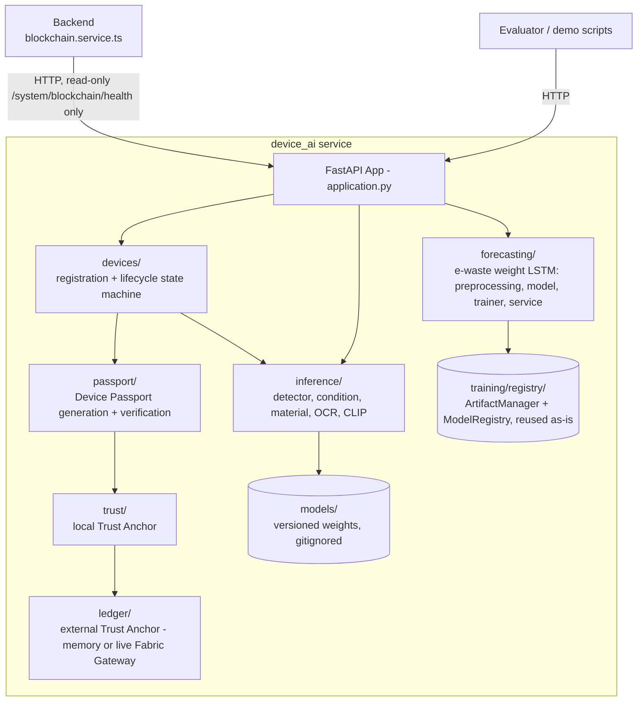

# 08 — AI

# EcoTrace India — AI Engineering Standards

Version: 1.0

Status: Active

---

# Table of Contents

1. [Purpose](#purpose)
2. [AI Capabilities](#ai-capabilities)
3. [Service Architecture](#service-architecture)
4. [Directory Layout](#directory-layout)
5. [Pipeline Separation](#pipeline-separation)
6. [Model Management](#model-management)
7. [API Surface](#api-surface)
8. [Data & Datasets](#data--datasets)
9. [Evaluation Standards](#evaluation-standards)
10. [Degradation & Fallbacks](#degradation--fallbacks)
11. [Coding Standards](#coding-standards)
12. [Testing Expectations](#testing-expectations)

---

# Purpose

This document defines how the AI components of EcoTrace India are designed, structured, and integrated. The AI service is an independent Python service (`03_ARCHITECTURE.md` → ADR-004) consumed only by the backend.

Governing principles (`CLAUDE.md`, `AGENTS.md`): AI modules are modular, independently testable, keep business logic out of models, separate preprocessing from inference, and never hardcode model paths.

---

# AI Capabilities

| Capability | Model / Technique | Consumer |
|---|---|---|
| Device image classification | YOLOv8 (fine-tuned) | Device registration flow |
| Device condition assessment | OpenCV features + classifier | Device registration flow |
| E-waste demand forecasting (P10.1) | Small LSTM (PyTorch), 1 layer + Dense(1) | Government analytics (`GET /analytics/forecast`) |
| Fraud detection | Rule-based + statistical scoring (v1) | Collection & reward flows |

Scope note: v1 favors simple, explainable approaches; deep-learning fraud models are future roadmap (`12_ROADMAP.md`).

---

# Service Architecture

**Corrected P8.9**: the diagram and directory layout below previously
described an early `classification`/`forecasting`/`fraud`-module
architecture that was never built. The service that actually shipped
(P5–P7, verified live through P8.5–P8.8) is `intelligence/device_ai/` — a
device registration → intelligence enrichment → passport → local trust
anchor → external (blockchain-abstraction) trust anchor lifecycle, not a
classify/forecast/fraud-check API:



**P10.1**: `forecasting/` (added alongside the lifecycle above, not replacing it)
implements the one exception to "not a classify/forecast/fraud-check API"
above — a real e-waste demand forecast, reached via
`POST /forecast/ewaste` and proxied by the backend's
`GET /analytics/forecast` (`05_API.md`). It reuses the existing training
platform's `ArtifactManager`/`ModelRegistry` (`training/registry/`, M1.3) for
checkpoint/provenance storage rather than duplicating that infrastructure,
but does not use `BaseTrainer` — a tiny LSTM trained in well under a second
does not need that abstraction's callback/experiment-tracking ceremony.

Rules:

- The AI service holds **no business logic** beyond the device lifecycle
  state machine itself — inference answers "what is this device / what
  condition is it in", never a downstream business decision.
- `DEVICE_BACKEND`/`TRUST_ANCHOR_BACKEND` default to `memory`; PostgreSQL
  is available (`database/`, Alembic-migrated, P8.1-verified) but only
  used when explicitly configured — never required for local dev/demo.
- Since P8.7, every route except a small public health/meta allowlist can
  require a shared-secret `X-Service-Api-Key` header
  (`api/service_auth.py`, opt-in, required in production) — see
  `05_API.md` → Internal AI Service API → Service authentication.

---

# Directory Layout

```
intelligence/device_ai/
├── app.py                    # ASGI entrypoint (uvicorn device_ai.app:app)
├── application.py            # FastAPI app factory: middleware, routers
├── api/                      # route modules: routes.py (meta/predict),
│                              # device_routes.py, blockchain_routes.py,
│                              # fingerprint_routes.py, ocr_routes.py,
│                              # dataset_routes.py, service_auth.py (P8.7)
├── devices/                  # registration + lifecycle state machine
├── inference/                # detector/condition/material/OCR/CLIP models
├── passport/                 # Device Passport generation + verification
├── trust/                    # local Trust Anchor
├── ledger/                   # external Trust Anchor (memory | Fabric Gateway)
├── fusion/, recoverability/, components/, materials/,
│   circular/, decision/, environmental/, integrity/  # internal-only
│                              # deterministic engines, no HTTP endpoints
├── database/                 # SQLAlchemy models + session (Postgres-backed
│                              # option; alembic/ holds the migration chain)
├── configs/                  # Settings (pydantic-settings), .env.example
├── utils/                    # metrics, rate limiting, hashing, request-id
├── training/, evaluation/    # offline tooling, not shipped in the runtime image
├── models/                   # local artifact cache (gitignored)
├── tests/
├── requirements.txt
└── .env.example
```

---

# Pipeline Separation

Per `AGENTS.md`, the following stages are separated and never mixed in one function/module:

| Stage | Lives in | Notes |
|---|---|---|
| Training | `training/` | Reproducible scripts with pinned configs; never part of the served app |
| Preprocessing | `app/<module>/preprocessing.py` | Same code used in training and inference to avoid skew |
| Inference | `app/<module>/inference.py` | Pure: model in, prediction out |
| Evaluation | `evaluation/` | Produces versioned metric reports |

---

# Model Management

- **No hardcoded model paths** (`CLAUDE.md`). Artifact locations come from configuration (environment variables) resolved by the registry module.
- Every artifact is versioned: `<model>-<semver>` with a metadata file (training date, dataset version, metrics).
- The served model version is an explicit config value; upgrading a model is a configuration + documentation change, reviewed like code.
- Model binaries are **not** committed to Git; they are stored as release artifacts / object storage and fetched at build or startup.

---

# API Surface

The API contract is defined normatively in `05_API.md` → Internal AI
Service API — corrected P8.9 to match the real, shipped endpoint list
(§Service Architecture above). Shape conventions:

- Responses include `model_version`/`confidence` on detection results, and
  a request-scoped `request_id` for correlation (`api/middleware.py`).
- Requests are validated with Pydantic schemas; invalid input returns the
  standard error envelope.
- Raw model inference (`inference/`) is stateless and side-effect-free —
  the HTTP endpoints built around it are **not**: `POST /devices/
  register` and the lifecycle/enrich/anchor endpoints genuinely create and
  mutate device records, passports, and trust anchors.

Real response shape (`GET /devices/{id}/passport`, captured live in
P8.5's evidence, `reports/p8_5_evidence/`):

```json
{
  "success": true,
  "passport": {
    "eco_id": "ET-2026-E08AA5A7",
    "device_type": "mouse",
    "carbon": { "carbon_score": 0.446 }
  },
  "request_id": "..."
}
```

---

# Data & Datasets

- Datasets are versioned and documented (source, size, license, preprocessing applied) under `ai/training/datasets.md`.
- No personal data enters training sets; device images are stripped of user-identifying metadata (EXIF) during preprocessing.
- Class labels for device categories mirror the canonical category list used by the backend — one source of truth, referenced not duplicated.

---

# Evaluation Standards

- Every model version ships with an evaluation report: metrics, dataset version, confusion matrix (classification) or error metrics (forecasting: MAPE/RMSE).
- Minimum acceptance thresholds are set per capability before deployment and recorded in the evaluation report.
- A model that regresses against the current production version is not promoted.
- **Forecasting (P10.1) evaluation is real, not asserted**: every train produces
  a chronological (never-shuffled) holdout split, and RMSE/MAE — plus MAPE
  when the holdout has no all-zero actuals — are computed from that split and
  returned in the API response (`forecasting/trainer.py`). No accuracy figure
  is hardcoded. There is currently no automated "reject a regressed forecast
  model" gate (only the classification-side threshold gate above exists) —
  documented here as a known gap, not silently glossed over.

---

# Degradation & Fallbacks

AI is advisory (`03_ARCHITECTURE.md` → integration rule 4):

| Failure | Fallback |
|---|---|
| Classification unavailable / low confidence | Backend flags device for manual categorization; registration proceeds |
| Forecasting: too little real history | `GET /analytics/forecast` returns `status: "INSUFFICIENT_HISTORICAL_DATA"` with a real day-count and reason; the other analytics endpoints (overview/regions/impact) are unaffected |
| Forecasting: torch backend not installed | `status: "MODEL_BACKEND_UNAVAILABLE"` — never a fabricated prediction |
| Forecasting: device_ai unreachable from the backend | `status: "SERVICE_UNAVAILABLE"` (mirrors `blockchain.service.ts`'s existing proxy-unreachable degradation) |
| Fraud service unavailable | Transactions proceed; flagged for retroactive scoring |

The backend, not the AI service, implements these fallbacks (`06_BACKEND.md` → AI client).

---

# Coding Standards

- Python 3.11+, type hints throughout, `mypy` clean, formatted with Black, linted with Ruff (`02_PROJECT_RULES.md`).
- Pinned dependencies in `requirements.txt`.
- Configuration via environment variables parsed once at startup; no `os.environ` scattered through code.
- Logging is structured and never includes raw images or personal data.

---

# Testing Expectations

Defined fully in `10_TESTING.md`. AI-specific minimums:

- Preprocessing: unit tests with fixture images/series.
- Inference: contract tests with a small pinned test model or stub, asserting response schema and determinism.
- API: FastAPI test-client integration tests.
- Evaluation scripts themselves are tested for reproducibility (same input → same metrics).
