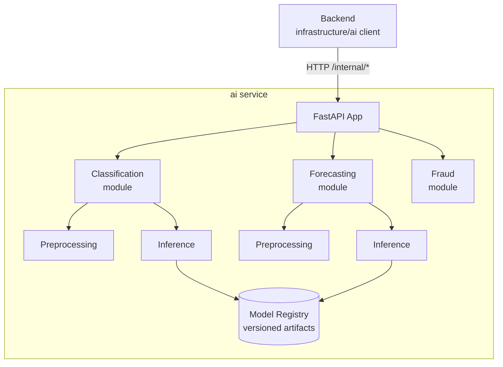

# 08 — AI

# EcoTrace India — AI Engineering Standards

Version: 1.0

Status: Active

---

# Table of Contents

1. [Purpose](#purpose)
2. [AI Capabilities](#ai-capabilities)
3. [Service Architecture](#service-architecture)
4. [Directory Layout](#directory-layout)
5. [Pipeline Separation](#pipeline-separation)
6. [Model Management](#model-management)
7. [API Surface](#api-surface)
8. [Data & Datasets](#data--datasets)
9. [Evaluation Standards](#evaluation-standards)
10. [Degradation & Fallbacks](#degradation--fallbacks)
11. [Coding Standards](#coding-standards)
12. [Testing Expectations](#testing-expectations)

---

# Purpose

This document defines how the AI components of EcoTrace India are designed, structured, and integrated. The AI service is an independent Python service (`03_ARCHITECTURE.md` → ADR-004) consumed only by the backend.

Governing principles (`CLAUDE.md`, `AGENTS.md`): AI modules are modular, independently testable, keep business logic out of models, separate preprocessing from inference, and never hardcode model paths.

---

# AI Capabilities

| Capability | Model / Technique | Consumer |
|---|---|---|
| Device image classification | YOLOv8 (fine-tuned) | Device registration flow |
| Device condition assessment | OpenCV features + classifier | Device registration flow |
| E-waste demand forecasting | Prophet | Government/admin analytics |
| Fraud detection | Rule-based + statistical scoring (v1) | Collection & reward flows |

Scope note: v1 favors simple, explainable approaches; deep-learning fraud models are future roadmap (`12_ROADMAP.md`).

---

# Service Architecture



Rules:

- The AI service holds **no business logic** — it answers "what is this / what will happen / how risky", never "what should the system do". Decisions (e.g., reject a registration) belong to the backend.
- The AI service never accesses PostgreSQL (`03_ARCHITECTURE.md` → integration rule 5). All input arrives in the request.
- Modules (classification, forecasting, fraud) are independent — separate code paths, separate tests, separately deployable behind one app.

---

# Directory Layout

```
ai/
├── app/
│   ├── main.py               # FastAPI assembly
│   ├── api/                  # route definitions (/internal/*)
│   ├── core/                 # config, logging, errors
│   ├── classification/
│   │   ├── preprocessing.py
│   │   ├── inference.py
│   │   └── schemas.py
│   ├── forecasting/
│   ├── fraud/
│   └── registry/             # model loading & versioning
├── training/                 # training scripts & configs (not shipped in image)
├── evaluation/               # evaluation scripts & reports
├── models/                   # local artifact cache (gitignored)
├── tests/
├── requirements.txt
└── .env.example
```

---

# Pipeline Separation

Per `AGENTS.md`, the following stages are separated and never mixed in one function/module:

| Stage | Lives in | Notes |
|---|---|---|
| Training | `training/` | Reproducible scripts with pinned configs; never part of the served app |
| Preprocessing | `app/<module>/preprocessing.py` | Same code used in training and inference to avoid skew |
| Inference | `app/<module>/inference.py` | Pure: model in, prediction out |
| Evaluation | `evaluation/` | Produces versioned metric reports |

---

# Model Management

- **No hardcoded model paths** (`CLAUDE.md`). Artifact locations come from configuration (environment variables) resolved by the registry module.
- Every artifact is versioned: `<model>-<semver>` with a metadata file (training date, dataset version, metrics).
- The served model version is an explicit config value; upgrading a model is a configuration + documentation change, reviewed like code.
- Model binaries are **not** committed to Git; they are stored as release artifacts / object storage and fetched at build or startup.

---

# API Surface

The internal API contract is defined normatively in `05_API.md` → Internal AI Service API. Shape conventions:

- Responses always include `modelVersion` and `confidence` (where applicable) so results are traceable.
- Requests are validated with Pydantic schemas; invalid input returns the standard error envelope.
- Inference endpoints are stateless and side-effect-free.

Example classification response shape (illustrative):

```json
{
  "success": true,
  "data": {
    "category": "SMARTPHONE",
    "condition": "FAIR",
    "confidence": 0.91,
    "modelVersion": "device-clf-1.2.0"
  }
}
```

---

# Data & Datasets

- Datasets are versioned and documented (source, size, license, preprocessing applied) under `ai/training/datasets.md`.
- No personal data enters training sets; device images are stripped of user-identifying metadata (EXIF) during preprocessing.
- Class labels for device categories mirror the canonical category list used by the backend — one source of truth, referenced not duplicated.

---

# Evaluation Standards

- Every model version ships with an evaluation report: metrics, dataset version, confusion matrix (classification) or error metrics (forecasting: MAPE/RMSE).
- Minimum acceptance thresholds are set per capability before deployment and recorded in the evaluation report.
- A model that regresses against the current production version is not promoted.

---

# Degradation & Fallbacks

AI is advisory (`03_ARCHITECTURE.md` → integration rule 4):

| Failure | Fallback |
|---|---|
| Classification unavailable / low confidence | Backend flags device for manual categorization; registration proceeds |
| Forecasting unavailable | Analytics endpoints return historical aggregates without forecast |
| Fraud service unavailable | Transactions proceed; flagged for retroactive scoring |

The backend, not the AI service, implements these fallbacks (`06_BACKEND.md` → AI client).

---

# Coding Standards

- Python 3.11+, type hints throughout, `mypy` clean, formatted with Black, linted with Ruff (`02_PROJECT_RULES.md`).
- Pinned dependencies in `requirements.txt`.
- Configuration via environment variables parsed once at startup; no `os.environ` scattered through code.
- Logging is structured and never includes raw images or personal data.

---

# Testing Expectations

Defined fully in `10_TESTING.md`. AI-specific minimums:

- Preprocessing: unit tests with fixture images/series.
- Inference: contract tests with a small pinned test model or stub, asserting response schema and determinism.
- API: FastAPI test-client integration tests.
- Evaluation scripts themselves are tested for reproducibility (same input → same metrics).
