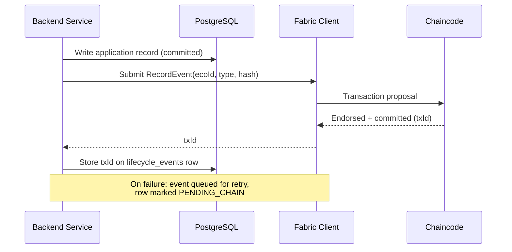

# 09 — Blockchain

# EcoTrace India — Blockchain Engineering Standards

Version: 1.0

Status: Active

---

# Table of Contents

1. [Purpose](#purpose)
2. [Role of the Blockchain](#role-of-the-blockchain)
3. [On-Chain vs Off-Chain Data](#on-chain-vs-off-chain-data)
4. [Network Design](#network-design)
5. [Chaincode Design](#chaincode-design)
6. [Asset & Event Model](#asset--event-model)
7. [Integration with the Backend](#integration-with-the-backend)
8. [Identity & Security](#identity--security)
9. [Failure Handling](#failure-handling)
10. [Directory Layout](#directory-layout)
11. [Testing Expectations](#testing-expectations)

---

# Purpose

This document defines the design and standards for the Hyperledger Fabric layer of EcoTrace India: what goes on-chain, how the network is shaped, and how the backend integrates with it.

Governing rule (`CLAUDE.md`, `AGENTS.md`): the blockchain manages **immutable records, lifecycle events, verification, and audit trails** — nothing else.

---

# Role of the Blockchain

The ledger provides what PostgreSQL cannot: **tamper-evident, independently verifiable history**.

| Concern | System |
|---|---|
| Application state, queries, analytics | PostgreSQL (`04_DATABASE.md`) |
| Immutable lifecycle audit trail | Hyperledger Fabric |
| Certificate verification | Fabric (anchor) + PostgreSQL (detail) |

The ledger is **not** a database. If a feature needs rich queries, mutable state, or large payloads, it belongs off-chain.

---

# On-Chain vs Off-Chain Data

## Stored on-chain

- EcoID (device identity reference)
- Lifecycle event type + timestamp + actor role (not personal identity)
- Hash of the corresponding off-chain record (integrity anchor)
- Certificate number + hash for recycling certificates

## Never stored on-chain

- Personal data (names, emails, phones, addresses)
- Device images or file contents
- GreenCoin balances or reward logic
- Any mutable application state

```mermaid
flowchart LR
    subgraph Off-chain — PostgreSQL
        R[Full record<br/>device, user, collection details]
    end
    subgraph On-chain — Fabric
        E[Event<br/>ecoId, eventType, timestamp,<br/>actorRole, recordHash]
    end
    R -->|SHA-256 hash| E
    E -->|txId stored on| R
```

The hash link makes tampering detectable in either direction: the off-chain row stores the `blockchain_tx_id` (`04_DATABASE.md` → `lifecycle_events`), and the on-chain event stores the record hash.

---

# Network Design

Prototype topology (sized for IEEE YESIST 2026, structured to grow):

| Element | v1 configuration |
|---|---|
| Organizations | `EcoTraceOrg` (platform). Future: recycler & government orgs (`12_ROADMAP.md`) |
| Peers | 1–2 peers, CouchDB state database |
| Ordering service | Raft, single node in dev; 3 nodes in demo/prod profile |
| Channel | `ecotrace-channel` (single channel in v1) |
| Chaincode | `ecotrace-lifecycle` (single contract) |

The network definition (configtx, crypto config, docker compose) lives in `blockchain/network/` and is started via the deployment tooling (`11_DEPLOYMENT.md`).

---

# Chaincode Design

- **Language:** TypeScript (Fabric contract API) — consistent with backend skills.
- **One contract, small surface.** Chaincode validates and records; it does not compute business outcomes.

| Function | Type | Purpose |
|---|---|---|
| `RegisterDevice(ecoId, recordHash)` | submit | Create the on-chain device identity |
| `RecordEvent(ecoId, eventType, recordHash)` | submit | Append a lifecycle event |
| `IssueCertificate(certNumber, ecoId, certHash)` | submit | Anchor a recycling certificate |
| `GetDeviceHistory(ecoId)` | evaluate | Full event history for a device |
| `VerifyCertificate(certNumber)` | evaluate | Certificate existence + hash |

Chaincode rules:

- Validates event ordering (e.g., `RECYCLED` requires prior `COLLECTED`) using the same lifecycle sequence as `04_DATABASE.md` → `LifecycleEventType`.
- Rejects duplicate EcoIDs and duplicate certificate numbers.
- Deterministic only: no timestamps from system clocks (use tx timestamp), no randomness, no external calls.

---

# Asset & Event Model

On-chain event record (illustrative shape):

```json
{
  "ecoId": "ECO-2026-8F3K2A",
  "eventType": "COLLECTED",
  "actorRole": "COLLECTOR",
  "recordHash": "sha256:9f2b…",
  "txTimestamp": "2026-07-20T10:30:00Z"
}
```

- `eventType` values are exactly the `LifecycleEventType` enum from `04_DATABASE.md`. Adding an event type is a cross-cutting change: database enum + chaincode + this document in one PR.
- `actorRole` is a role, never a user identity.

---

# Integration with the Backend

The backend is the **sole Fabric client** (`03_ARCHITECTURE.md` → ADR-002), via `backend/src/infrastructure/fabric/` (`06_BACKEND.md`).



- Database first, ledger second: the user-facing operation succeeds on the database write; the chain write confirms asynchronously if needed (`03_ARCHITECTURE.md` → integration rule 3).
- Clients never see Fabric directly; device history endpoints (`05_API.md`) merge off-chain records with on-chain tx references.

---

# Identity & Security

- Fabric identities (MSP credentials) are issued per environment and held **only** by the backend service; never in client apps, never committed to Git (`02_PROJECT_RULES.md` → Secrets).
- One backend application identity per environment in v1; per-organization identities arrive with multi-org topology (`12_ROADMAP.md`).
- Chaincode endorsement policy: majority of orgs once multi-org; single-org endorsement in v1.
- TLS enabled on all Fabric communications in demo/prod profiles.

---

# Failure Handling

| Failure | Behavior |
|---|---|
| Fabric unreachable at write time | Event queued (outbox in PostgreSQL), retried with backoff; row marked `PENDING_CHAIN` |
| Transaction rejected (validation) | Logged and surfaced as an integrity alert — indicates a state divergence bug, not retried blindly |
| Hash mismatch on verification | Surfaced as a tamper alert in the admin dashboard |

The retry queue drains in order per device to preserve event sequence.

---

# Directory Layout

```
blockchain/
├── network/            # configtx, crypto-config, compose profiles
├── chaincode/
│   └── ecotrace-lifecycle/
│       ├── src/
│       └── test/
├── scripts/            # channel creation, chaincode deploy
└── docs/               # network runbooks
```

---

# Testing Expectations

Defined fully in `10_TESTING.md`. Blockchain-specific minimums:

- Chaincode unit tests with a mocked stub: happy paths, ordering violations, duplicates.
- Integration tests against a local dev network for submit → query round-trips.
- Backend Fabric client tests with the network faked, covering the retry/outbox path.
