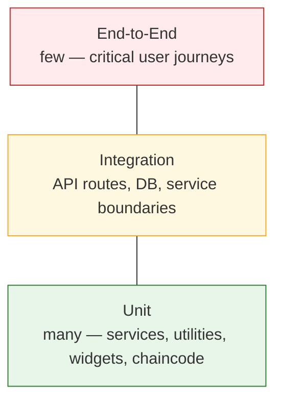

# 10 — Testing

# EcoTrace India — Testing Strategy & Standards

Version: 1.0

Status: Active

---

# Table of Contents

1. [Purpose](#purpose)
2. [Testing Philosophy](#testing-philosophy)
3. [Test Pyramid](#test-pyramid)
4. [Tooling by Stack](#tooling-by-stack)
5. [Test Types & Requirements](#test-types--requirements)
6. [Test Data Management](#test-data-management)
7. [Quality Gates](#quality-gates)
8. [Test Organization](#test-organization)
9. [Coverage Policy](#coverage-policy)
10. [Regression Policy](#regression-policy)

---

# Purpose

This document defines how EcoTrace India is tested across all modules. Module documents (06–09) state module-specific minimums; this document defines the strategy, tooling, and gates that bind them together.

Governing rule (`CLAUDE.md`, `AGENTS.md`): every implementation must be verifiable, and failing tests are never ignored without explanation.

---

# Testing Philosophy

- Tests are part of the implementation, not a follow-up task.
- Test behavior through public interfaces; avoid coupling tests to internals.
- Fast, deterministic tests are the default; slow or flaky tests are quarantined and fixed, not tolerated.
- Every bug fix adds a regression test that fails before the fix and passes after.

---

# Test Pyramid

Most tests are unit tests. Integration tests cover boundaries (HTTP, database, AI client, Fabric client). End-to-end tests cover only the critical demo journeys.

---

# Tooling by Stack

| Module | Unit / Integration | Notes |
|---|---|---|
| Backend (`backend/`) | Jest + Supertest | Integration tests run against a disposable PostgreSQL (Docker) |
| Dashboard (`dashboard/`) | Vitest + React Testing Library | Component & hook tests |
| Mobile (`mobile/`) | `flutter test` | Widget + unit tests |
| AI (`ai/`) | pytest + FastAPI TestClient | Fixture-based; pinned test artifacts |
| Chaincode (`blockchain/`) | Jest with Fabric contract stub | Dev-network integration via scripts |
| Cross-cutting E2E | `testing/` suites | Runs against the Docker Compose stack (`11_DEPLOYMENT.md`) |

---

# Test Types & Requirements

## Unit tests

- Mock all external dependencies (repositories, HTTP clients, Fabric, filesystem).
- Cover business rules exhaustively — especially state machines (`DeviceStatus`, `CollectionStatus` transitions per `04_DATABASE.md`).

## Integration tests

- Backend: real Express app + real test database, Prisma migrations applied fresh (verifies migrations run on empty DB — `04_DATABASE.md`).
- Verify the API contract of `05_API.md`: status codes, envelopes, error codes, role enforcement (401/403 paths are mandatory tests).

## End-to-end tests

Minimum journeys (aligned with the IEEE demonstration):

1. Register → login → register device → receive EcoID/QR.
2. Request collection → assign collector → verify → collect.
3. Recycler intake → process → certificate issued → certificate verifiable.
4. GreenCoins credited and visible after recycling.

## Smoke tests

- Post-deployment: `/health` endpoints of backend and AI service, database connectivity, Fabric network reachability (`11_DEPLOYMENT.md`).

---

# Test Data Management

- Factories/builders per entity produce valid default objects; tests override only relevant fields.
- Test databases are created and destroyed per run — never shared, never seeded from production-like data.
- Fixture assets (device images, time series) are small, committed, and documented.
- Seeds for demos (`04_DATABASE.md` → Seed Data) are separate from test fixtures.

---

# Quality Gates

Every pull request must pass (enforced by CI — `11_DEPLOYMENT.md`):

| Gate | Requirement |
|---|---|
| Build | All modules compile/build |
| Tests | All test suites green |
| Lint | ESLint / Ruff / `flutter analyze` clean |
| Types | `tsc --noEmit`, `mypy`, Dart analyzer clean |
| Migrations | Apply cleanly to an empty database |

A red gate blocks merge. Skipping a gate requires an explicit, written justification in the PR (`AGENTS.md` → Never ignore failing tests).

---

# Test Organization

- Unit tests live next to or mirroring the module they test (`tests/` per module — see layouts in 06–09).
- Test names describe behavior: `rejects collection status transition from COMPLETED to IN_PROGRESS`.
- One logical assertion focus per test; shared setup via factories, not copy-paste.
- Cross-cutting E2E suites live in `testing/` with their own fixtures and runner config.

---

# Coverage Policy

- Coverage is a signal, not a target to game. Guideline thresholds:
  - Backend services & domain logic: ≥ 80%
  - Chaincode: ≥ 90% (small surface, high stakes)
  - Shared frontend components/services: ≥ 70%
- Uncovered critical paths flagged in review take priority over raising aggregate numbers.

---

# Regression Policy

- Every bug fix includes a test reproducing the bug.
- Flaky tests are fixed or quarantined within the same week they are detected; quarantined tests are tracked as technical debt.
- Before each release (`develop` → `main`), the full suite — including E2E — must pass on the release candidate.
