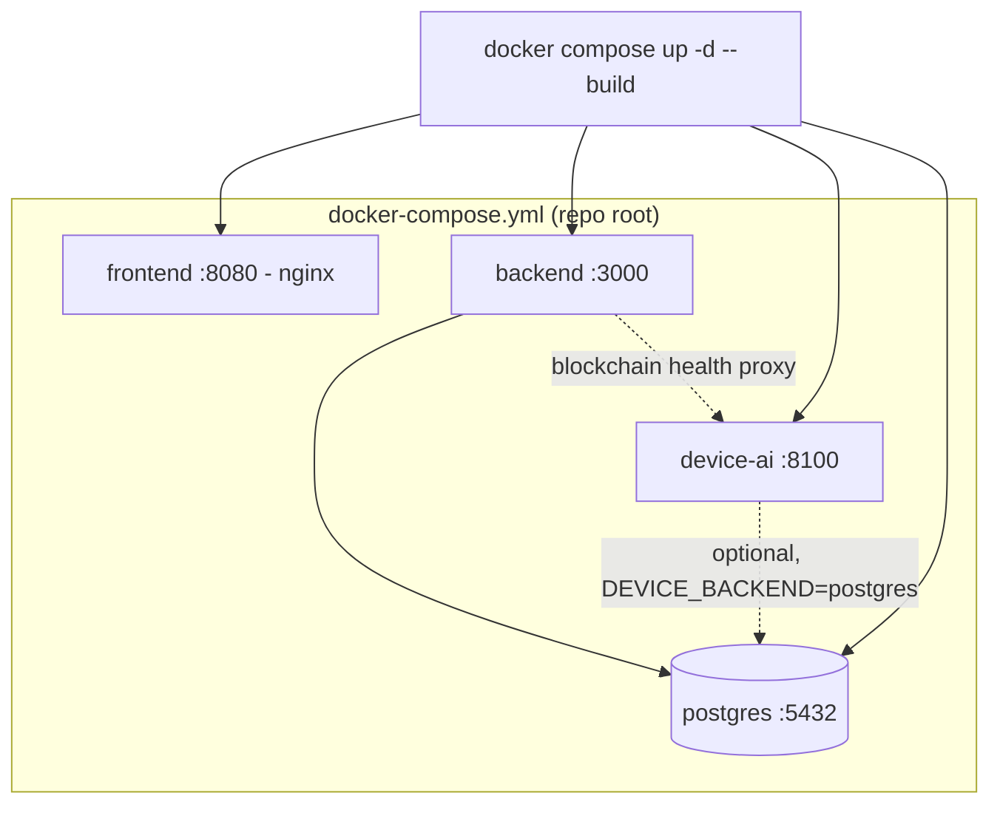
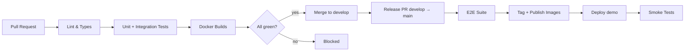

# 11 — Deployment

# EcoTrace India — Deployment & Operations Standards

Version: 1.0

Status: Active

---

# Table of Contents

1. [Purpose](#purpose)
2. [Deployment Principles](#deployment-principles)
3. [Environments](#environments)
4. [Containerization](#containerization)
5. [Local Development Stack](#local-development-stack)
6. [CI/CD Pipeline](#cicd-pipeline)
7. [NGINX Gateway](#nginx-gateway)
8. [Configuration Management](#configuration-management)
9. [Health Checks & Monitoring](#health-checks--monitoring)
10. [Backup & Recovery](#backup--recovery)
11. [Release Process](#release-process)

---

# Purpose

This document defines how EcoTrace India is packaged, deployed, and operated. Deployment assets live in `deployment/`; CI/CD workflows live in `.github/workflows/`.

---

# Deployment Principles

- **Everything runs in Docker.** Every service (backend, dashboard, AI, database, Fabric network, NGINX) is containerized; the full stack starts with one command for the IEEE YESIST 2026 demo (`03_ARCHITECTURE.md` → Architecture Goals).
- **Build once, configure per environment.** Images are environment-agnostic; behavior differs only via environment variables.
- **No manual steps.** Anything done twice is scripted in `scripts/` or `deployment/`.
- **Secrets never enter images or Git** (`02_PROJECT_RULES.md`).

---

# Environments

| Environment | Purpose | Branch | Data |
|---|---|---|---|
| `local` | Developer machines | any | Disposable, seeded |
| `ci` | Automated test runs | PR branches | Ephemeral per run |
| `demo` | IEEE YESIST 2026 demonstration | `main` release | Seeded demo dataset |
| `prod` (future) | Real deployment | `main` | Real data, backed up |

Fabric network profiles per environment: single-node ordering in `local`/`ci`, 3-node Raft in `demo`/`prod` (`09_BLOCKCHAIN.md`).

---

# Containerization

**Current implementation (P7.5):** one Dockerfile per runnable service,
colocated with its source: `backend/Dockerfile` (Node, multi-stage: build →
minimal runtime, non-root `node` user), `intelligence/device_ai/Dockerfile`
(Python, multi-stage: wheel-build → slim runtime, non-root `appuser`),
`frontend/Dockerfile` (Node build stage → `nginx:1.27-alpine` runtime
serving the static bundle with SPA-fallback routing, `frontend/nginx.conf`).
Every image has a container `HEALTHCHECK`. There is no `ai/Dockerfile` or
`dashboard/Dockerfile` — those directory names were aspirational; the real
service directories are `intelligence/device_ai/` and `frontend/`.
AI model artifacts are **not** baked into the image (`.dockerignore`/
`.gitignore` exclude `*.pt`/`weights/`) — the container starts with an
empty `models/` directory and serves the mock inference pipeline until real
weights are provisioned separately, matching `08_AI.md` → Model Management.

---

# Local Development Stack — real, live-verified (P7.5/P7.8)

- The root **`docker-compose.yml`** (not `deployment/docker/`) defines the
  full stack that can genuinely run in this environment: `postgres`,
  `backend`, `device-ai`, `frontend` — health-gated startup order
  (`depends_on: condition: service_healthy`), internal Compose-DNS
  networking (e.g. the backend reaches `http://device-ai:8100`, never
  `localhost`), and zero hardcoded secrets (every credential is
  `${VAR:-local-dev-placeholder}`).
- **No Fabric service is defined.** No Hyperledger Fabric peer/orderer/CA
  binaries or channel artifacts exist anywhere in this repository — adding
  one to compose would either silently fail to start or require inventing
  infrastructure this project has never built. `FABRIC_ENABLED=false` is
  the honest default; the backend's blockchain-health proxy and the
  frontend's `BlockchainHealthCard` (`07_FRONTEND.md`) both degrade
  honestly rather than fabricating a "connected" status.
- Database migrations for `intelligence/device_ai` run via `alembic
  upgrade head` (not automatic on container start — a deliberate,
  explicit step); the backend's Prisma migration history is applied the
  same way. A genuine `upgrade → downgrade → upgrade` round-trip against a
  disposable database was verified in P7.10, which also fixed a real
  defect: a fresh `alembic_version` table defaults to `VARCHAR(32)`,
  too narrow for this project's `NNN_description`-style revision IDs — see
  `intelligence/device_ai/alembic/env.py`.
- React Native (Expo) apps have no compose service (no Android SDK/iOS
  Xcode toolchain exists in this environment — see P9.3/P9.10) — they
  point at the backend via the `EXPO_PUBLIC_API_BASE_URL` build-time env
  var (`mobile/*/src/config/env.ts`), independent of whichever host is
  actually running the compose stack.
- One-command reproducible demo on top of this stack:
  `scripts/demo/run_demo.py` (P7.8).

---

# CI/CD Pipeline

**Updated P9.8**: four real, independently-triggered workflows now exist —
`backend-ci.yml`, `device-ai-ci.yml`, `chaincode-ci.yml`, `frontend-ci.yml` —
each path-filtered to its own module plus manual dispatch, running on every
push/PR to `develop`/`main`:

| Workflow | Blocking gates | Informational (non-blocking) gates |
|---|---|---|
| `backend-ci.yml` | lint, typecheck, format check, test, build, Docker build | — |
| `device-ai-ci.yml` | pytest, Docker build | ruff, mypy (see below) |
| `chaincode-ci.yml` | lint, build, test | — |
| `frontend-ci.yml` | lint, typecheck, build, Docker build | format check (see below) |

**Honestly disclosed (P9.8)**: wiring up `device-ai-ci.yml` and
`frontend-ci.yml` for the first time surfaced real, pre-existing debt that
had never been CI-gated before — ~1,450 `ruff` violations and ~200 `mypy`
errors across `intelligence/device_ai` (concentrated in the vendored/generated
`devices/fabric_pb/` protobuf stubs and pre-P9.8 test files, not this phase's
own changes), and 161 files not matching the frontend's current Prettier
config. Mass-fixing that debt is out of scope for a CI/CD-hardening phase —
those specific gates run as `continue-on-error: true` (visible in CI output,
never blocking) until a dedicated cleanup phase tightens them to blocking.
Every other gate listed above is real, currently green, and blocking.

**What remains aspirational**: no CI workflow for the mobile apps yet; no
automated E2E stage; no automated release/tag/deploy stage (the actual
deploy step, `scripts/deployment/deploy.sh`, exists and is environment-gated
— see Release Process below — but isn't yet invoked automatically by a
workflow). The diagram below is the intended full design, not the current
reality.

GitHub Actions, triggered per the Git workflow in `02_PROJECT_RULES.md`:

Pipeline stages map to the quality gates in `10_TESTING.md`:

| Stage | Runs |
|---|---|
| Lint & Types | ESLint, `tsc --noEmit`, Ruff, mypy — per changed module, including both mobile apps |
| Tests | Jest, Vitest, pytest; backend integration against ephemeral PostgreSQL |
| Docker Builds | All service images build successfully |
| E2E (release only) | Full-stack journeys from `testing/` against the composed stack |
| Smoke | Health endpoints + connectivity after deploy |

CI secrets live in GitHub Actions encrypted secrets only.

---

# NGINX Gateway

**Status: partially implemented.** `frontend/Dockerfile`'s runtime stage
uses `nginx:1.27-alpine`, but only to serve the frontend's own static
bundle (`frontend/nginx.conf` — SPA-fallback routing, long-cache headers
for hashed assets). It is **not** a unified gateway: it does not terminate
TLS, does not proxy `/api/*` to the backend, and the backend/device-ai
ports are reachable directly (`docker-compose.yml` maps `3000`/`8100`
straight to the host) rather than being fronted by it. A single public
entry point performing routing/TLS termination as described below remains
a real gap for a production (not local-dev/demo) deployment — recorded
honestly rather than presented as already built. Baseline hardening
described below (rate limiting, security headers) **is** implemented, just
at the application layer (`backend/src/shared/middleware/`, P7.4), not at
an NGINX gateway layer.

- Single public entry point: TLS termination, routing, static dashboard serving.
- Routes: `/api/*` → backend; `/` → dashboard assets. The AI service and database are **not** exposed publicly (`03_ARCHITECTURE.md`).
- Baseline hardening: rate limiting on auth endpoints, request size limits (device image uploads bounded), standard security headers.

---

# Configuration Management

- Each service reads environment variables validated at startup (`06_BACKEND.md`, `08_AI.md`).
- **Current implementation (P7.2):** there is no `deployment/env/` directory yet —
  each runnable service keeps its own `.env.example` beside its source
  (`backend/.env.example`, `intelligence/device_ai/.env.example`,
  `frontend/.env.example`), indexed from the repo root's `.env.example`.
  Real values are provisioned outside Git in every case (`.gitignore`
  excludes `.env`/`.env.*`, keeping only the `*.example` templates tracked).
- Both the backend (`env.schema.ts`, Zod, `superRefine`) and the Python
  service (`configs/settings.py`, Pydantic `model_validator`) fail fast at
  startup when `NODE_ENV`/`ENVIRONMENT=production` is combined with an
  unsafe configuration (placeholder JWT secrets, a missing `DATABASE_URL`,
  `FABRIC_ENABLED=true` without TLS/identity material, or — since P8.7 —
  a missing `SERVICE_API_KEY`) — see `backend/tests/unit/config.test.ts`
  and `intelligence/device_ai/tests/test_p72_production_config_validation.py`.
- `SERVICE_API_KEY` (P8.7, `intelligence/device_ai/.env.example`): unset
  by default (open, matching every prior phase's local-dev/demo behavior
  — `docker-compose.yml` passes it through empty). Set it for any
  deployment reachable beyond a laptop; see `05_API.md` → Internal AI
  Service API → Service authentication.
- Mobile apps have no runtime `.env` mechanism; the API base URL is an
  Expo build-time public env var, `EXPO_PUBLIC_API_BASE_URL` (see
  `mobile/*/src/config/env.ts`), not a loaded environment file.
- A configuration change that alters behavior is documented in the affected
  module document, same PR (`02_PROJECT_RULES.md` → Documentation Policy).

---

# Health Checks & Monitoring

**Current implementation:** every service exposes liveness/readiness at
its real, verified paths — backend `GET /api/v1/health` (liveness) +
`GET /api/v1/ready` (readiness, pings Postgres) + `GET /api/v1/metrics`
(P7.3: request count/latency per route, blockchain-check outcomes);
device-ai `GET /health` (liveness/readiness, includes a `database`
component when a backend is configured for Postgres — P7.3) +
`GET /metrics` (request counts, Fabric transaction success/failure
counts). Both `/metrics` endpoints are a small dependency-free JSON
summary, not a Prometheus exposition format — no scrape target
(Prometheus/Grafana) exists in this environment, so pulling in a metrics
client library for a format nothing consumes was judged unnecessary
(P7.3's own reasoning, unchanged since).
- Docker healthchecks gate container readiness on every image (P7.5);
  compose ordering waits on healthy dependencies
  (`depends_on: condition: service_healthy`), live-verified end-to-end.
- Logs are structured JSON to stdout (Pino/Loguru), correlation IDs
  (`X-Request-ID`) flow through every request.
- v1 monitoring is logs + healthchecks + the lightweight metrics above;
  a real Prometheus/Grafana stack remains roadmap.

---

# Backup & Recovery

**Updated P9.8** — real, working backup/restore scripts now exist and were
genuinely rehearsed against the live stack, closing the gap P8.9 honestly
disclosed:

- **`scripts/deployment/backup_postgres.sh [output-dir]`** — runs a real
  `pg_dump` (custom format) against the running `ecotrace-postgres`
  container and copies it to the host.
- **`scripts/deployment/restore_postgres.sh <backup-file> [--into <db>] [--yes]`**
  — restores a backup via `pg_restore`. Defaults to a new, disposable
  database name (never the live one) unless `--into` names one explicitly;
  restoring into an *existing* database additionally requires `--yes`, so an
  operator cannot accidentally overwrite live data with a single mistyped
  command.
- **Genuinely rehearsed this phase, not just written**: backed up the live
  demo database (9 users, 8 submissions, 35 devices), restored it into a
  disposable database via the script, and verified row counts and a sample
  row's exact byte content (UUID + email) matched the source precisely. Full
  evidence in `reports/P9_8_PRODUCTION_DEPLOYMENT_CICD.md`.
- **Still real gaps, honestly disclosed**: neither script is wired to a
  scheduler (cron/Task Scheduler/CI) yet — running a backup is a manual
  operator action, not yet automated on a cadence. No `deployment/runbooks/`
  directory exists yet for broader incident procedures beyond database
  backup/restore specifically.
- **Fabric ledger backup**: P9.2 proved a real local Hyperledger Fabric
  network is achievable in this environment (superseding this section's
  earlier "no live network exists" statement), but it is an explicitly
  local, throwaway, single-machine test network — its crypto material and
  ledger state live in Docker volumes and a gitignored bootstrap directory
  by design, not a production ledger warranting its own backup procedure.
  A genuine multi-org production Fabric deployment's backup strategy is a
  distinct, larger undertaking than this local pilot's scope.
- **Underlying persistence** (unchanged from P8.9): Postgres data persists
  across container restarts/recreates via the named Docker volume
  `postgres_data`; `docker compose down -v` still destroys it irreversibly
  — the scripts above are exactly the mitigation for that, now real rather
  than aspirational. Database schema changes remain forward-only
  (`04_DATABASE.md`): a bad migration is fixed with a new corrective
  migration, never a manual rollback.

---

# Release Process

1. Release PR: `develop` → `main`, with changelog summary.
2. Full CI including E2E must be green.
3. Merge tags a version (`v<major>.<minor>.<patch>`) and publishes images.
4. Deploy to `demo`; smoke tests verify.
5. Rollback = redeploy previous image tag; database rollbacks follow the forward-only migration policy (`04_DATABASE.md`) — write a corrective migration rather than reverting.

**Environment-gated deploys (P9.8)**: `scripts/deployment/deploy.sh <environment>`
is the single entrypoint every deploy goes through:

| Environment | Behavior |
|---|---|
| `local`, `demo` | Real: `docker compose up -d --build` against this repo — genuinely tested this phase, all services healthy afterward. |
| `staging` | `BLOCKED — ENVIRONMENT`: refuses with exit code 2 and a clear message. No staging host, DNS, TLS, or credentials exist. |
| `production` | `BLOCKED — ENVIRONMENT`, same reason, plus a deliberate standing refusal: this script will not deploy to production without a separate, reviewed change to the gate itself — the explicit point being to make an accidental production deploy structurally impossible, not just discouraged. |

No release stage currently invokes this script automatically — it is a
manual operator command today, same as the rest of the release process
above.
