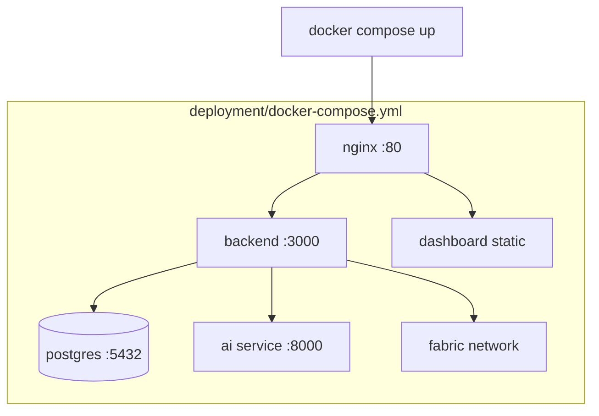
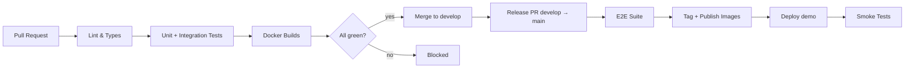

# 11 — Deployment

# EcoTrace India — Deployment & Operations Standards

Version: 1.0

Status: Active

---

# Table of Contents

1. [Purpose](#purpose)
2. [Deployment Principles](#deployment-principles)
3. [Environments](#environments)
4. [Containerization](#containerization)
5. [Local Development Stack](#local-development-stack)
6. [CI/CD Pipeline](#cicd-pipeline)
7. [NGINX Gateway](#nginx-gateway)
8. [Configuration Management](#configuration-management)
9. [Health Checks & Monitoring](#health-checks--monitoring)
10. [Backup & Recovery](#backup--recovery)
11. [Release Process](#release-process)

---

# Purpose

This document defines how EcoTrace India is packaged, deployed, and operated. Deployment assets live in `deployment/`; CI/CD workflows live in `.github/workflows/`.

---

# Deployment Principles

- **Everything runs in Docker.** Every service (backend, dashboard, AI, database, Fabric network, NGINX) is containerized; the full stack starts with one command for the IEEE YESIST 2026 demo (`03_ARCHITECTURE.md` → Architecture Goals).
- **Build once, configure per environment.** Images are environment-agnostic; behavior differs only via environment variables.
- **No manual steps.** Anything done twice is scripted in `scripts/` or `deployment/`.
- **Secrets never enter images or Git** (`02_PROJECT_RULES.md`).

---

# Environments

| Environment | Purpose | Branch | Data |
|---|---|---|---|
| `local` | Developer machines | any | Disposable, seeded |
| `ci` | Automated test runs | PR branches | Ephemeral per run |
| `demo` | IEEE YESIST 2026 demonstration | `main` release | Seeded demo dataset |
| `prod` (future) | Real deployment | `main` | Real data, backed up |

Fabric network profiles per environment: single-node ordering in `local`/`ci`, 3-node Raft in `demo`/`prod` (`09_BLOCKCHAIN.md`).

---

# Containerization

- One Dockerfile per service, colocated with the service (`backend/Dockerfile`, `ai/Dockerfile`, `dashboard/Dockerfile`).
- Multi-stage builds: build stage → minimal runtime stage (no dev dependencies, no source maps in prod images).
- Images run as non-root users.
- The dashboard builds to static assets served by NGINX.
- AI model artifacts are fetched at build/startup, not baked from Git (`08_AI.md` → Model Management).

---

# Local Development Stack

- `deployment/docker-compose.yml` defines the full stack; `deployment/docker-compose.dev.yml` overlays hot-reload volumes for development.
- Database migrations run automatically on backend startup in `local`/`ci`; explicitly (scripted) in `demo`/`prod` (`04_DATABASE.md` → Migration Policy).
- Flutter apps run on emulators/devices pointing at the local gateway.

---

# CI/CD Pipeline

GitHub Actions, triggered per the Git workflow in `02_PROJECT_RULES.md`:

Pipeline stages map to the quality gates in `10_TESTING.md`:

| Stage | Runs |
|---|---|
| Lint & Types | ESLint, `tsc --noEmit`, Ruff, mypy, `flutter analyze` per changed module |
| Tests | Jest, Vitest, pytest, `flutter test`; backend integration against ephemeral PostgreSQL |
| Docker Builds | All service images build successfully |
| E2E (release only) | Full-stack journeys from `testing/` against the composed stack |
| Smoke | Health endpoints + connectivity after deploy |

CI secrets live in GitHub Actions encrypted secrets only.

---

# NGINX Gateway

- Single public entry point: TLS termination, routing, static dashboard serving.
- Routes: `/api/*` → backend; `/` → dashboard assets. The AI service and database are **not** exposed publicly (`03_ARCHITECTURE.md`).
- Baseline hardening: rate limiting on auth endpoints, request size limits (device image uploads bounded), standard security headers.

---

# Configuration Management

- Each service reads environment variables validated at startup (`06_BACKEND.md`, `08_AI.md`).
- `deployment/env/` holds per-environment `*.env.example` templates; real values are provisioned outside Git.
- A configuration change that alters behavior is documented in the affected module document, same PR (`02_PROJECT_RULES.md` → Documentation Policy).

---

# Health Checks & Monitoring

- Every service exposes a health endpoint: backend `/api/v1/health`, AI `/internal/health`.
- Docker healthchecks gate container readiness; compose ordering waits on healthy dependencies.
- Logs are structured JSON to stdout, collected by the container runtime; correlation IDs flow across services (`06_BACKEND.md` → Logging).
- v1 monitoring is logs + healthchecks; metrics/alerting stack is roadmap (`12_ROADMAP.md`).

---

# Backup & Recovery

- `demo`/`prod`: scheduled PostgreSQL dumps (retention: 7 daily), restore procedure scripted and rehearsed before the IEEE demonstration.
- Fabric ledger data volumes are persisted and included in the backup routine.
- Recovery runbook lives in `deployment/runbooks/`.

---

# Release Process

1. Release PR: `develop` → `main`, with changelog summary.
2. Full CI including E2E must be green.
3. Merge tags a version (`v<major>.<minor>.<patch>`) and publishes images.
4. Deploy to `demo`; smoke tests verify.
5. Rollback = redeploy previous image tag; database rollbacks follow the forward-only migration policy (`04_DATABASE.md`) — write a corrective migration rather than reverting.
