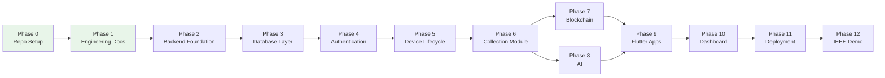

# 12 — Roadmap

# EcoTrace India — Engineering Roadmap

Version: 1.0

Status: Active

---

# Table of Contents

1. [Purpose](#purpose)
2. [Roadmap Overview](#roadmap-overview)
3. [Phase Details](#phase-details)
4. [Milestone Exit Criteria](#milestone-exit-criteria)
5. [Dependency Map](#dependency-map)
6. [Risk Register](#risk-register)
7. [Post-Competition Roadmap](#post-competition-roadmap)

---

# Purpose

This document translates the project milestones from `PROJECT.md` into an engineering roadmap: what is built in each phase, in what order, with what exit criteria and risks.

`PROJECT.md` owns the *what and why*; this document owns the *engineering how and when*. If they diverge, `PROJECT.md` wins (`01_CLAUDE.md` → Documentation Priority).

---

# Roadmap Overview

Phases 0–1 are complete (repository and this handbook). Phases 7 and 8 can proceed in parallel once Phase 6 lands.

---

# Phase Details

## Phase 2 — Backend Foundation

- Express + TypeScript scaffold per `06_BACKEND.md` layout
- Typed config, error hierarchy, logging, health endpoint
- CI pipeline: lint, types, tests, Docker build (`11_DEPLOYMENT.md`)

## Phase 3 — Database Layer

- Prisma schema implementing the entity model in `04_DATABASE.md`
- Initial migration + seed framework
- Migration CI check (clean apply on empty DB)

## Phase 4 — Authentication

- Register/login/refresh/me endpoints per `05_API.md`
- JWT issuance, role claims, `authenticate`/`authorize` middleware
- Role model seeded for all five personas

## Phase 5 — Device Lifecycle

- Device registration, EcoID generation, QR payloads
- Lifecycle event recording (off-chain first; `PENDING_CHAIN` fields ready)
- Device history endpoint

## Phase 6 — Collection Module

- Collection requests, collector assignment, status state machine
- Collector verification (QR scan flow)
- GreenCoin reward transactions on completed recycling

## Phase 7 — Blockchain

- Local Fabric network + `ecotrace-lifecycle` chaincode per `09_BLOCKCHAIN.md`
- Backend Fabric client with outbox/retry
- Backfill of lifecycle events recorded before chain availability

## Phase 8 — Artificial Intelligence

- FastAPI service scaffold per `08_AI.md`
- Device classification (YOLOv8) + condition assessment
- Demand forecasting (Prophet); rule-based fraud scoring
- Backend AI client with graceful degradation

## Phase 9 — Flutter Applications

- Single codebase, role-based flows per `07_FRONTEND.md`
- Consumer journey first (register → device → collection → rewards)
- Collector and recycler flows second

## Phase 10 — Dashboard

- React + Tailwind scaffold per `07_FRONTEND.md`
- Admin management views; government analytics (heatmaps, statistics, forecast)

## Phase 11 — Deployment

- Full Docker Compose stack, NGINX gateway, demo environment (`11_DEPLOYMENT.md`)
- E2E suite green against the composed stack (`10_TESTING.md`)
- Backup/restore rehearsed

## Phase 12 — IEEE Demonstration

- Demo dataset seeded; demo script rehearsed end-to-end
- Presentation materials; fallback plan for offline demo (local stack)

---

# Milestone Exit Criteria

A phase is complete only when (in addition to the Definition of Done in `02_PROJECT_RULES.md`):

| Phase | Exit criterion |
|---|---|
| 2 | CI green on scaffold; health endpoint served via Docker |
| 3 | Migrations apply cleanly; seeds produce a usable dataset |
| 4 | All auth endpoints pass integration tests incl. 401/403 paths |
| 5 | Device journey passes integration tests; EcoID uniqueness enforced |
| 6 | Full collection state machine tested; rewards credited correctly |
| 7 | Submit → query round-trip on dev network; outbox retry proven |
| 8 | Models meet evaluation thresholds (`08_AI.md`); fallbacks verified |
| 9 | E2E journey 1 & 2 pass from the consumer/collector apps |
| 10 | Government analytics render from live API data |
| 11 | One-command stack start; smoke tests green |
| 12 | Rehearsed demo runs without manual intervention |

---

# Dependency Map

| Needs | Before it can start |
|---|---|
| Database layer (P3) | Backend scaffold (P2) |
| Auth (P4) | Database (P3) |
| Device lifecycle (P5) | Auth (P4) |
| Collection (P6) | Device lifecycle (P5) |
| Blockchain (P7), AI (P8) | Collection (P6) — parallel tracks |
| Flutter apps (P9) | Stable API surface from P4–P8 |
| Dashboard (P10) | Analytics endpoints (P8) |
| Deployment (P11) | All services containerizable |

Frontend work may begin earlier against the documented API contract (`05_API.md`) using mocked responses, at the team's discretion.

---

# Risk Register

Engineering mitigations for the risks named in `PROJECT.md`:

| Risk | Mitigation |
|---|---|
| AI model accuracy | Advisory-only AI with manual fallbacks (`08_AI.md`); evaluation thresholds gate promotion |
| Blockchain integration complexity | Backend-only Fabric access, minimal chaincode surface, outbox pattern (`09_BLOCKCHAIN.md`); ship P5–P6 without chain if needed |
| Time constraints | Strict phase ordering; API contract lets frontend proceed in parallel; scope guarded by `PROJECT.md` exclusions |
| Hardware limitations | Single-org Fabric profile and CPU-friendly model sizes for local/demo |
| Integration challenges | Contract-first APIs (`05_API.md`), health checks, E2E suite before the demo |

---

# Post-Competition Roadmap

From `PROJECT.md` → Future Roadmap, in engineering terms (not scheduled):

- Multi-org Fabric network (recycler + government organizations)
- OpenAPI generation from backend schemas
- Metrics & alerting stack (beyond logs + healthchecks)
- Message queue for chain writes if volume outgrows the outbox (`03_ARCHITECTURE.md` → ADR-005 revisit)
- IoT ingestion, carbon tracking, digital product passport, manufacturer APIs
- National-scale deployment hardening

Each future item enters scope only via an update to `PROJECT.md` first.
