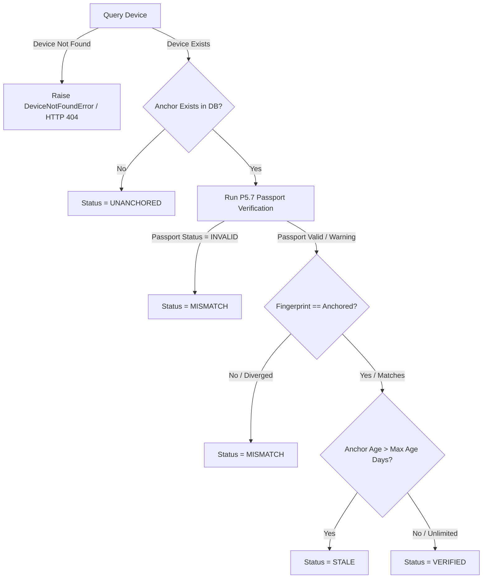

# P5.10 — Trust-Aware Device Operations Report

## Executive Summary

Phase **P5.10 Trust-Aware Device Operations** builds on top of the established P5.7/P5.8/P5.9 trust architecture by providing continuous, deterministic verification of whether a device's **CURRENT** passport matches its anchored state, detecting legitimate data evolution versus integrity drift/tampering, and enforcing time-based freshness policies.

All evaluation queries (`GET /devices/{id}/trust`) adhere to strict read-only guarantees: zero database writes, zero device mutations, zero passport mutations, and zero audit event emissions. Explicit re-anchoring (`POST /devices/{id}/passport/reanchor`) is isolated as a deliberate write operation.

---

## 1. Trust Status Model & Definitions

The system establishes five canonical trust states (`TrustStatus` enum):

| Trust Status | Definition | Trigger Conditions |
|---|---|---|
| `UNANCHORED` | No trust anchor exists for the device. | Device is registered/known, but no trust anchor row exists in the repository. |
| `ANCHORED` | An anchor exists (unverified intermediate state). | Reference state before active passport comparison. |
| `VERIFIED` | Full verification succeeds, fingerprint matches, and record is fresh. | Passport is valid, current SHA-256 fingerprint matches anchored fingerprint, and anchor age $\le$ `trust_anchor_max_age_days`. |
| `MISMATCH` | Passport differs from anchor or failed integrity checks. | Current fingerprint $\ne$ anchored fingerprint, OR passport verification failed with status `INVALID`. |
| `STALE` | Anchor matches current passport but exceeds freshness window. | Fingerprints match and passport is valid, but anchor age > `trust_anchor_max_age_days`. |

---

## 2. Status Precedence Hierarchy

The deterministic evaluation order implemented in `DevicePassportTrustService.get_device_trust_status(device_id)` is:

---

## 3. Freshness Policy Configuration

- **Setting**: `Settings.trust_anchor_max_age_days`
- **Default**: `90` days
- **Behavior**:
  - Positive integer: Anchors older than `max_age_days` evaluated as `STALE`.
  - `0`, negative, or `None`: Disables freshness expiration (anchors remain `VERIFIED` indefinitely as long as fingerprints match).
- **Timezone Awareness**: All calculations are UTC-aware, comparing ISO timestamps with `datetime.now(UTC)`.

---

## 4. REST API Contract & Audit Boundaries

### Endpoints:
1. `GET /devices/{device_id}/trust`:
   - **Method**: `GET`
   - **Type**: Strictly Read-Only
   - **Guarantees**: Zero database writes, zero device mutations, zero event emissions.
   - **Responses**:
     - `HTTP 200 OK`: Returns `DeviceTrustStatusResponse` containing `status`, `passport_fingerprint`, `anchored_fingerprint`, `is_fresh`, `age_days`, `checks`, and `details`.
     - `HTTP 404 Not Found`: Returned if `device_id` does not exist.
2. `POST /devices/{device_id}/passport/reanchor`:
   - **Method**: `POST`
   - **Type**: Explicit Write Operation
   - **Behavior**: Validates current passport, enforces trust policy, and updates the stored anchor record in-place (`overwrite=True`).

---

## 5. Test Verification Summary

- **P5.10 Test Suite (`test_p510_trust_aware_operations.py`)**: **18 passed**
- **Core P4.3–P5.10 Regression Suite**: **168 passed**
- **Full Active Suite**: **973 passed**
- **Failures**: 0

---

## 6. Cryptographic Safety & Immutability Audit

| Protected Asset Path | Expected SHA-256 | Actual SHA-256 | Status |
|---|---|---|:---:|
| `dataset_acquisition/training/p4_4_2_bulk_balance_v1/runs/p442_yolo11n/weights/best.pt` | `c40a4afccacbbde89fce2a3a5fb73467e8614dc09365ea4678b24f7ad9218e92` | `c40a4afccacbbde89fce2a3a5fb73467e8614dc09365ea4678b24f7ad9218e92` | **MATCH** |
| `dataset_acquisition/training/p4_11_multisource_targeted_aug_v1/runs/p411_yolo11n_targeted_aug/weights/best.pt` | `ca10aaf0de5cc6e24874a24a472b5cf8135f7163f7b54289a74554265a97355c` | `ca10aaf0de5cc6e24874a24a472b5cf8135f7163f7b54289a74554265a97355c` | **MATCH** |
| `dataset_acquisition/training/p4_12_model_scale_v1/runs/p412_yolo11s/weights/best.pt` | `96f156d0a46240f6a67187704f91f8a7b1e675e1b94246cf0d83f19f3f0380bc` | `96f156d0a46240f6a67187704f91f8a7b1e675e1b94246cf0d83f19f3f0380bc` | **MATCH** |
| `dataset_acquisition/training/p4_14_targeted_ood_robustness_v1/runs/p414_yolo11n_targeted_aug/weights/best.pt` | `8fdb02a43db526f7ebb4ba413e6e3dcf5d8eb516590bcd0120d26118e79e9d81` | `8fdb02a43db526f7ebb4ba413e6e3dcf5d8eb516590bcd0120d26118e79e9d81` | **MATCH** |
| `dataset_acquisition/evaluation/p4_5_real_world_v1/p45_data.yaml` | `b5fae47d73ec30698d9825cb04c06722bc1cb41d687a917bb208f1bd1c3bdf5b` | `b5fae47d73ec30698d9825cb04c06722bc1cb41d687a917bb208f1bd1c3bdf5b` | **MATCH** |
| `dataset_acquisition/evaluation/p4_7_wikimedia_ood_v1/p47_final_data.yaml` | `5daa90ae1ebca5fe7b5578dd37530e5eba90b47ce7873c35e133e51f7e60e284` | `5daa90ae1ebca5fe7b5578dd37530e5eba90b47ce7873c35e133e51f7e60e284` | **MATCH** |

- **Git HEAD**: `fb9b084e727ef14a4bff9b0e7814c884b7b7157f`
- **Git diff check**: Clean (zero whitespace errors or tracked binaries).
