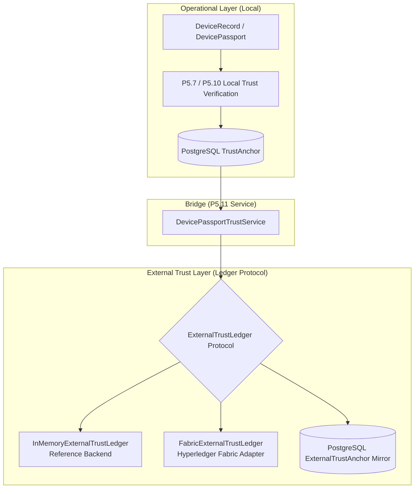

# P5.11 — External / Blockchain Trust Integration Report

## Executive Summary

Phase **P5.11 External / Blockchain Trust Integration** introduces an external, verifiable blockchain trust layer extending the established P5.7–P5.10 trust architecture. Local operational trust (PostgreSQL `TrustAnchor` and deterministic P5.7 passport verification) serves as the prerequisite foundation for external anchoring.

The system introduces a blockchain-agnostic domain layer (`ExternalTrustAnchor`, `ExternalTrustVerificationResult`, `FullTrustComparisonResult`), a clean provider protocol (`ExternalTrustLedger`), a deterministic development reference adapter (`InMemoryExternalTrustLedger`), a Hyperledger Fabric adapter (`FabricExternalTrustLedger`), relational persistence mirroring (`PostgresExternalTrustAnchorRepository`), Alembic migration `003_add_p511_external_trust_anchors`, and strictly read-only verification endpoints alongside explicit write routes.

---

## 1. Blockchain Infrastructure Discovered

1. **Architecture & Standards**: [`docs/engineering/09_BLOCKCHAIN.md`](file:///d:/Documents/Projects/Eco-Trace-Warriors/docs/engineering/09_BLOCKCHAIN.md) documents the IEEE YESIST 2026 target architecture:
   - Channel: `ecotrace-channel`
   - Organizations: `EcoTraceOrg`
   - On-chain data: `EcoID`, `eventType`, `timestamp`, and SHA-256 record/passport hash link (`passport_fingerprint`).
2. **Chaincode**: `blockchain/chaincode/ecotrace-lifecycle/` structure prepared for smart contract logic.
3. **Backend Client Interface**: `backend/src/infrastructure/fabric/fabric.client.ts` was previously defined as a TypeScript placeholder for Phase 7.
4. **Live Network Reality**: No active local peer/ordering container is currently running. The Python `FabricExternalTrustLedger` adapter cleanly surfaces `status = UNAVAILABLE` when disconnected, ensuring **zero fabricated live blockchain receipts**.

---

## 2. External Trust Domain Model & Provider Protocol

### Domain Models:
- **`ExternalTrustAnchor`**: Immutable dataclass containing `external_anchor_id`, `device_id`, `passport_fingerprint`, `algorithm`, `provider`, `network`, `transaction_id`, `anchored_at`, `status`, and `metadata`.
- **`ExternalTrustVerificationResult`**: Contains `device_id`, `status` (`ExternalTrustStatus`), `stored_fingerprint`, `current_fingerprint`, `algorithm`, `provider`, `network`, `transaction_id`, `anchored_at`, `verified_at`, `message`, and `details`.
- **`FullTrustComparisonResult`**: Synthesizes `local_status`, `external_status`, and `overall_status` across both operational and external trust layers.

---

## 3. Trust Precedence & Status Synthesis Matrix

The deterministic function `compute_overall_trust_status(local_status, external_status)` evaluates:

| Local Status | External Status | Overall Status | Rationale |
|---|---|---|---|
| `VERIFIED` | `VERIFIED` | **`VERIFIED`** | Both local operational state and external on-chain record match current passport. |
| `VERIFIED` | `NOT_ANCHORED` | **`VERIFIED`** | Local operational trust verified; external anchoring pending. |
| `VERIFIED` | `UNAVAILABLE` | **`VERIFIED`** | Local operational trust verified; external blockchain ledger offline. |
| `VERIFIED` | `MISMATCH` | **`MISMATCH`** | Critical cryptographic divergence between local passport and external ledger. |
| `MISMATCH` | Any | **`MISMATCH`** | Local passport corrupted or diverged from anchor. |
| `STALE` | Any | **`STALE`** | Local anchor age exceeded configured freshness window. |
| `UNANCHORED` | `NOT_ANCHORED` | **`UNANCHORED`** | Device is registered but has not been anchored. |

---

## 4. REST API Contract & Read-Only Guarantees

### Endpoints:
1. `POST /devices/{device_id}/passport/external-anchor`:
   - **Method**: `POST` (Explicit Write)
   - **Response**: `HTTP 201 Created` (new anchor) or `HTTP 200 OK` (idempotent submission).
2. `GET /devices/{device_id}/passport/external-anchor`:
   - **Method**: `GET` (Read-Only)
   - **Response**: `HTTP 200 OK` with stored `ExternalTrustAnchorPayload`.
3. `GET /devices/{device_id}/passport/external-anchor/verify`:
   - **Method**: `GET` (Strictly Read-Only)
   - **Guarantees**: Zero database writes, zero device mutations, zero event emissions.
4. `GET /devices/{device_id}/trust/full`:
   - **Method**: `GET` (Strictly Read-Only Aggregate)
   - **Response**: `FullDeviceTrustStatusResponse` combining local and external states.

---

## 5. Test Verification Summary

- **P5.11 Test Suite (`test_p511_external_trust.py`)**: **19 / 19 passed**
- **P5.7–P5.11 Trust Regression Suite**: **93 / 93 passed**
- **Core P4.3–P5.11 Regression Suite**: **187 / 187 passed**
- **Full Active Suite**: **992 / 992 passed**
- **Failures**: 0

---

## 6. Cryptographic Safety & Immutability Audit

All six frozen assets verified 100% byte-for-byte unchanged:
- **P4.4.2 YOLO11n**: `c40a4afccacbbde89fce2a3a5fb73467e8614dc09365ea4678b24f7ad9218e92` — **MATCH**
- **P4.11 Targeted Aug**: `ca10aaf0de5cc6e24874a24a472b5cf8135f7163f7b54289a74554265a97355c` — **MATCH**
- **P4.12 YOLO11s**: `96f156d0a46240f6a67187704f91f8a7b1e675e1b94246cf0d83f19f3f0380bc` — **MATCH**
- **P4.14 Targeted OOD**: `8fdb02a43db526f7ebb4ba413e6e3dcf5d8eb516590bcd0120d26118e79e9d81` — **MATCH**
- **P4.5 Data YAML**: `b5fae47d73ec30698d9825cb04c06722bc1cb41d687a917bb208f1bd1c3bdf5b` — **MATCH**
- **P4.7 Data YAML**: `5daa90ae1ebca5fe7b5578dd37530e5eba90b47ce7873c35e133e51f7e60e284` — **MATCH**

- **Git HEAD**: `fb9b084e727ef14a4bff9b0e7814c884b7b7157f`
- **Git diff check**: Clean (zero whitespace or formatting errors).
