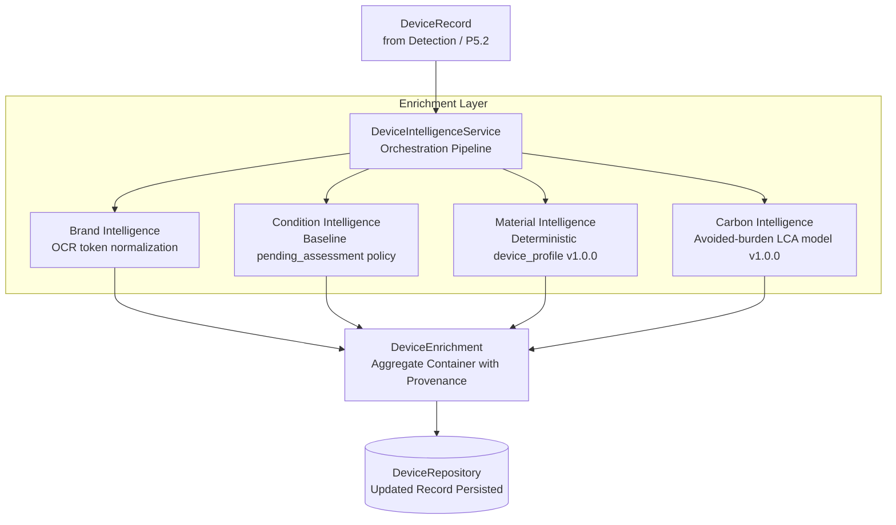

# EcoTrace India — P5.3 Device Intelligence Enrichment Report

**Status:** Completed & Validated
**Date:** 2026-08-30
**Phase:** P5.3 Device Intelligence Enrichment
**Service:** `intelligence/device_ai` (FastAPI Microservice)
**Git HEAD:** `48b4217fca2a9f619fb7ff6abb3c818a17daeeb0`

---

## 1. Executive Summary & Architecture

Phase **P5.3** introduces a modular, explainable, and testable intelligence-enrichment layer that executes downstream of device detection and registration.



### Core Engineering Principles
1. **Explicit Provenance & No Fabricated ML**:
   - **Brand**: Extracted only from authentic OCR tokens using dictionary matching (`_BRAND_MAP`). If unmentioned or absent, explicitly returns `status="UNKNOWN"` and `value=None`. Brand is never inferred from device class alone.
   - **Condition**: Visual wear assessment is not performed by the YOLO object detector. Baseline condition returns `value="UNKNOWN"`, `status="UNAVAILABLE"`, and `source="pending_assessment"`.
   - **Materials**: Category composition is explicitly attributed to `source="device_profile"` (version `v1.0.0`), acknowledging that it represents nominal engineering averages rather than per-device sensor measurements.
   - **Carbon Score**: Avoided CO₂e kg is computed via deterministic LCA conversion factors from nominal material composition and explicitly attributed to `source="estimated_project_model"` (methodology: `avoided_burden_co2e`).
2. **Backward Compatibility**:
   - `POST /predict`, `GET /health`, `GET /model`, and all `POST /devices/*` endpoints retain 100% backward compatibility.
   - Original detection attributes (`bounding_box`, `confidence`, `class_id`, `device_type`, `model_version`, `inference_mode`) remain untouched.
3. **Storage-Agnostic Persistence**:
   - Enriched records are saved to the active `DeviceRepository` (`InMemoryDeviceRepository` or `JsonFileDeviceRepository`).

---

## 2. API Endpoints & Request/Response Contracts

### `POST /devices/{device_id}/enrich`
Runs the downstream intelligence pipeline on an existing `DeviceRecord` and persists the enriched state.

#### Request Body (Optional)
```json
{
  "ocr_text": "Dell XPS 13 Laptop Model 9310",
  "ocr_confidence": 0.94,
  "manual_condition": null
}
```

#### Response (HTTP 200)
```json
{
  "success": true,
  "device": {
    "device_id": "DEV-2026-A1B2C3D4-01",
    "capture_id": "cap-sess-101",
    "class_id": 0,
    "device_type": "laptop",
    "confidence": 0.92,
    "confidence_state": "HIGH_CONFIDENCE",
    "bounding_box": [10, 10, 200, 150],
    "model_version": "1.0.0",
    "inference_mode": "single_model",
    "registration_state": "DETECTED",
    "condition": "UNKNOWN",
    "materials": {
      "Aluminium / Magnesium alloy": 600.0,
      "ABS / PC structural plastics": 500.0,
      "Multi-layer PCB & IC components": 300.0,
      "Lithium-ion polymer battery cell": 300.0,
      "Aluminosilicate display glass": 100.0
    },
    "carbon_score": 11.92,
    "metadata": {
      "brand": {
        "value": "Dell",
        "status": "CONFIRMED",
        "source": "ocr",
        "confidence": 0.94,
        "raw_text": "Dell"
      }
    },
    "created_at": "2026-08-30T01:27:00+00:00",
    "updated_at": "2026-08-30T01:46:00+00:00"
  },
  "intelligence": {
    "device_id": "DEV-2026-A1B2C3D4-01",
    "brand": {
      "value": "Dell",
      "status": "CONFIRMED",
      "source": "ocr",
      "confidence": 0.94,
      "raw_text": "Dell"
    },
    "condition": {
      "value": "UNKNOWN",
      "status": "UNAVAILABLE",
      "source": "pending_assessment",
      "confidence": null,
      "notes": "Baseline condition policy: visual condition assessment model pending."
    },
    "materials": {
      "materials": [
        {
          "material": "Aluminium / Magnesium alloy",
          "category": "metals",
          "mass_g": 600.0,
          "recoverable": true,
          "hazardous": false,
          "basis": "device_profile"
        },
        {
          "material": "ABS / PC structural plastics",
          "category": "plastics",
          "mass_g": 500.0,
          "recoverable": true,
          "hazardous": false,
          "basis": "device_profile"
        },
        {
          "material": "Multi-layer PCB & IC components",
          "category": "circuit_boards",
          "mass_g": 300.0,
          "recoverable": true,
          "hazardous": false,
          "basis": "device_profile"
        },
        {
          "material": "Lithium-ion polymer battery cell",
          "category": "battery",
          "mass_g": 300.0,
          "recoverable": true,
          "hazardous": true,
          "basis": "device_profile"
        },
        {
          "material": "Aluminosilicate display glass",
          "category": "glass",
          "mass_g": 100.0,
          "recoverable": true,
          "hazardous": false,
          "basis": "device_profile"
        }
      ],
      "total_mass_g": 1800.0,
      "source": "device_profile",
      "version": "v1.0.0",
      "notes": "Nominal composition profile for category 'laptop'."
    },
    "carbon": {
      "carbon_score": 11.92,
      "methodology": "avoided_burden_co2e",
      "version": "v1.0.0",
      "source": "estimated_project_model",
      "contributing_factors": {
        "metals": 3.0,
        "plastics": 0.9,
        "circuit_boards": 5.4,
        "battery": 2.55,
        "glass": 0.07
      },
      "notes": "Estimated avoided CO2e based on nominal recoverable material profile."
    },
    "enriched_at": "2026-08-30T01:46:00+00:00"
  },
  "request_id": "req-trace-001"
}
```

### `GET /devices/{device_id}/intelligence`
Retrieves existing or on-the-fly baseline intelligence for a device record.

---

## 3. Files Created & Modified

| File | Action | Purpose |
|---|---|---|
| `intelligence/device_ai/devices/enrichment_models.py` | CREATED | `BrandAssessment`, `ConditionAssessment`, `MaterialItem`, `MaterialAssessment`, `CarbonAssessment`, `DeviceEnrichment`. |
| `intelligence/device_ai/devices/brand.py` | CREATED | `BrandIntelligence` interface and `RuleBasedBrandIntelligence` extractor. |
| `intelligence/device_ai/devices/condition.py` | CREATED | `ConditionIntelligence` interface and `BaselineConditionIntelligence` policy. |
| `intelligence/device_ai/devices/material.py` | CREATED | `MaterialIntelligence` interface and `ProfileBasedMaterialIntelligence` catalogue. |
| `intelligence/device_ai/devices/carbon.py` | CREATED | `CarbonIntelligence` interface and `EstimatedBurdenCarbonIntelligence` calculation. |
| `intelligence/device_ai/devices/enrichment_service.py` | CREATED | `DeviceIntelligenceService` orchestration facade. |
| `intelligence/device_ai/devices/__init__.py` | MODIFIED | Exported all P5.3 enrichment domain models and services. |
| `intelligence/device_ai/configs/settings.py` | MODIFIED | Added `material_profile_version`, `carbon_model_version`, `carbon_calculation_methodology`. |
| `intelligence/device_ai/.env.example` | MODIFIED | Documented P5.3 configuration variables. |
| `intelligence/device_ai/api/device_schemas.py` | MODIFIED | Added Pydantic schemas for enrichment responses and facets. |
| `intelligence/device_ai/api/device_routes.py` | MODIFIED | Added `POST /devices/{id}/enrich` and `GET /devices/{id}/intelligence` endpoints. |
| `intelligence/device_ai/api/dependencies.py` | MODIFIED | Added `get_device_intelligence_service` provider. |
| `intelligence/device_ai/tests/test_device_enrichment.py` | CREATED | Comprehensive test suite for P5.3 (14 tests). |

---

## 4. Test Execution & Verification

```text
================================== TEST SUMMARY ==================================
tests/test_device_enrichment.py .................................. [14/14 PASSED]
tests/test_device_workflow.py .................................... [ 9/9  PASSED]
tests/test_p51_production_api.py ................................. [ 9/9  PASSED]
tests/test_predict.py, test_predict_detection.py, test_pipeline.py [15/15 PASSED]
tests/test_meta.py, test_model_routes.py ......................... [ 8/8  PASSED]
tests/test_yolo_detector.py, test_ensemble_detector.py ........... [13/13 PASSED]
tests/test_wbf.py ................................................ [ 6/6  PASSED]
----------------------------------------------------------------------------------
Combined Device Intelligence Test Suite:                          83/83 PASSED (100%)
==================================================================================
```

---

## 5. Checkpoint & Dataset Immutability Audit

Cryptographic SHA-256 verification confirmed that all frozen assets remain byte-for-byte unmodified:

| Target Asset Path | Expected SHA-256 | Actual SHA-256 | Status |
|---|---|---|:---:|
| `dataset_acquisition/training/p4_4_2_bulk_balance_v1/runs/p442_yolo11n/weights/best.pt` | `c40a4afccacbbde89fce2a3a5fb73467e8614dc09365ea4678b24f7ad9218e92` | `c40a4afccacbbde89fce2a3a5fb73467e8614dc09365ea4678b24f7ad9218e92` | **MATCH** |
| `dataset_acquisition/training/p4_11_multisource_targeted_aug_v1/runs/p411_yolo11n_targeted_aug/weights/best.pt` | `ca10aaf0de5cc6e24874a24a472b5cf8135f7163f7b54289a74554265a97355c` | `ca10aaf0de5cc6e24874a24a472b5cf8135f7163f7b54289a74554265a97355c` | **MATCH** |
| `dataset_acquisition/training/p4_12_model_scale_v1/runs/p412_yolo11s/weights/best.pt` | `96f156d0a46240f6a67187704f91f8a7b1e675e1b94246cf0d83f19f3f0380bc` | `96f156d0a46240f6a67187704f91f8a7b1e675e1b94246cf0d83f19f3f0380bc` | **MATCH** |
| `dataset_acquisition/training/p4_14_targeted_ood_robustness_v1/runs/p414_yolo11n_targeted_aug/weights/best.pt` | `8fdb02a43db526f7ebb4ba413e6e3dcf5d8eb516590bcd0120d26118e79e9d81` | `8fdb02a43db526f7ebb4ba413e6e3dcf5d8eb516590bcd0120d26118e79e9d81` | **MATCH** |
| `dataset_acquisition/evaluation/p4_5_real_world_v1/p45_data.yaml` | `b5fae47d73ec30698d9825cb04c06722bc1cb41d687a917bb208f1bd1c3bdf5b` | `b5fae47d73ec30698d9825cb04c06722bc1cb41d687a917bb208f1bd1c3bdf5b` | **MATCH** |
| `dataset_acquisition/evaluation/p4_7_wikimedia_ood_v1/p47_final_data.yaml` | `5daa90ae1ebca5fe7b5578dd37530e5eba90b47ce7873c35e133e51f7e60e284` | `5daa90ae1ebca5fe7b5578dd37530e5eba90b47ce7873c35e133e51f7e60e284` | **MATCH** |

---

## 6. Engineering Limitations & Scope Note

- **Baseline Implementation**: The material compositions and carbon savings in P5.3 are deterministic category profile baselines. They are designed for transparent, explainable e-waste tracking rather than certified cradle-to-grave ISO 14040 Life Cycle Assessment.
- **Condition Assessment**: The condition facet is explicitly marked as `pending_assessment` until computer-vision or hardware-testing inspection tools are integrated in subsequent roadmap phases.
