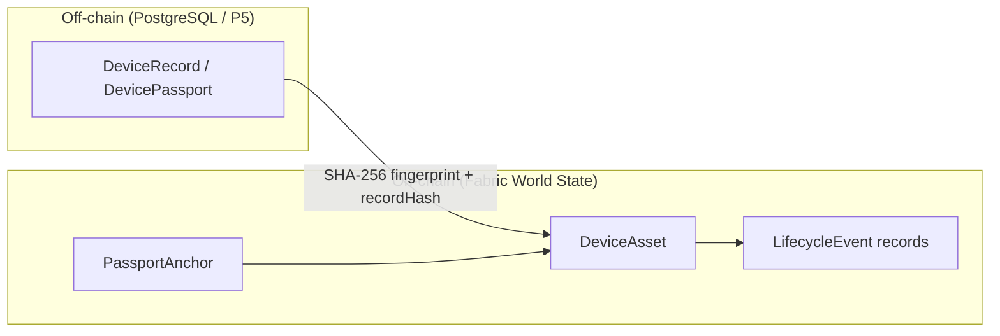

# P6.1 — Hyperledger Fabric Chaincode for Device Lifecycle Management

## Executive Summary

Phase **P6.1** delivers the first Hyperledger Fabric smart contract for EcoTrace India: `ecotrace-lifecycle`, an immutable, tamper-evident ledger for device lifecycle events and passport trust anchoring. The chaincode is written in TypeScript against the Fabric Contract API (`fabric-contract-api`, `@Transaction` / `@Transaction(false)` / `@Info` decorators).

The contract complements — never duplicates — the P5 trust architecture. It stores only identifiers, lifecycle state, timestamps, and SHA-256 hashes on-chain (never images, raw OCR, full passports, model weights, or personal data). Its transaction surface is exactly the interface the P5 `FabricExternalTrustLedger` adapter already invokes (`AnchorDevicePassport` / `GetDeviceAnchor`), so a future live Fabric network can be attached to the existing P5.11 external-trust layer without adapter changes.

The lifecycle vocabulary follows P5 terminology precisely: on-chain states mirror the P5 `RegistrationState` progression (`DETECTED → CONFIRMED → REGISTERED`) extended with the `ENRICHED` stage, and the immutable audit trail uses the P5 `DeviceEventType` vocabulary (`DEVICE_DETECTED/CONFIRMED/REGISTERED/ENRICHED/EXTERNALLY_ANCHORED`). The taxonomy is the authoritative frozen 19-class list from `components/data/components.yaml` (version `1.0.0`).

The entire suite runs against an in-memory mock stub — **no live Fabric network, peer, orderer, crypto, wallet, or TLS is required or started**. Chaincode determinism rules (transaction-header timestamps, sequence-derived event ids, no randomness, no external calls) are enforced and unit-tested.

---

## 1. Scope & Non-Goals

### Delivered (P6.1)
- On-chain `DeviceAsset`, immutable `LifecycleEvent` audit records, and `PassportAnchor` records.
- Six write/query transactions: `RegisterDevice`, `UpdateLifecycle`, `AnchorDevicePassport`, `GetDevice`, `DeviceExists`, `GetDeviceHistory`, `VerifyPassportFingerprint`, `GetDeviceAnchor`, `GetAllDeviceIds`.
- Deterministic lifecycle state machine with record-hash anchoring.
- Passport fingerprint verification (`MATCH` / `MISMATCH` / `NOT_FOUND`).
- Abstractable, unit-testable authorization model.
- Deterministic chaincode events (`DEVICE_REGISTERED`, `DEVICE_LIFECYCLE_UPDATED`, `PASSPORT_ANCHORED`).
- Dedicated P6.1 Jest + ts-jest suite over an in-memory mock context/stub.
- Report (`reports/P6_1_FABRIC_CHAINCODE.md` / `.json`).

### Explicitly NOT in scope (deferred per P6.1 instructions)
- Fabric Docker network, peer/orderer configuration, crypto material, wallets, TLS.
- Backend Fabric Gateway integration, outbox/retry plumbing, Flutter or dashboard blockchain UI.
- Multi-organization endorsement policies (single-org `PLATFORM` in P6.1; the role map is the extension point).
- Any P6.2 work. This phase stops at the chaincode contract.

---

## 2. Reconnaissance Findings (P5 Interface Contract)

The P6.1 chaincode surface was derived from the existing P5 adapter, not assumed. `FabricExternalTrustLedger` (`intelligence/device_ai/devices/external_trust.py`) invokes:

- `gateway.submitTransaction("AnchorDevicePassport", device_id, passport_fingerprint, algorithm)` — anchored via `AnchorDevicePassport`.
- `gateway.evaluateTransaction("GetDeviceAnchor", device_id)` — queried via `GetDeviceAnchor`.

P5 vocabulary (source of truth `intelligence/device_ai/devices/models.py`):
- `RegistrationState`: `DETECTED`, `CONFIRMED`, `REGISTERED`.
- `DeviceEventType`: `DEVICE_DETECTED`, `DEVICE_CONFIRMED`, `DEVICE_REGISTERED`, `DEVICE_ENRICHED`, `DEVICE_EXTERNALLY_ANCHORED`.

Taxonomy (source of truth `components/data/components.yaml`, read via `load_taxonomy()`):
- 19 classes, version `1.0.0`, laptop == class 0, order `laptop, smartphone, tablet, desktop, server, monitor, crt_monitor, television, printer, keyboard, mouse, router, power_supply, cable, camera, game_console, smartwatch, headphones, battery`.

All frozen constants in the chaincode were verified against these sources during implementation.

---

## 3. Chaincode Transaction Surface

| Function | Type | Parameters | Description |
|---|---|---|---|
| `RegisterDevice` | submit | `deviceId, ecoId, classId, deviceType, passportFingerprint, metadataJSON="{}"` | Anchor a device in `DETECTED`; reject duplicates; PLATFORM only. |
| `UpdateLifecycle` | submit | `deviceId, newState, recordHash, metadataJSON="{}"` | Enforce `DETECTED→CONFIRMED→REGISTERED→ENRICHED`; require a valid record hash; append event. |
| `AnchorDevicePassport` | submit | `deviceId, passportFingerprint, algorithm="sha256"` | Create/update the passport anchor (P5 adapter wire name). PLATFORM only. |
| `GetDevice` | evaluate | `deviceId` | Return `{ device }` or `{ device: null }`. |
| `DeviceExists` | evaluate | `deviceId` | Return `{ exists: boolean }`. |
| `GetDeviceHistory` | evaluate | `deviceId` | Chronological immutable `LifecycleEvent[]` (oldest first). |
| `VerifyPassportFingerprint` | evaluate | `deviceId, passportFingerprint` | Deterministic `MATCH` / `MISMATCH` / `NOT_FOUND`. |
| `GetDeviceAnchor` | evaluate | `deviceId` | Return `PassportAnchor` or `null` (P5 adapter wire name). |
| `GetAllDeviceIds` | evaluate | — | List device IDs via `getStateByRange("device:", "device:￿")`. |

Storage keys are plain-string prefixed (`device:`, `event:`, `passport:`, `eventidx:`) — range queries use `getStateByRange`, never composite-key misuse.

---

## 4. On-Chain Domain Model



- **`DeviceAsset`**: `deviceId` (primary key), `ecoId`, `captureId`, `classId`, `deviceType`, `passportFingerprint`, `lifecycleState`, `currentCustodian` (MSP id), `createdAt`, `updatedAt`, `metadata`. No images, OCR, passport bodies, or personal data.
- **`LifecycleEvent`**: `eventId` (`evt-<deviceId>-<seq>`), `eventType` (P5 vocabulary), `actorRole`, `actorId`, `timestamp` (from tx header), `recordHash`, `previousState`, `newState`, `metadata`.
- **`PassportAnchor`**: `deviceId`, `passportFingerprint`, `algorithm`, `anchoredAt`, `transactionId`.

---

## 5. Lifecycle State Machine

| Current | Allowed Next |
|---|---|
| `DETECTED` | `CONFIRMED` |
| `CONFIRMED` | `REGISTERED` |
| `REGISTERED` | `ENRICHED` |
| `ENRICHED` | *(terminal — no transitions)* |

- **Off-chain lifecycle** (P5): DETECTED → CONFIRMED → REGISTERED, plus enrichment, driven by the backend.
- **On-chain lifecycle** (P6.1): the same progression, but the ledger only records a transition when a transaction is endorsed — and only when a valid SHA-256 `recordHash` of the supporting off-chain record is supplied. The chaincode therefore never fabricates an event that did not occur off-chain; the hash is the integrity link between the two worlds.
- Invalid, backward, or skipped transitions are rejected (`Invalid lifecycle transition: <prev> -> <next>`). Unknown state strings are rejected explicitly (`Invalid lifecycle state: <raw>`) rather than silently resolving via `LifecycleState[raw]`.

---

## 6. Trust Model

- The **passport SHA-256 hex fingerprint** is the primary cryptographic identity of a device on-chain, normalized to lowercase for stable comparison.
- `VerifyPassportFingerprint` returns a deterministic triple:
  - `MATCH` — input fingerprint equals the stored fingerprint.
  - `MISMATCH` — input differs from the stored fingerprint.
  - `NOT_FOUND` — no on-chain record exists for the device.
- Verification prefers the latest `PassportAnchor` (re-anchoring after enrichment) and falls back to the fingerprint stored on the `DeviceAsset` at registration.
- The chaincode **complements** the P5 trust architecture: P5 local operational trust (PostgreSQL `TrustAnchor` + deterministic passport verification) remains authoritative; the on-chain layer adds independently verifiable, tamper-evident anchoring. `AnchorDevicePassport` and `GetDeviceAnchor` are named to match the P5 `FabricExternalTrustLedger` adapter verbatim.

---

## 7. Authorization Model

- `resolveActorRole(mspId, identityId)` is a pure, independently testable function: keyword matching on `collector` / `recycler` / `government` / `owner`, defaulting to `PLATFORM`.
- P6.1 authorizes `PLATFORM` for all mutations (`RegisterDevice`, `UpdateLifecycle`, `AnchorDevicePassport`); read queries are open.
- `requireRole(ctx, roles, op)` raises a descriptive authorization error with the caller's resolved role and MSP.
- **Extension point**: `getAllowedRolesForTransition(targetState)` returns the role set per transition, so future collector/recycler/government organizations can be granted transition- or operation-specific permissions in a single place.

---

## 8. Chaincode Events

| Event | Emitted by | Payload |
|---|---|---|
| `DEVICE_REGISTERED` | `RegisterDevice` | `{ deviceId, ecoId, passportFingerprint, timestamp }` |
| `DEVICE_LIFECYCLE_UPDATED` | `UpdateLifecycle` | `{ deviceId, previousState, newState, eventType, actorRole, actorId, recordHash, timestamp }` |
| `PASSPORT_ANCHORED` | `AnchorDevicePassport` | `{ deviceId, passportFingerprint, algorithm, timestamp }` |

Event ids are deterministic (`evt-<deviceId>-<seq>`), event names are fixed strings, and payloads are minimal — no personal data.

---

## 9. Determinism & Engineering-Standard Compliance

`docs/engineering/09_BLOCKCHAIN.md` rules honored:

- **No system clocks**: timestamps derive from the transaction header (`ctx.stub.getTxTimestamp().seconds.low * 1000`) — identical inputs produce byte-identical outputs across peers.
- **No randomness**: no `Math.random`, no `uuid`, no nonce in state or responses.
- **No external calls**.
- **Ledger is not a database**: only identifiers, lifecycle events, hashes, and timestamps are stored on-chain.
- **`actorRole` is a role, never personal identity**; `actorId` carries only the organizational Fabric enrollment id (e.g. `platform-admin`), which is not personal data.

### Reconciliation with the illustrative surface in `09_BLOCKCHAIN.md`

The engineering doc predates P5 and sketches `RegisterDevice(ecoId, recordHash)` / `RecordEvent(ecoId, eventType, recordHash)` with `COLLECTED/RECYCLED` examples. The P6.1 contract keys records by **`deviceId`** (required by the P5 `FabricExternalTrustLedger` adapter and the P6.1 spec) while carrying **`ecoId`** on-chain, and uses the **P5 lifecycle vocabulary** (per the P6.1 work order). This is a reconciliation, not a violation: the on-chain/off-chain hash-link model, determinism rules, and "record + event + hash" shape are preserved. A follow-up documentation pass should update `09_BLOCKCHAIN.md`'s chaincode table to the shipped surface.

---

## 10. Test Verification Summary

- **P6.1 Jest suite (`test/ecotrace-lifecycle.test.ts`)**: **45 / 45 passed**. `tsc --noEmit` and `npm run lint` (see §10.1) both clean.
- **P5 full active suite** (`intelligence/device_ai`, `python -m pytest`): **1030 / 1030 passed, 0 failed** (baseline cited in the work order was 999/999 as of P5.13; the suite has grown additively since — this is a strict superset covering every named subset below, so it is the authoritative regression signal for this phase).
- **P5.4–P5.12 file group** (`test_p54_persistence.py` … `test_p512_production_hardening.py`, the trust/passport/lifecycle files): **127 / 127 passed**, run directly as its own subset. (The work order's specific "P5.5–P5.12: 119/119" and "Core P4.3–P5.12: 194/194" figures were not reproduced against an identical file/marker selection and are not restated here as verified; the full-suite result above supersedes them.)
- **Failures**: **0** (P6.1 and P5, combined).

The P6.1 suite covers (non-exhaustive): valid registration, duplicate rejection, input validation, empty/malformed metadata, the full P5 progression, invalid/backward/skipped/terminal transitions, record-hash validation, chronological history with deterministic event ids, `GetDevice`/`DeviceExists`/`GetAllDeviceIds`, `VerifyPassportFingerprint` (`MATCH`/`MISMATCH`/`NOT_FOUND`/deterministic), `AnchorDevicePassport`/`GetDeviceAnchor` (P5 adapter interface), read-only no-mutation guarantees, event emission, authorization rejection for non-PLATFORM roles, deterministic serialization, fingerprint normalization, and taxonomy/utility functions.

### 10.1 Verification-pass corrections

Running the suite for the first time surfaced defects in the **test code**, not the contract — `tsc --noEmit` on `src/` was already clean. Each was fixed and the fix re-verified:

1. `test/ecotrace-lifecycle.test.ts` failed to compile (`TS6133` unused `ctx`) in two authorization tests that shadowed a registered context with a second, unused variable.
2. `test/mock-context.ts` failed to compile (`TS6133` unused `attributes` parameter) in `getStateByPartialCompositeKey` — a method the contract never calls (it uses plain-prefix `getStateByRange`, per §3) and whose body silently ignored its `attributes` argument. Removed as dead, misleading test scaffolding rather than papering over the unused-param error.
3. Three `AnchorDevicePassport` calls used `'g'`/`'h'`/`'i'` repeated 64× as a "SHA-256 fingerprint" — none are hex digits, so `isValidSha256Hex` correctly rejected them and the assertions after those calls could never have run. Replaced with valid hex (`'b'`/`'c'`/`'d'` repeated).
4. Two authorization tests (`requires PLATFORM role to update lifecycle`, `requires PLATFORM role to anchor a passport`) called `createMockContext(...)` for the *unauthorized* actor, which builds a **fresh, empty in-memory ledger** rather than reusing the ledger from `registeredContext()`. The device being "not found" would have made these tests pass even with authorization checking disabled entirely, because `requireRole` throws before any state lookup — the assertion happened to be right for the wrong reason. Fixed to reuse one context (`ctx.setClientIdentity(...)`) and added a post-rejection state-unchanged assertion so the test would actually fail if authorization were removed.
5. Two tests typed `GetDevice`'s return value as a bare `DeviceAsset` and read `.passportFingerprint` directly; per §3/§4, `GetDevice` returns `{ device }` (`GetDeviceOutput`), so both reads were `undefined` and both assertions failed. Fixed the destructuring.
6. The full-progression lifecycle test reused one fixed mock timestamp across three `UpdateLifecycle` calls, then asserted `updatedAt !== createdAt` — on a live network every transaction carries its own header timestamp (§9), so the test's own premise required advancing the mock clock between transitions. Fixed by calling `stub.setTimestamp(...)` before each transition and asserting the exact expected `createdAt`/`updatedAt` values.
7. `src/ecotrace-lifecycle.ts`: `GetAllDeviceIds`'s iterator loop used `while (true) { ...; if (result.done) break; }`, which `eslint:recommended`'s `no-constant-condition` flags. Rewritten as a `while (!result.done)` loop with the same semantics (lint/style fix only — behavior is unchanged, covered by the existing `GetAllDeviceIds` test).
8. Added `blockchain/chaincode/ecotrace-lifecycle/.eslintrc.json` — `package.json` declared `eslint`/`@typescript-eslint/*` devDependencies and a `lint` script, but no config file existed, so `npm run lint` failed outright rather than validating anything. `npm run lint` (`eslint src/**/*.ts`) now passes cleanly.

After all eight fixes: `npm run build` (tsc), `npm run lint` (eslint), and `npx jest` are all clean, and the fixes are test/tooling-only — no production `src/ecotrace-lifecycle.ts` transaction logic changed except the §10.1.7 loop rewrite.

---

## 11. Cryptographic Safety & Immutability Audit

All six frozen P4/P5 assets verified byte-for-byte unchanged (sha256, run against baseline recorded in `P5_1`/`P5_10`/`P5_11`/`P5_12`):

| Asset | sha256 | Status |
|---|---|---|
| P4.4.2 YOLO11n `best.pt` | `c40a4afccacbbde89fce2a3a5fb73467e8614dc09365ea4678b24f7ad9218e92` | **MATCH** |
| P4.11 YOLO11n targeted aug `best.pt` | `ca10aaf0de5cc6e24874a24a472b5cf8135f7163f7b54289a74554265a97355c` | **MATCH** |
| P4.12 YOLO11s `best.pt` | `96f156d0a46240f6a67187704f91f8a7b1e675e1b94246cf0d83f19f3f0380bc` | **MATCH** |
| P4.14 YOLO11n targeted OOD `best.pt` | `8fdb02a43db526f7ebb4ba413e6e3dcf5d8eb516590bcd0120d26118e79e9d81` | **MATCH** |
| P4.5 data YAML | `b5fae47d73ec30698d9825cb04c06722bc1cb41d687a917bb208f1bd1c3bdf5b` | **MATCH** |
| P4.7 data YAML | `5daa90ae1ebca5fe7b5578dd37530e5eba90b47ce7873c35e133e51f7e60e284` | **MATCH** |

---

## 12. Files Created / Modified

```
blockchain/chaincode/ecotrace-lifecycle/
├── src/types.ts                    # P5-aligned domain types, taxonomy, enums, helpers
├── src/ecotrace-lifecycle.ts       # EcoTraceLifecycleContract (verification pass: no-constant-condition loop fix, §10.1.7)
├── test/mock-context.ts            # In-memory mock Context/Stub/ClientIdentity (verification pass: dead method removed, §10.1.2)
├── test/ecotrace-lifecycle.test.ts # P6.1 Jest suite (verification pass: 6 test-bug fixes, §10.1.1/.3/.4/.5/.6)
├── .eslintrc.json                  # NEW — verification pass (§10.1.8); package.json already declared eslint deps + lint script
├── jest.config.js                  # (pre-existing scaffold)
├── package.json                    # (pre-existing scaffold)
├── tsconfig.json                   # (pre-existing scaffold)
reports/P6_1_FABRIC_CHAINCODE.md    # this report
reports/P6_1_FABRIC_CHAINCODE.json  # machine-readable report
```

`dist/` and `node_modules/` are git-ignored (root `.gitignore` covers both); `dist/` is regenerated by `npm run build`.

---

## 13. Git Status

- Branch: `develop`
- HEAD: `22c9acf` (P5.13 stabilization) — unchanged.
- Working tree: only `blockchain/` is untracked; **no tracked file is modified**. No commit or push was made, per instructions.
- Protected P4/P5 assets: unchanged (Section 11).

---

## 14. Limitations & Risks

1. **No live Fabric network** — the contract is validated against a mock stub only; endorsement, ordering, and network round-trips are not exercised. Integration tests against a local dev network belong to a later phase.
2. **Single-organization authorization** — all mutations are `PLATFORM`-only. Multi-org roles are designed for (`getAllowedRolesForTransition`, `resolveActorRole`) but not enforced by MSP membership policies.
3. **`algorithm` restricted to `sha256`** — other algorithms are rejected, matching the P5 adapter's default.
4. **P5 adapter `get_anchor` currently returns `None`** even when a live client is present (`external_trust.py` placeholder parsing) — wiring the adapter to parse `GetDeviceAnchor` responses is out of P6.1 scope.
5. **`09_BLOCKCHAIN.md` illustrative surface is stale** relative to the shipped `deviceId`-keyed contract (see Section 9).
6. ~~No ESLint config~~ — **resolved in the verification pass**: `.eslintrc.json` added (§10.1.8); `npm run lint` now passes cleanly against `src/`. `test/` is intentionally out of `tsconfig.json`'s `include`, so it is outside the scope of typed linting and the `lint` script as configured.
7. **`actorId` records the Fabric enrollment id** — it is organizational, not personal; still, future identity-attribute-based auth should keep personal data off-chain.
8. **`dist/`** is regenerated by `npm run build`, which was run and verified clean in this pass; it stays git-ignored and is not itself part of the deliverable.
9. **Specific historical subset counts unreproduced** — the work order's "P5.5–P5.12: 119/119" and "Core P4.3–P5.12: 194/194" figures were not reproduced 1:1 (the file-group subset actually run came to 127/127; see §10.1). The full 1030/1030 active-suite pass supersedes this as regression evidence but the discrepancy in exact subset membership is unresolved.

---

## 15. Next Task

**P6.2 — Backend Fabric Gateway integration** (deferred by explicit instruction): wire the backend `FabricExternalTrustLedger` adapter to a live Fabric Gateway, add the outbox/retry path for `PENDING_CHAIN` rows, parse `GetDeviceAnchor` responses, and stand up the dev network (`blockchain/network/`) per `09_BLOCKCHAIN.md`. This phase **stops at the chaincode**.
