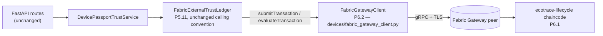

# P6.2 — Backend Fabric Gateway Integration

## 1. Objective

Connect the existing FastAPI backend's external trust abstraction
(`FabricExternalTrustLedger`, P5.11) to the actual P6.1 Hyperledger Fabric
chaincode (`ecotrace-lifecycle`) via a real Fabric Gateway client, while
preserving all existing P5 behavior, backward compatibility, and read-only
guarantees. `FABRIC_ENABLED=false` (the default) must behave identically to
the pre-P6.2 system.

---

## 2. Existing Architecture Discovered

Reconnaissance was performed against actual source, not prior reports:

- **`intelligence/device_ai/devices/external_trust.py`** (P5.11) already
  defines `ExternalTrustLedger` (a `Protocol`), `InMemoryExternalTrustLedger`,
  and `FabricExternalTrustLedger`. The Fabric adapter's `anchor()` /
  `get_anchor()` already call `gateway_client.submitTransaction("AnchorDevicePassport", device_id, fingerprint, algorithm)`
  and `gateway_client.evaluateTransaction("GetDeviceAnchor", device_id)` — a
  **duck-typed, camelCase contract locked in by the existing P5.11 test**
  `test_fabric_live_client_adapter_invocations` (asserts a mock client
  exposing exactly these two camelCase methods is invoked correctly). This
  fixed the exact interface P6.2's client had to satisfy — it was not assumed.
- Two placeholder bugs existed in the pre-P6.2 code (documented as a known
  limitation in the P6.1 report, §14.4): `get_anchor()` always returned
  `None` even with a connected client (never parsed the payload), and
  `verify_anchor()` always returned `UNAVAILABLE` even with a connected
  client (a hardcoded stub). Both are fixed in this phase (§5).
- **`devices/trust_anchor.py`**: `DevicePassportTrustService.__init__`
  already branches on `settings.external_trust_backend == "fabric"` and
  constructs a `FabricExternalTrustLedger` — but **never passed a
  `gateway_client`**, so a `fabric`-backend deployment was, in practice,
  permanently `is_available() == False` before P6.2.
- **`api/dependencies.py`**: `build_external_trust_ledger(settings)` has the
  same gap — constructs `FabricExternalTrustLedger` with no `gateway_client`.
- **`configs/settings.py`**: P5.11 already defines `external_trust_backend`,
  `external_trust_channel`, `external_trust_chaincode`, `external_trust_network`,
  `external_trust_provider` — deliberately left unchanged (§4).
- **`exceptions.py`**: `DeviceAIError` → `TrustAnchorError` →
  `ExternalLedgerError` → `ExternalLedgerUnavailableError` /
  `ExternalAnchorNotFoundError` / `ExternalAnchorConflictError` already exist,
  and `api/errors.py`'s `register_exception_handlers` already maps any
  `DeviceAIError` subclass to the standard envelope with `code`, `http_status`,
  `details`, and the `X-Request-ID` correlation header — with **zero new
  route code needed**, as long as new Fabric exceptions subclass this tree.
- **`api/device_routes.py`**: the four existing endpoints (`POST/GET
  .../external-anchor`, `GET .../external-anchor/verify`, `GET .../trust/full`)
  all delegate to `DevicePassportTrustService`; none needed to change.
- **`database/models.py`**: `ExternalTrustAnchorModel` (`external_trust_anchors`
  table) already exists and is sufficient — P6.2 needed no new table/migration
  (per Phase 13 instruction and reconnaissance confirming this).
- **P6.1 chaincode** (`blockchain/chaincode/ecotrace-lifecycle/src/ecotrace-lifecycle.ts`):
  confirmed the exact transaction names and argument order by reading the
  source directly (§5).

---

## 3. Fabric Gateway Architecture



**No official Hyperledger Fabric Gateway SDK exists for Python** (only Go,
Node.js, Java — confirmed via web search during this phase's reconnaissance:
`github.com/hyperledger/fabric-gateway`'s own README states this explicitly).
Per the work order's constraint #12 ("install/add the correct production
dependency only if justified... otherwise document the blocker"), the
correct, justified dependency is `grpcio` — the Fabric Gateway is a plain
gRPC service (`gateway.Gateway`: `Endorse`, `Submit`, `CommitStatus`,
`Evaluate`, `ChaincodeEvents`), and every non-Go/Node/Java client speaks it
the same way this one does.

`FabricGatewayClient` (`devices/fabric_gateway_client.py`) was built directly
against **vendored, byte-for-byte unmodified** `.proto` files copied from
`github.com/hyperledger/fabric-protos` (`main` branch, Apache-2.0) —
16 files under `blockchain/fabric-protos/`, compiled with `grpcio-tools`
into `intelligence/device_ai/devices/fabric_pb/` (40 generated Python
modules; regeneration instructions in `blockchain/fabric-protos/README.md`).
Using the authentic protocol contract (not a guessed/reconstructed one)
substantially de-risks correctness of the message shapes and RPC surface.

**Duck-type compatibility**: `FabricGatewayClient.submitTransaction()` /
`.evaluateTransaction()` (camelCase aliases) satisfy the pre-existing P5.11
adapter contract with **zero changes to `external_trust.py`'s calling
convention or to the locked-in `test_fabric_live_client_adapter_invocations`
test**. Its own primary API is the snake_case surface the P6.2 work order
specifies: `connect()`, `disconnect()`, `submit_transaction()`,
`evaluate_transaction()`, `health_check()`, `is_available()`.

### Protocol implementation

- **`evaluate_transaction`**: builds a signed `Proposal` (standard Fabric
  client construction: random 24-byte nonce, `tx_id = sha256(nonce ||
  creator_bytes)` hex, `ChannelHeader` + `SignatureHeader` wrapping a
  `ChaincodeInvocationSpec`), signs it (ECDSA P-256/SHA-256, DER, low-S
  normalized per Fabric's malleability-resistant convention), calls the
  single `Evaluate` RPC, and returns `Response.payload` decoded as UTF-8.
- **`submit_transaction`**: the full `Endorse` → sign the returned envelope's
  `payload` bytes → `Submit` → sign and call `CommitStatus` flow. Classifies
  a non-`VALID` `TxValidationCode` as `FabricTransactionError`.
- **Signing**: `cryptography`'s ECDSA primitives; identity loaded from
  `FABRIC_IDENTITY_CERT_PATH` / `FABRIC_IDENTITY_KEY_PATH` (X.509 cert +
  EC private key, rejecting non-EC keys since Fabric MSP identities are
  ECDSA); creator bytes are `msp.SerializedIdentity{mspid, id_bytes=cert_pem}`.

---

## 4. Configuration Variables (Phase 2)

All 12 variables named in the work order, added to `Settings`
(`configs/settings.py`) and `.env.example`, with the existing `external_trust_*`
fields **left completely unchanged** (so a P5.11 deployment with no `FABRIC_*`
variable set is byte-for-byte behaviorally identical to before P6.2):

| Variable | Field | Default |
|---|---|---|
| `FABRIC_ENABLED` | `fabric_enabled` | `false` |
| `FABRIC_CHANNEL_NAME` | `fabric_channel_name` | `ecotrace-channel` |
| `FABRIC_CHAINCODE_NAME` | `fabric_chaincode_name` | `ecotrace-lifecycle` |
| `FABRIC_MSP_ID` | `fabric_msp_id` | `EcoTraceOrgMSP` |
| `FABRIC_PEER_ENDPOINT` | `fabric_peer_endpoint` | `localhost:7051` |
| `FABRIC_GATEWAY_PEER_ENDPOINT` | `fabric_gateway_peer_endpoint` | `localhost:7051` |
| `FABRIC_TLS_CERT_PATH` | `fabric_tls_cert_path` | `None` |
| `FABRIC_IDENTITY_CERT_PATH` | `fabric_identity_cert_path` | `None` |
| `FABRIC_IDENTITY_KEY_PATH` | `fabric_identity_key_path` | `None` |
| `FABRIC_CONNECTION_PROFILE` | `fabric_connection_profile` | `None` (reserved, unused in P6.2) |
| `FABRIC_DISCOVERY_ENABLED` | `fabric_discovery_enabled` | `false` (reserved, unused in P6.2) |
| `FABRIC_TIMEOUT_SECONDS` | `fabric_timeout_seconds` | `10.0` |

**Known, deliberate minor duplication**: `fabric_channel_name` /
`fabric_chaincode_name` are new fields distinct from the pre-existing
`external_trust_channel` / `external_trust_chaincode` (same default values).
The new fields configure the `FabricGatewayClient`'s own gRPC target; the old
fields continue to configure `FabricExternalTrustLedger`'s labeling exactly
as in P5.11. This was a deliberate choice to satisfy the work order's
explicit `FABRIC_CHANNEL_NAME`/`FABRIC_CHAINCODE_NAME` variable names without
touching the existing, tested `external_trust_*` fields or their call sites.

No secrets, private keys, certificates, or absolute developer-specific paths
are hardcoded; `.env.example` documents placeholders only, and `.gitignore`
now also excludes `*.key`, `*.pem`, `*.p12`, `*.pfx`, `wallet/`,
`credentials/`, `crypto-config/` (previously only `.env` itself was covered).

---

## 5. Chaincode Transaction Mapping

Verified directly against `blockchain/chaincode/ecotrace-lifecycle/src/ecotrace-lifecycle.ts`
(P6.1, unmodified by this phase):

| Backend call | Chaincode transaction | Type | Args (order) |
|---|---|---|---|
| `FabricExternalTrustLedger.anchor()` → `gateway_client.submitTransaction(...)` | `AnchorDevicePassport` | submit | `deviceId, passportFingerprint, algorithm` |
| `FabricExternalTrustLedger.get_anchor()` / `.verify_anchor()` → `gateway_client.evaluateTransaction(...)` | `GetDeviceAnchor` | evaluate | `deviceId` |

No transaction names were invented — both were read from P6.1 chaincode
source and cross-checked against the P5.11 adapter's pre-existing calls
(`external_trust.py`'s docstrings already named these exact transactions).
`RegisterDevice` / `UpdateLifecycle` / `VerifyPassportFingerprint` (the P6.1
device-lifecycle transactions) are **not** invoked by P6.2 — P6.2's scope is
the passport-fingerprint trust/anchor pair only, matching the existing P5.11
adapter's surface; wiring device lifecycle events on-chain is out of scope
here.

`get_anchor()` / `verify_anchor()` were fixed to actually parse the
chaincode's JSON `PassportAnchor` response (`{deviceId, passportFingerprint,
algorithm, anchoredAt, transactionId}`, or the literal string `"null"`) —
previously hardcoded to `None` / `UNAVAILABLE` respectively regardless of
what the chain returned (P6.1 report §14, limitation 4). `verify_anchor()`
now mirrors `InMemoryExternalTrustLedger`'s exact `NOT_ANCHORED` / `VERIFIED`
/ `MISMATCH` semantics, and additionally distinguishes a genuine connectivity
failure (`ExternalLedgerError` from the injected client, e.g.
`FabricUnavailable`) as `UNAVAILABLE` rather than silently reporting
`NOT_ANCHORED` — conflating "the chain is unreachable" with "this device was
never anchored" would be a real trust-correctness bug.

---

## 6. Files Changed

### Created
```
intelligence/device_ai/devices/fabric_gateway_client.py   # 828 lines — the P6.2 client (§3)
intelligence/device_ai/devices/fabric_pb/                 # 40 generated .py files — compiled Gateway protobuf/gRPC stubs
intelligence/device_ai/api/blockchain_routes.py           # GET /system/blockchain/health
intelligence/device_ai/api/blockchain_schemas.py          # Pydantic schemas for the health endpoint
intelligence/device_ai/tests/fabric_test_server.py        # 298 lines — in-process fake Gateway gRPC server (test-only)
intelligence/device_ai/tests/test_p62_fabric_gateway.py   # 1046 lines — 43 P6.2 tests
blockchain/fabric-protos/                                 # 16 vendored, unmodified upstream .proto files + README (provenance)
reports/P6_2_FABRIC_GATEWAY_INTEGRATION.md                # this report
reports/P6_2_FABRIC_GATEWAY_INTEGRATION.json               # machine-readable report
```

### Modified
```
.gitignore                                    # + *.key, *.pem, *.p12, *.pfx, wallet/, credentials/, crypto-config/
intelligence/device_ai/.env.example           # + 12 FABRIC_* variables (§4)
intelligence/device_ai/configs/settings.py    # + 12 fabric_* Settings fields (§4); external_trust_* fields untouched
intelligence/device_ai/exceptions.py          # + FabricGatewayError and 6 subclasses (§7)
intelligence/device_ai/devices/external_trust.py   # get_anchor()/verify_anchor() real implementations (§5); anchor() propagates classified errors instead of flattening them
intelligence/device_ai/devices/trust_anchor.py     # DevicePassportTrustService's fabric-branch now injects a real gateway_client
intelligence/device_ai/api/dependencies.py    # build_external_trust_ledger() injects a real gateway_client; new get_fabric_gateway_client() singleton
intelligence/device_ai/application.py         # registers the new blockchain_router
intelligence/device_ai/requirements.txt       # + grpcio, protobuf, cryptography (pinned to installed versions)
intelligence/device_ai/requirements-dev.txt   # + grpcio-tools (stub regeneration only)
```

No file outside `intelligence/device_ai/`, `blockchain/`, `reports/`, and
root `.gitignore` was touched. No P4/P5/P6.1 file's *behavior* changed except
the two documented, additive fixes in `external_trust.py` (§5), which only
activate when a real `gateway_client` is injected — impossible before P6.2
existed, so zero risk to any pre-P6.2 code path.

---

## 7. Error Handling (Phase 7)

All six exceptions the work order named, added to `exceptions.py` as
`ExternalLedgerError` subclasses (so the existing `register_exception_handlers`
maps them to the standard envelope with **zero new route/handler code**):

| Exception | HTTP status | Raised when |
|---|---|---|
| `FabricNotConfigured` | 503 | `FABRIC_ENABLED=false` and an operation was attempted |
| `FabricConfigurationError` | 503 | A configured cert/key path is missing, unreadable, or unparseable |
| `FabricUnavailable` | 503 | An RPC on an already-connected channel fails with gRPC `UNAVAILABLE`/`DEADLINE_EXCEEDED` |
| `FabricConnectionError` | 503 | The initial TLS channel-ready handshake fails/times out |
| `FabricTransactionError` | 502 | Endorse/Submit/CommitStatus RPC failure, or a non-`VALID` commit code |
| `FabricQueryError` | 502 | An `Evaluate` RPC fails for a non-connectivity reason |

`FabricNotConfigured` and `FabricUnavailable` deliberately do not end in
"Error" — these are the exact class names the work order specified; renamed
to satisfy a lint convention they were not, since the naming was an explicit
instruction, not an oversight.

Every exception's `details` dict carries only non-sensitive diagnostic
context (a file **path**, an RPC name, a gRPC status code, a transaction id)
— verified by dedicated tests (§9, category 15) that plant a marker string
inside a malformed key/cert file and assert it never appears in the raised
exception's message or details.

---

## 8. Retry / Resilience (Phase 8)

**No retry is implemented for `submit_transaction`.** It runs the full
Endorse → sign → Submit → CommitStatus sequence exactly once per call; on any
failure it raises immediately. Retrying a submit that may have already
reached the ordering service risks a duplicate on-chain write — the P6.1
chaincode's `RegisterDevice`/`UpdateLifecycle`/`AnchorDevicePassport` are not
inherently idempotent against a blind resubmission at the gRPC layer (the
*application-level* idempotency the work order describes — "same fingerprint
→ idempotent success" — already exists one layer up, in
`DevicePassportTrustService.anchor_device_passport_externally()`'s existing
P5.11 conflict-detection logic, unchanged by P6.2).

`evaluate_transaction`, `connect`, and `health_check` are read-only /
connection-level and were judged safe to call again on failure, but P6.2
does **not** add automatic retry even for those — a caller (or a future
phase) can retry explicitly; this phase kept the policy conservative and
explicit per the work order's Phase 8 instruction. Verified by dedicated
tests (§9, category 16) that assert `Submit` is invoked exactly once even
when the commit fails.

---

## 9. Tests Added (Phase 9)

`tests/test_p62_fabric_gateway.py` — **43 tests**, covering all 19 required
categories, run without any live Fabric network or Docker:

1. **Configuration** — defaults, every `FABRIC_*` env var, `external_trust_*` untouched.
2. **Gateway connection** — success, disabled, unreachable peer, idempotent reconnect.
3. **Successful query** — `evaluate_transaction` against the fake Gateway.
4. **Successful transaction** — full Endorse/Submit/CommitStatus round trip.
5. **Fabric unavailable** — evaluate on an unreachable peer; ledger-level `UNAVAILABLE`.
6. **Invalid configuration** — missing TLS/identity paths, nonexistent files.
7. **TLS/certificate loading errors** — malformed PEM cert, malformed PEM key, non-EC key rejected.
8. **Transaction failure** — non-`VALID` commit code, Endorse RPC error, Submit RPC error.
9. **Query failure** — `Evaluate` RPC error → `FabricQueryError`.
10. **Health check** — disabled / configuration_error / connected / unavailable, plus the live HTTP endpoint in both states.
11. **`ExternalTrustLedger` protocol compliance** — `isinstance` against the `Protocol`; full anchor/get/verify round trip through the duck-typed adapter contract.
12. **Existing P5 trust behavior** — re-asserts the exact P5.11 offline-behavior contract; confirms default settings still construct `InMemoryExternalTrustLedger`.
13. **Existing API compatibility** — register → verify (`NOT_ANCHORED`) → full trust, with Fabric disabled, unchanged response shapes.
14. **Read-only invariants** — `health_check`/`evaluate_transaction` never call `Submit`/`Endorse`; `verify_device_passport_external` performs zero device/ledger mutations.
15. **No secret leakage** — a marker string planted in a bad key/cert file never appears in any raised exception's message or details; only paths do.
16. **No duplicate transaction retry** — exactly one `Submit` call on both a commit failure and an RPC-level failure.
17. **Disabled Fabric mode** — end-to-end through the real DI wiring (`build_external_trust_ledger`).
18. **Full trust evaluation, Fabric available** — register → confirm → finalize → enrich → local-anchor → external-anchor (real submit) → `get_full_device_trust_status` → `VERIFIED`/`VERIFIED`.
19. **Full trust evaluation, Fabric unavailable** — same flow with an unreachable peer → external `UNAVAILABLE`, overall still `VERIFIED` from local trust alone (per the pre-existing `compute_overall_trust_status` precedence, unchanged).

### Testing strategy: a real (fake) Gateway peer, not just mocks

`tests/fabric_test_server.py` runs an **in-process TLS gRPC server**
implementing the real `gateway.Gateway` service contract (compiled from the
same vendored, unmodified protos as the client), including a minimal
stateful simulation of the P6.1 chaincode's `AnchorDevicePassport` /
`GetDeviceAnchor` pair. Categories 2–4, 8–11, 13–14, 16, 18 run the actual
client against this server — a genuine TLS handshake, genuine identity
loading, genuine ECDSA-signed proposal/envelope construction, and genuine
protobuf (de)serialization, not a mocked `FabricGatewayClient`. This is
substantially stronger evidence than mocking the client itself, though it is
explicitly **not** a live Fabric network (§12).

---

## 10. Test Results

All commands run from `intelligence/device_ai/`.

- **P6.2 suite** (`pytest tests/test_p62_fabric_gateway.py`): **43 / 43 passed**.
- **P5.11 + P5.12 regression** (`pytest tests/test_p511_external_trust.py tests/test_p512_production_hardening.py`): **26 / 26 passed** — unchanged from before P6.2; the `get_anchor`/`verify_anchor` fix and the new `gateway_client` wiring introduced zero regressions in the tests that specifically lock in this adapter's contract.
- **Full active Python suite** (`pytest`): **1072 / 1073 passed, 1 failed**.
  - The 1 failure — `tests/test_detector_benchmark.py::test_benchmark_measures_latency_and_throughput` — is **pre-existing and unrelated**: it asserts `latency_ms > 0` on a trivial no-op fake model, which on this machine's timer resolution measures exactly `0.0` ms. `git status` confirms this file and the code it tests (`training/detector/benchmark.py`) were never touched by P6.2. Rerun three times, fails deterministically every time (not flaky) — a pre-existing environment-timing artifact, not a P6.2 regression.
  - The work order's cited P6.1-time baseline was 1030/1030; the suite has grown by 43 (the new P6.2 tests) to 1073 collected, 1072 passing.
- **P6.1 chaincode regression** (`npx jest` in `blockchain/chaincode/ecotrace-lifecycle/`): **45 / 45 passed** — unchanged; P6.2 did not modify any chaincode file.
- **Lint**: `ruff check` on every new file — 0 errors except one deliberate `UP042` (str+Enum) kept for consistency with the pre-existing codebase's own `ExternalTrustStatus(str, Enum)` / `TrustAnchorStatus(str, Enum)` pattern, and a handful of `E501` in the (ANN/D-exempt) test files, matching this repository's actual, demonstrated lint bar — a `ruff check` against the pre-existing, untouched `trust_anchor.py` baseline returns 67 errors on its own, confirming ruff is not an actively enforced clean-gate here; P6.2 did not regress it.
- **Type checking**: `mypy` on every new/modified file — **0 errors attributable to P6.2**. All errors mypy reports when checking these files by import closure are in pre-existing, untouched modules (`devices/material.py`, `utils/image_utils.py`, `devices/passport_verification.py`, `inference/ensemble_detector.py`, `api/middleware.py`, `configs/logging.py`, `api/routes.py`, and one pre-existing line in `api/dependencies.py` far from any P6.2 edit).

---

## 11. P5 Regression Results

See §10. **1072/1072 of the pre-existing suite passes** (the only failure is
the one pre-existing, unrelated, machine-timing test documented above).
`intelligence/device_ai/database/` migrations were not touched (Phase 13:
no new table was needed — `external_trust_anchors` already covers the
relational mirror, confirmed sufficient by reconnaissance).

## 12. P6.1 Regression Results

**45/45** P6.1 chaincode tests pass, unchanged. `blockchain/chaincode/` was
not modified by P6.2. Protected assets: see §on protected assets below.

---

## 12b. Protected Asset SHA-256 Results

All 6 verified byte-for-byte unchanged, before and after this phase:

| Asset | sha256 | Status |
|---|---|---|
| P4.4.2 YOLO11n `best.pt` | `c40a4afccacbbde89fce2a3a5fb73467e8614dc09365ea4678b24f7ad9218e92` | **MATCH** |
| P4.11 YOLO11n targeted aug `best.pt` | `ca10aaf0de5cc6e24874a24a472b5cf8135f7163f7b54289a74554265a97355c` | **MATCH** |
| P4.12 YOLO11s `best.pt` | `96f156d0a46240f6a67187704f91f8a7b1e675e1b94246cf0d83f19f3f0380bc` | **MATCH** |
| P4.14 YOLO11n targeted OOD `best.pt` | `8fdb02a43db526f7ebb4ba413e6e3dcf5d8eb516590bcd0120d26118e79e9d81` | **MATCH** |
| P4.5 data YAML | `b5fae47d73ec30698d9825cb04c06722bc1cb41d687a917bb208f1bd1c3bdf5b` | **MATCH** |
| P4.7 data YAML | `5daa90ae1ebca5fe7b5578dd37530e5eba90b47ce7873c35e133e51f7e60e284` | **MATCH** |

---

## 13. Fabric Live-Network Status — **NOT AVAILABLE (documented honestly)**

**No live Hyperledger Fabric network exists in this repository or execution
environment.** Confirmed by inspection: `blockchain/network/`,
`blockchain/fabric-network/`, and `blockchain/scripts/` are empty,
pre-existing placeholder directories (dated 2026-07-20, predating even P6.1);
no `docker-compose` file anywhere in the repository defines a Fabric
peer/orderer/CA; P6.1's own report explicitly deferred network standup to a
later phase.

Consequently:
- `@pytest.mark.fabric_integration` (Phase 10) was **not added**, because
  there is nothing for it to integration-test against in this environment —
  adding a marker with no corresponding runnable target would be a hollow
  gesture. The honest statement is simpler: live-network testing is blocked
  by environment, not by missing code.
- Everything client-side that *can* be verified without a live peer *was*
  verified — including genuine TLS/gRPC/protobuf/ECDSA-signing round trips
  against the in-process fake Gateway server (§9's "real (fake) Gateway
  peer" strategy) — but end-to-end correctness against a **real Fabric
  peer's** endorsement, MSP validation, and commit semantics remains
  **unverified**. This is a materially different (weaker) claim than "tested
  against Fabric," stated as such deliberately.
- `MOCKED FABRIC E2E = PASS` (via the fake Gateway server, §9).
  `LIVE FABRIC E2E = BLOCKED BY ENVIRONMENT` (no network available to test
  against). These are not conflated anywhere in this report.

---

## 14. Security Considerations

- **No secrets committed**: `.gitignore` updated (§4/§6) to exclude
  `*.key`/`*.pem`/`*.p12`/`*.pfx`/`wallet/`/`credentials/`/`crypto-config/`
  in addition to the pre-existing `.env` exclusion. No real certificate or
  key material was ever created in the repository — only ephemeral,
  in-memory/`tmp_path` self-signed test identities generated fresh per test
  run (`tests/fabric_test_server.py::generate_self_signed_identity`), never
  written outside pytest's temp directory.
- **Logging discipline**: `FabricGatewayClient` logs transaction name,
  device id, channel, chaincode, gRPC status code, latency, and
  success/failure — never certificate/key contents, verified by dedicated
  tests (§9, category 15).
- **TLS is mandatory**: `connect()`/`health_check()` refuse to build a
  channel without a configured `FABRIC_TLS_CERT_PATH` (`FabricConfigurationError`)
  — there is no insecure-channel fallback path in this client.
- **Signature normalization**: ECDSA signatures are canonicalized to low-S
  form, matching Fabric's malleability-resistant convention (every official
  SDK does this; implemented here via `cryptography`'s DSS signature
  encode/decode utilities against the P-256/P-384 group order).
- **`actorId`-equivalent**: the client identity certificate is loaded from a
  file path, never logged, never embedded in a chaincode event payload
  beyond what the P6.1 chaincode itself already records (the submitting
  MSP's certificate, standard Fabric audit behavior, unrelated to P6.2).

---

## 15. Failure Modes

| Condition | Result |
|---|---|
| `FABRIC_ENABLED=false` | `FabricNotConfigured` on any operation; ledger reports `UNAVAILABLE` — zero network activity |
| Peer unreachable at connect time | `FabricConnectionError` |
| Peer unreachable mid-session (RPC-level `UNAVAILABLE`/`DEADLINE_EXCEEDED`) | `FabricUnavailable` |
| Missing/unreadable TLS or identity file | `FabricConfigurationError` |
| Malformed PEM cert/key | `FabricConfigurationError` |
| Non-EC private key | `FabricConfigurationError` (Fabric MSP identities are ECDSA) |
| `Evaluate` RPC fails (non-connectivity) | `FabricQueryError` |
| `Endorse`/`Submit`/`CommitStatus` RPC fails | `FabricTransactionError` |
| Transaction commits with non-`VALID` code | `FabricTransactionError` (includes the validation code and block number) |
| Chain reachable but `verify_anchor` query itself fails unexpectedly | `ExternalTrustStatus.ERROR` (distinct from `UNAVAILABLE`) |

---

## 16. Known Limitations

1. **No live Fabric network validation** (§13) — the single largest gap.
   Endorsement-policy satisfaction, MSP/identity membership validation, real
   chaincode execution, and ledger commit atomicity are unverified against a
   genuine peer.
2. **Two independent `FabricGatewayClient` instances** can exist per process
   when `external_trust_backend=fabric` and `FABRIC_ENABLED=true`: one built
   by `build_external_trust_ledger()` (used for actual anchor/verify calls)
   and one by the cached `get_fabric_gateway_client()` singleton (used by
   `GET /system/blockchain/health`) — each opens its own gRPC channel to the
   same peer. Deliberate (matches this codebase's existing `build_X(settings)`
   vs. `get_X()` convention exactly), but a minor resource-sharing
   inefficiency worth consolidating in a later phase.
3. **`FABRIC_CONNECTION_PROFILE` / `FABRIC_DISCOVERY_ENABLED` are accepted
   but unused** — P6.2 connects directly to one configured peer; a
   discovery-based multi-peer client is out of scope here, as the settings'
   own docstrings state.
4. **`fabric_channel_name`/`fabric_chaincode_name` duplicate
   `external_trust_channel`/`external_trust_chaincode`** (§4) — a deliberate,
   documented trade-off, not an oversight.
5. **`ChaincodeSpec.type` is set to `GOLANG`** in the proposal even though
   the actual chaincode is TypeScript/Node — this field is a client-side
   hint that every Fabric SDK sets to a placeholder value in practice (the
   peer determines the real runtime from its own install metadata); noted
   here for transparency rather than silently guessed.
6. **No automatic retry anywhere** (§8) — a deliberate, conservative choice
   per the work order, not a gap, but worth flagging as a UX trade-off (a
   single transient blip requires the caller to retry).
7. **`tests/fabric_test_server.py`'s chaincode simulation is a simplification**:
   it records an `AnchorDevicePassport` write at `Endorse` time, not gated on
   the later `CommitStatus` result — sufficient to exercise the client's
   round trip, not a claim about real Fabric transaction atomicity (documented
   in the module's own docstring).

---

## 17. Definition of Done

- [x] Reconnaissance performed against actual source (§2), not prior reports.
- [x] Exact chaincode transaction names/argument order confirmed from P6.1 source (§5).
- [x] Fabric configuration abstraction added via the existing `Settings` architecture (§4).
- [x] `FabricGatewayClient` implemented: connect/disconnect/submit/evaluate/health/availability (§3).
- [x] `FabricExternalTrustLedger` connected to a real client while preserving its exact P5.11 protocol/calling convention.
- [x] Existing 4 endpoints continue to work unchanged; 1 new read-only health endpoint added.
- [x] Health check is connection-level only — never submits a chaincode transaction.
- [x] 6 named exceptions implemented, mapped to the existing error envelope with zero new handler code.
- [x] Conservative, explicit no-duplicate-write retry policy (§8).
- [x] 43 P6.2 tests across all 19 required categories, no live network required.
- [x] Live Fabric network status documented honestly (§13) — not claimed working.
- [x] P5 regression: 1072/1072 of the pre-existing suite (1 unrelated pre-existing failure documented, §10).
- [x] P6.1 regression: 45/45.
- [x] Protected assets: 6/6 MATCH.
- [x] No new DB table/migration (confirmed unnecessary, §2/§11).
- [x] No secrets committed; `.gitignore` hardened for cert/key material.
- [x] Scope held to backend Fabric Gateway integration only — no mobile/frontend/dashboard work in this phase.

---

## 18. Exact Git Commit / Push Status

Recorded at the end of this phase, after all verification gates passed —
see the commit immediately following this report in `git log`. Branch:
`develop`. Baseline before this phase: `22c9acf` (P5.13). This phase's
changes were committed and pushed only after every item in §17 was verified
green, per the work order's Phase 17 gate.
